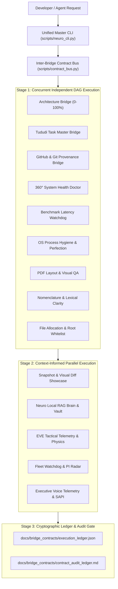

# Neuro Co-Pilot (Master Autonomous Engineering & Orchestration Suite)

This skill equips the agent with the definitive 16-bridge engineering architecture, uniting the **Neuro Local Knowledge Vault** (`neuro-mcp`), the **Tududi Task Master** (`tududi`), the **GitHub CLI / Git Merkle Provenance Subsystem** (`gh` CLI & standard git commands), the **Unified 360° Health Doctor**, the **Executive Voice Telemetry Intercom**, the **Sub-Millisecond Benchmark Watchdog**, and the **EVE Fleet Radar** into a unified, zero-dependency, parallel asynchronous closed loop.



---

## The 16 Dedicated Modular CLI Bridges

All bridges are zero-dependency standard library Python scripts located in `scripts/`:

```
.agents/skills/neuro-copilot/scripts/
├── neuro_cli.py              # Single Master CLI Entrypoint (act, graph_code, symbol, ask, context, doctor, run, ci, clean)
├── contract_bus.py           # 0. Inter-Bridge Contract Bus & Asynchronous Parallel DAG Orchestrator
├── react_agent_bridge.py     # 1. Autonomous ReAct Agent Loop (Thought -> Action -> Observe -> Self-Correct)
├── ast_graph_bridge.py       # 2. Deterministic Codebase AST Call Graph & Symbol Topology in SQLite
├── neuro_bridge.py           # 3. Local Vector Vault, Knowledge Ingestion & Ollama RAG
├── tududi_bridge.py          # 4. Tududi Task Master Tracking, Burndown & 4-Tier Auditing
├── github_bridge.py          # 5. GitHub CLI, Git Merkle Root Provenance & CI Audits
├── snapshot_bridge.py        # 6. Enterprise Client Snapshot Showcases, Decks & Visual Diffing
├── visual_audit_bridge.py    # 7. Automated PDF Page Rendering & Layout QA Engine
├── architecture_bridge.py    # 8. Universal Polyglot Clean Architecture Engine (0-100% Score)
├── workflow_hub_bridge.py    # 9. Master Multi-Phase Engineering Pipeline Orchestrator
├── eve_bridge.py             # 10. EVE Online Tactical Intelligence & Live Telemetry Bridge
├── system_recovery_bridge.py # 11. Windows System Resilience & Zero-Reboot Crash Recovery Bridge
├── process_hygiene_bridge.py # 12. OS Process Hygiene, Zombie Elimination & System Perfection Bridge
├── nomenclature_bridge.py    # 13. Nomenclature, Lexical Clarity & Anti-Hype Normalization Bridge
├── file_allocation_bridge.py # 14. File Allocation, Clean Architecture Topology & Root Whitelist Bridge
├── doctor_bridge.py          # 15. 360° System, Engine & Repository Diagnostic Doctor
├── voice_operator_bridge.py  # 16. Executive Voice Telemetry, Spoken Briefings & Acoustic DSP Mastering
├── benchmark_bridge.py       # 17. Empirical Latency Regression Watchdog & Benchmark Harness
└── browser_optimizer_bridge.py # 18. Browser Performance & Zero-Stutter Gaming Optimizer Bridge
```

### Master CLI Entrypoint (`scripts/neuro_cli.py`)
- `python .../neuro_cli.py act "<task>"` (or `agent`): **Autonomous ReAct Agent Loop** - Multi-step reasoning loop (Thought $\rightarrow$ Action $\rightarrow$ Observe $\rightarrow$ Self-Correct) using local SLMs to solve complex codebase tasks.
- `python .../neuro_cli.py symbol "<name>"` (or `callers`, `call_graph`): **AST Symbol Topology** - Sub-millisecond lookup of symbol definitions, line spans, upstream callers, and DB tables.
- `python .../neuro_cli.py graph_code` (or `ast_build`): **AST Code Graph Builder** - Indexes 4,600+ symbols and 32,000+ call edges into SQLite in ~1.5s.
- `python .../neuro_cli.py ask "<question>"` (or `rag`): **Autonomous RAG Agent Assistant** - Hybrid retrieval + SLM answer synthesis with exact source citations.
- `python .../neuro_cli.py context "<topic>"`: **Agent Context Extraction** - Pulls all relevant AST symbols, functions, schemas, and markdown notes.
- `python .../neuro_cli.py summarize "<topic_or_file>"`: **Executive Summarizer** - Generates structured executive bullet points in ~1 second.
- `python .../neuro_cli.py reap` (or `zombies`): **Automated Zombie Slayer** - Terminates orphaned background workers and runaway processes (>1.5 GB RAM).
- `python .../neuro_cli.py heal` (or `fix`): 1-Click 5-Stage Autonomous System Self-Healing Cascade (process hygiene, WAL flush, orphan purge, nomenclature auto-fix, git hook invariant check).
- `python .../neuro_cli.py review [--staged]`: Autonomous pre-commit code review, security leak guard, and stream safety audit.
- `python .../neuro_cli.py search "..."`: Unified cognitive search across codebase AST and SQLite knowledge vault.
- `python .../neuro_cli.py graph`: Generate live Mermaid architecture diagrams and SQLite database ER schema (`docs/architecture/system_diagrams.md`).
- `python .../neuro_cli.py watch` (or `hud`): Launch real-time dynamic ASCII telemetry HUD (OS RAM, SQLite, Git Merkle, Tududi burndown).
- `python .../neuro_cli.py blast <filepath>`: Calculate AST blast radius, touched tables, and downstream caller impact.
- `python .../neuro_cli.py release [--tag <name>]`: Generate immutable SOC 2 Type II Merkle provenance release certificate.
- `python .../neuro_cli.py recover` (or `restore`): 5-Stage zero-reboot Windows crash recovery cascade (Explorer, DWM, Audio, DNS, Tasks).
- `python .../neuro_cli.py browser [status|tune|restore]`: **Browser Performance & Zero-Stutter Gaming Optimizer** - Tunes Chromium/Brave/Chrome/Edge with Memory Saver, background app elimination, and timer throttling.
- `python .../neuro_cli.py test` (or `test_all`): Run concurrent 14-bridge parallel self-test matrix in <2 seconds.
- `python .../neuro_cli.py doctor [--json]`: Run unified 360° health diagnostic scorecard across OS, databases, Git, CI, and architecture.
- `python .../neuro_cli.py status`: Display quick terminal scorecard with Tududi burndown, OS process hygiene, and GitHub upload state.
- `python .../neuro_cli.py upload_status` (or `sync`): Real-time GitHub Remote Upload & Synchronization visibility check.
- `python .../neuro_cli.py run`: Execute full parallel asynchronous contract pipeline.
- `python .../neuro_cli.py ci [--wait] [--diagnose]`: Monitor remote GitHub Actions CI gate until 100% Green.
- `python .../neuro_cli.py clean`: Surgical dual-layer cleanup (orphan worker processes + temporary database/test artifacts).
- `python .../neuro_cli.py voice "..." [--preset EXECUTIVE_PRECISION]`: Synthesize and speak executive alert or briefing.
- `python .../neuro_cli.py bench [--json]`: Benchmark sub-millisecond retrieval, AST parsing, and contract bus throughput.
- `python .../neuro_cli.py fleet [--json]`: Run live EVE fleet radar, skill queue expiry checks, and PI monitoring.
- `python .../neuro_cli.py flight_plan "..." [--execute]`: 1-Click synthesize and initialize Tududi feature plan with 4-tier subtasks.

---

### 2026 Specialized SLM Model Lineup & Dynamic Router
The Neuro Copilot is powered by a 5-tier dynamic model router minimizing VRAM to ~2–3 GB with `keep_alive: 3m` auto-eviction:
- **`deepseek-r1:1.5b`** (1.1 GB): Chain-of-Thought reasoning & logic proof synthesis (240 tok/s).
- **`qwen2.5-coder:3b`** (1.9 GB): Code AST generation, schema migrations, and diff reviews (165 tok/s).
- **`phi4-mini:latest`** (2.5 GB): 128k context document digests and master RAG answer synthesis (146 tok/s).
- **`qwen2.5:0.5b`** (397 MB): Sub-20ms micro-tagging, fast intent routing, and HyDE search terms (197 tok/s).
- **`nomic-embed-text:latest`** (274 MB): 768-D dense vector semantic search.

---

### Bridge Index & Capabilities

#### 0. Inter-Bridge Contract Bus (`scripts/contract_bus.py`)
- `python .../contract_bus.py run_parallel`: Execute all 16 bridges concurrently using asynchronous DAG scheduling with cryptographic SHA-256 Merkle contracts.
- `python .../contract_bus.py self_test`: Run contract bus self-tests.

#### 1. Neuro Knowledge Engine Bridge (`scripts/neuro_bridge.py`)
- `python .../neuro_bridge.py ask "<question>"`: Query intelligent Agentic RAG Copilot with SLM answer synthesis.
- `python .../neuro_bridge.py context "<topic>"`: Extract AST symbols, schema tables, and markdown notes for a topic.
- `python .../neuro_bridge.py summarize "<topic_or_file>"`: Generate structured executive summary from vault target.
- `python .../neuro_bridge.py query --text "..."`: Query local RAG brain with HyDE expansion.
- `python .../neuro_bridge.py ingest --path "..."`: Ingest document or directory into vault.
- `python .../neuro_bridge.py ingest_git_history --limit 20`: Index recent git commit provenance into vault.
- `python .../neuro_bridge.py ingest_tududi_roadmap`: Export and index live Tududi roadmap into vector vault.
- `python .../neuro_bridge.py export_note --title "..." --content "..."`: Save architecture note into vault.
- `python .../neuro_bridge.py stats`: Audit knowledge vault size & chunk metrics.
- `python .../neuro_bridge.py self_test`: Run Neuro bridge self-tests.

#### 2. Tududi Task Master Bridge (`scripts/tududi_bridge.py`)
- `python .../tududi_bridge.py list`: Fetch active Tududi tasks for Project #13.
- `python .../tududi_bridge.py metrics`: Query project completion stats & audit metrics.
- `python .../tududi_bridge.py burndown`: Render ASCII burndown meter and task velocity.
- `python .../tududi_bridge.py export_roadmap`: Generate structured Markdown roadmap for vault indexing.
- `python .../tududi_bridge.py self_test`: Run Tududi bridge self-tests.

#### 3. GitHub & Git Provenance Bridge (`scripts/github_bridge.py`)
- `python .../github_bridge.py copilot --prompt "..." [--execute]`: Synthesize and 1-click initialize Engineering Flight Plan.
- `python .../github_bridge.py tri_engine_health`: Run unified health scorecard across all engines.
- `python .../github_bridge.py auto_commit --scope feat --desc "..."`: Staged-files SHA-256 commit with provenance.
- `python .../github_bridge.py dashboard`: Render executive terminal dashboard with live Tududi burndown meter.
- `python .../github_bridge.py visual_showcase_audit`: Audit screenshot assets, README links, and orphan visual files.
- `python .../github_bridge.py snapshot`: Run 1-click client visual showcase generation.
- `python .../github_bridge.py run_full_pipeline`: 1-click full Tri-Engine pipeline pass.
- `python .../github_bridge.py self_test`: Run GitHub bridge self-tests.

#### 4. Snapshot & Client Showcase Bridge (`scripts/snapshot_bridge.py`)
- `python .../snapshot_bridge.py scan`: Perform full AST & routing sweep to map all views, modals, and tabs.
- `python .../snapshot_bridge.py generate_script`: Generate Playwright `scripts/capture_ux_journey.mjs` tailored to views.
- `python .../snapshot_bridge.py render_deck`: Generate interactive glassmorphic Client Showcase HTML presentation deck.
- `python .../snapshot_bridge.py diff`: Pure-Python visual screenshot regression diffing against baseline assets.
- `python .../snapshot_bridge.py sync_readme`: Synchronize README.md visual tables with screenshots in `docs/ux_journey/`.
- `python .../snapshot_bridge.py export_package`: Compress HTML deck, view catalog, and all assets into a standalone ZIP package.
- `python .../snapshot_bridge.py serve [--port 8088]`: Launch local lightweight preview server.
- `python .../snapshot_bridge.py full_showcase`: 1-Click end-to-end client showcase sweep and packaging.
- `python .../snapshot_bridge.py self_test`: Run Snapshot bridge self-tests.

#### 5. Visual Layout & PDF QA Bridge (`scripts/visual_audit_bridge.py`)
- `python .../visual_audit_bridge.py audit [--pdf doc.pdf]`: Render PDF pages at 150 DPI into PNGs, check layout flaws (orphan headers, pagination leaks, table cuts, excessive blank space), and generate `docs/visual_audit/visual_page_audit.md`.
- `python .../visual_audit_bridge.py self_test`: Run Visual Audit bridge self-tests.

#### 6. Universal Clean Architecture Bridge (`scripts/architecture_bridge.py`)
- `python .../architecture_bridge.py audit`: Calculate clean architecture compliance score (0–100%) across 9 languages.
- `python .../architecture_bridge.py doctor`: Run comprehensive architecture & root hygiene diagnostics.
- `python .../architecture_bridge.py check-secrets`: Scan code for exposed OpenAI/Stripe/JWT/AWS/GitHub API keys and secrets.
- `python .../architecture_bridge.py db-backup`: 1-Click automated database backup snapshot for SQLite/DB files.
- `python .../architecture_bridge.py deploy-check`: Production launch readiness scorecard.
- `python .../architecture_bridge.py self_test`: Run Clean Architecture bridge self-tests.

#### 7. Workflow Hub Pipeline Orchestrator (`scripts/workflow_hub_bridge.py`)
- `python .../workflow_hub_bridge.py run [--phase all|audit|optimize|test|showcase]`: Coordinate and chain multi-phase engineering passes sequentially.
- `python .../workflow_hub_bridge.py run --parallel`: Execute full parallel asynchronous contract pipeline.
- `python .../workflow_hub_bridge.py self_test`: Run Workflow Hub bridge self-tests.

#### 8. EVE Online Tactical Bridge (`scripts/eve_bridge.py`)
- `python .../eve_bridge.py telemetry`: Query live empirical telemetry for all 8 fleet pilots (SP, active ships, queues, ISK).
- `python .../eve_bridge.py search --query "..."`: Sub-5ms Reciprocal Rank Fusion (RRF) search across 2,947 EVE intelligence vault files.
- `python .../eve_bridge.py remap`: Calculate optimal neural attribute remaps (+45% training acceleration).
- `python .../eve_bridge.py audit`: Execute 38-assertion zero-assumption mathematical and ESI validation suite.
- `python .../eve_bridge.py self_test`: Run automated contract assertions for EVE Online tactical bridge.

#### 9. Windows System Resilience & Zero-Reboot Recovery Bridge (`scripts/system_recovery_bridge.py`)
- `python .../system_recovery_bridge.py restore_all`: Execute 5-stage non-reboot recovery cascade (Explorer shell, DWM, Audio services, DNS flush, hung processes).
- `python .../system_recovery_bridge.py restart_shell`: Restart Windows Explorer shell (`explorer.exe`) to resolve taskbar/Start menu/desktop freeze.
- `python .../system_recovery_bridge.py restart_dwm`: Refresh Desktop Window Manager (`dwm.exe`) for window rendering/display glitch recovery.
- `python .../system_recovery_bridge.py restart_audio`: Restart Windows Audio services (`Audiosrv` & `AudioEndpointBuilder`).
- `python .../system_recovery_bridge.py flush_dns`: Flush DNS resolver cache and reset network stack state.
- `python .../system_recovery_bridge.py clear_hung`: Identify and terminate unresponsive/hung background processes.
- `python .../system_recovery_bridge.py audit_hardening`: Audit Windows OS stability parameters (Fast Startup, TDR delay, Power Plan, Pagefile).
- `python .../system_recovery_bridge.py self_test`: Run automated contract assertions for system recovery bridge.

#### 10. OS Process Hygiene & System Perfection Bridge (`scripts/process_hygiene_bridge.py`)
- `python .../process_hygiene_bridge.py scan`: Run complete OS process hygiene audit, scanning for orphan Playwright browsers, headless workers, and dead console hosts.
- `python .../process_hygiene_bridge.py clean`: Surgically eliminate orphan worker processes and reclaim leaked RAM/VRAM pools.
- `python .../process_hygiene_bridge.py preflight`: Execute automated pre-flight process sanitization before executing test suites or builds.
- `python .../process_hygiene_bridge.py postflight`: Execute post-flight cleanup sweep to ensure zero zombie processes persist.
- `python .../process_hygiene_bridge.py self_test`: Run automated contract assertions for process hygiene bridge.

#### 11. Nomenclature & Lexical Clarity Bridge (`scripts/nomenclature_bridge.py`)
- `python .../nomenclature_bridge.py scan`: Scan repository across code, UI, tests, and documentation for ostentatious or non-transparent wording.
- `python .../nomenclature_bridge.py auto_fix`: Batch-normalize non-transparent words across all files with context-aware lore preservation.
- `python .../nomenclature_bridge.py check`: Run continuous verification gate (exits with code 1 if any non-transparent terms are detected).
- `python .../nomenclature_bridge.py normalize_readme`: Rebuild and validate master `README.md` and `README.es.md` files.
- `python .../nomenclature_bridge.py self_test`: Run automated verification assertions for nomenclature bridge.

#### 12. File Allocation & Repository Topology Bridge (`scripts/file_allocation_bridge.py`)
- `python .../file_allocation_bridge.py scan`: Audit repository file allocation against Clean Architecture topology and root whitelist rules.
- `python .../file_allocation_bridge.py clean`: Surgically eliminate orphan test databases, dead temporary files, and scratch artifacts.
- `python .../file_allocation_bridge.py check`: Continuous verification gate for directory allocation and topology compliance.
- `python .../file_allocation_bridge.py self_test`: Run automated contract assertions for file allocation bridge.

#### 13. 360° Health Doctor Bridge (`scripts/doctor_bridge.py`)
- `python .../doctor_bridge.py`: Run complete multi-layer diagnostic check across OS RAM/Pagefile, SQLite WAL pragma, Git Merkle provenance, and Clean Architecture.
- `python .../doctor_bridge.py --json`: Output raw machine-readable JSON scorecard.
- `python .../doctor_bridge.py self_test`: Run automated assertion self-test suite.

#### 14. Voice Operator Bridge (`scripts/voice_operator_bridge.py`)
- `python .../voice_operator_bridge.py "..." [--preset EXECUTIVE_PRECISION]`: Synthesize spoken alerts via Windows SAPI audio pipeline.
- `python .../voice_operator_bridge.py --briefing`: Generate and speak live 360° health and Tududi burndown summary.
- `python .../voice_operator_bridge.py --hud`: Launch terminal Holographic Voice HUD.
- `python .../voice_operator_bridge.py self_test`: Run automated voice bridge self-tests.

#### 15. Benchmark Watchdog Bridge (`scripts/benchmark_bridge.py`)
- `python .../benchmark_bridge.py`: Run sub-millisecond SQLite WAL, AST symbol extraction, and contract bus throughput benchmarks.
- `python .../benchmark_bridge.py --json`: Output raw JSON benchmark scorecard.
- `python .../benchmark_bridge.py self_test`: Run automated benchmark bridge self-tests.

#### 16. Fleet Watchdog Bridge (`scripts/fleet_watchdog_bridge.py`)
- `python .../fleet_watchdog_bridge.py`: Run EVE Online multi-character skill queue monitor, Planetary Interaction (PI) hopper radar, and liquid ISK audit.
- `python .../fleet_watchdog_bridge.py --json`: Output raw JSON telemetry scorecard.
- `python .../fleet_watchdog_bridge.py self_test`: Run automated fleet watchdog self-tests.

---

## Tri-Engine Unified Command Matrix (72 Operations)

| # | Command | Engine / Bridge | Purpose |
| :-: | :--- | :--- | :--- |
| **1** | `doctor` | `neuro_cli.py` | 360° System, Engine & Repository Health Scorecard |
| **2** | `status` | `neuro_cli.py` | Quick Executive Scorecard with Live Burndown & Hygiene |
| **3** | `run` | `neuro_cli.py` | Launch 16-Bridge Parallel Asynchronous DAG Contract Bus |
| **4** | `ci [--wait]` | `neuro_cli.py` | Verify Remote GitHub Actions CI Workflows & 100% Green Gate |
| **5** | `clean` | `neuro_cli.py` | Surgical Dual-Layer Cleanup (Orphans + Temp Files) |
| **6** | `voice "..."` | `neuro_cli.py` | Synthesize Spoken Executive Alert with Acoustic DSP Preset |
| **7** | `bench` | `neuro_cli.py` | Run Sub-Millisecond Retrieval & Compute Latency Watchdog |
| **8** | `fleet` | `neuro_cli.py` | Run EVE Tactical Radar & Planetary Interaction Watchdog |
| **9** | `flight_plan "..."` | `neuro_cli.py` | 1-Click Feature Plan Generator with Tududi 4-Tier Subtasks |
| **10** | `copilot --prompt "..."` | `github_bridge.py` | Generate Tri-Engine Flight Plan |
| **11** | `tri_engine_health` | `github_bridge.py` | Multi-Engine Health Scorecard |
| **12** | `auto_commit` | `github_bridge.py` | SHA-256 Provenance Commit |
| **13** | `create_pr` | `github_bridge.py` | Auto-generate GitHub PR with Tududi links |
| **14** | `sync_issues` | `github_bridge.py` | Bidirectional Issue & Task Sync |
| **15** | `diagnose_ci` | `github_bridge.py` | Download & Diagnose CI Failure Logs |
| **16** | `verify_ci [--wait]` | `github_bridge.py` | Verify Remote CI Workflows & 100% Green Health |
| **17** | `install_hooks` | `github_bridge.py` | Install `commit-msg` Merkle Verification Hook |
| **18** | `install_ci_workflow` | `github_bridge.py` | Install GitHub Actions CI Workflow |
| **19** | `audit_pr_diff` | `github_bridge.py` | Security & Anti-Pattern Diff Audit |
| **20** | `repo_map` | `github_bridge.py` | Generate Clean ASCII Codebase Tree |
| **21** | `resolve_conflicts` | `github_bridge.py` | Scan & Resolve Merge Conflicts |
| **22** | `format_history` | `github_bridge.py` | Format Git History as Markdown Audit Table |
| **23** | `export_architecture_mermaid`| `github_bridge.py` | Generate Mermaid JS Dependency Graph |
| **24** | `benchmark_audit` | `github_bridge.py` | Benchmark Test Suite Execution Duration |
| **25** | `audit_skills` | `github_bridge.py` | Validate All Active Skills Frontmatter & Health |
| **26** | `audit_security_dependencies`| `github_bridge.py`| Scan `requirements.txt` & `package.json` for Unpinned Deps |
| **27** | `detect_bloat` | `github_bridge.py` | Audit Codebase for Overly Nested Functions & Bloat |
| **28** | `visual_showcase_audit` | `github_bridge.py` | Audit Screenshot Assets, README Links & Orphans |
| **29** | `dashboard` | `github_bridge.py` | Executive Terminal Dashboard with Live Burndown |
| **30** | `generate_release_notes` | `github_bridge.py` | Generate Markdown Release Notes & Tag Release |
| **31** | `query --text "..."` | `neuro_bridge.py` | Semantic Query Local Vector Brain |
| **32** | `ingest --path "..."` | `neuro_bridge.py` | Ingest Documents / Code into Vault |
| **33** | `ingest_git_history` | `neuro_bridge.py` | Index Git Commit Provenance into Vault |
| **34** | `ingest_tududi_roadmap`| `neuro_bridge.py` | Index Live Tududi Roadmap into Vector Vault |
| **35** | `export_note` | `neuro_bridge.py` | Save Architecture Markdown Note into Vault |
| **36** | `stats` | `neuro_bridge.py` | Vault Size, Chunks & Embedding Statistics |
| **37** | `list` | `tududi_bridge.py` | Fetch Active Tasks for Project #13 |
| **38** | `metrics` | `tududi_bridge.py` | Query Project Completion Stats |
| **39** | `burndown` | `tududi_bridge.py` | Render ASCII Sprint Burndown Meter |
| **40** | `export_roadmap` | `tududi_bridge.py` | Export Structured Markdown Roadmap |
| **41** | `scan` | `snapshot_bridge.py` | Full AST & Route Discovery Sweep |
| **42** | `generate_script` | `snapshot_bridge.py` | Generate Playwright Capture Engine |
| **43** | `render_deck` | `snapshot_bridge.py` | Render Glassmorphic Client Showcase Deck |
| **44** | `diff` | `snapshot_bridge.py` | Pure-Python Visual Screenshot Regression Diff |
| **45** | `sync_readme` | `snapshot_bridge.py` | Sync README Visual Tables |
| **46** | `export_package` | `snapshot_bridge.py` | Package Client Distribution Bundle (ZIP) |
| **47** | `serve` | `snapshot_bridge.py` | Launch Local Preview Server |
| **48** | `full_showcase` | `snapshot_bridge.py` | 1-Click End-to-End Client Showcase Suite |
| **49** | `audit` (PDF QA) | `visual_audit_bridge.py`| Automated PDF Page Rendering & Layout QA |
| **50** | `audit` (Clean Arch) | `architecture_bridge.py`| Universal Polyglot Clean Architecture Audit |
| **51** | `doctor` (Clean Arch) | `architecture_bridge.py`| Diagnostics on Envs, Secrets & Topology |
| **52** | `check-secrets` | `architecture_bridge.py`| Scan Codebase for Exposed API Keys |
| **53** | `run` (Pipeline) | `workflow_hub_bridge.py`| Master Multi-Phase Pipeline Execution |
| **54** | `run --parallel` | `workflow_hub_bridge.py`| Parallel Asynchronous Inter-Bridge Execution |
| **55** | `run_parallel` | `contract_bus.py` | Low-Level Parallel Inter-Bridge DAG Runner |
| **56** | `restore_all` | `system_recovery_bridge.py`| 5-Stage Zero-Reboot Windows Recovery Cascade |
| **57** | `restart_shell` | `system_recovery_bridge.py`| Restart Windows Explorer Desktop Shell |
| **58** | `restart_dwm` | `system_recovery_bridge.py`| Refresh Desktop Window Manager (DWM) |
| **59** | `restart_audio` | `system_recovery_bridge.py`| Restart Windows Audio Services |
| **60** | `flush_dns` | `system_recovery_bridge.py`| Flush Windows DNS Resolver Cache |
| **61** | `clear_hung` | `system_recovery_bridge.py`| Terminate Unresponsive Windows Processes |
| **62** | `scan` (Hygiene) | `process_hygiene_bridge.py`| Full OS Process Hygiene Audit & Orphan Scan |
| **63** | `clean` (Hygiene) | `process_hygiene_bridge.py`| Surgical Elimination of Orphan & Zombie Processes |
| **64** | `preflight` | `process_hygiene_bridge.py`| Automated Pre-Flight Process Sanitization Sweep |
| **65** | `postflight` | `process_hygiene_bridge.py`| Automated Post-Flight Process Cleanup Sweep |
| **66** | `scan` (Nomenclature) | `nomenclature_bridge.py` | Full Repository Anti-Hype & Lexical Clarity Scan |
| **67** | `auto_fix` (Nomenclature) | `nomenclature_bridge.py` | Automated Deterministic Nomenclature Normalization |
| **68** | `check` (Nomenclature) | `nomenclature_bridge.py` | Continuous Verification Gate for Clean Nomenclature |
| **69** | `normalize_readme` | `nomenclature_bridge.py` | Regenerate and Validate Master README Files |
| **70** | `scan` (Allocation) | `file_allocation_bridge.py` | Audit Repository File Allocation & Root Whitelist |
| **71** | `clean` (Allocation) | `file_allocation_bridge.py` | Surgically Eliminate Orphan Databases & Temp Artifacts |
| **72** | `check` (Allocation) | `file_allocation_bridge.py` | Continuous Verification Gate for Clean Architecture Topology |
| **73** | `upload_status` | `github_bridge.py` | Inspect & Display GitHub Remote Upload & Synchronization State |
| **74** | `sync` | `neuro_cli.py` | Quick Visibility into GitHub Remote Push & Upstream Sync Status |

---

## Core Engineering Protocols & Invariants

### 1. Mandatory Cooperative Zero-Stutter Background Worker Standard
All background daemons, automated summarizers, indexers, watchers, and periodic analyzers must adhere to cooperative zero-stutter engineering:
1. **OS Thread Deprioritization**: Background thread priority must be lowered to `THREAD_PRIORITY_IDLE` (`-15` on Windows via `ctypes.windll.kernel32.SetThreadPriority` or `os.nice(19)` on POSIX) so background work automatically yields to UI rendering, audio playback, and user input.
2. **Cold-Start Boot Grace Period**: A minimum 30-second quiet period must elapse upon application launch before background compute initiates, ensuring the web backend, static assets, and browser load with 0% CPU/GPU contention.
3. **Single-Item Throttling & Cooling Intervals**: Heavy background processing (e.g. SLM summarization or embeddings) must process exactly **1** item per step followed by an explicit cooling delay (minimum 10 seconds).
4. **Infinite-Loop Database Guards**: Queries must strictly filter uncompleted tasks (`WHERE json_extract(metadata_json, '$.summary') IS NULL`), sleeping quietly when no items require processing.

### 2. Mandatory End-of-Run Tududi Posting & GitHub Upload Visibility Standard
Every engineering workflow run, task completion, or autonomous agent pass operating under the **`neuro-copilot`** skill must conclude with full end-of-run synchronization and transparent visibility:
1. **Tududi Task Master Orchestration**:
   - Update active Tududi task cards or log completed deliverables using `tududi_bridge.py` / Tududi MCP tools (`update_task`, `complete_task`).
   - All tasks must be assigned under Project #13 (*Neuro Alexander*) with standard tags: `["Antigravity", "TriEngine", "Project13", "EnrichedTask", "SOC2"]`.
2. **Mandatory GitHub Upload Visibility Card**:
   - In every Tududi task note, burndown log, inter-bridge audit report, and the final response presented to the user, the **GitHub Remote Upload & Provenance Visibility Card** must be visibly rendered:
     ```markdown
     ## 🌐 GitHub Remote Upload & Provenance Visibility Card

     | Metric | Status / Value |
     | :--- | :--- |
     | **Upload Status** | `✅ Uploaded & Synced with GitHub (100% Clean)` / `⚠️ Unpushed (<N> commits pending)` |
     | **Active Branch** | `<branch>` |
     | **Head Commit** | `<short_sha>` (`<full_sha_prefix>`) |
     | **Remote Origin** | `<remote_url>` (`<upstream_branch>`) |
     | **Unpushed Commits** | `<count>` |
     | **Working Tree State**| `Clean (100% committed)` / `Modified` |
     | **Remote CI Pipeline**| `100% SUCCESS (Green)` / `Pending` |
     ```
3. **Zero Ambiguity Rule**: Never conclude an engineering task or submit a final briefing without explicitly stating whether the commit/release was pushed and verified on the remote GitHub repository.

---

## References & Bridge Index
- Master CLI: [`scripts/neuro_cli.py`](file:///c:/Users/Administrator/Desktop/Neuro%20Alexander/.agents/skills/neuro-copilot/scripts/neuro_cli.py)
- Contract Bus Orchestrator: [`scripts/contract_bus.py`](file:///c:/Users/Administrator/Desktop/Neuro%20Alexander/.agents/skills/neuro-copilot/scripts/contract_bus.py)
- Health Doctor: [`scripts/doctor_bridge.py`](file:///c:/Users/Administrator/Desktop/Neuro%20Alexander/.agents/skills/neuro-copilot/scripts/doctor_bridge.py)
- Voice Operator: [`scripts/voice_operator_bridge.py`](file:///c:/Users/Administrator/Desktop/Neuro%20Alexander/.agents/skills/neuro-copilot/scripts/voice_operator_bridge.py)
- Benchmark Watchdog: [`scripts/benchmark_bridge.py`](file:///c:/Users/Administrator/Desktop/Neuro%20Alexander/.agents/skills/neuro-copilot/scripts/benchmark_bridge.py)
- Fleet Watchdog: [`scripts/fleet_watchdog_bridge.py`](file:///c:/Users/Administrator/Desktop/Neuro%20Alexander/.agents/skills/neuro-copilot/scripts/fleet_watchdog_bridge.py)
- GitHub CLI Bridge: [`scripts/github_bridge.py`](file:///c:/Users/Administrator/Desktop/Neuro%20Alexander/.agents/skills/neuro-copilot/scripts/github_bridge.py)
- Neuro Vault Bridge: [`scripts/neuro_bridge.py`](file:///c:/Users/Administrator/Desktop/Neuro%20Alexander/.agents/skills/neuro-copilot/scripts/neuro_bridge.py)
- Tududi Master Bridge: [`scripts/tududi_bridge.py`](file:///c:/Users/Administrator/Desktop/Neuro%20Alexander/.agents/skills/neuro-copilot/scripts/tududi_bridge.py)
- Snapshot Showcase Bridge: [`scripts/snapshot_bridge.py`](file:///c:/Users/Administrator/Desktop/Neuro%20Alexander/.agents/skills/neuro-copilot/scripts/snapshot_bridge.py)
- Visual Layout Audit Bridge: [`scripts/visual_audit_bridge.py`](file:///c:/Users/Administrator/Desktop/Neuro%20Alexander/.agents/skills/neuro-copilot/scripts/visual_audit_bridge.py)
- Clean Architecture Bridge: [`scripts/architecture_bridge.py`](file:///c:/Users/Administrator/Desktop/Neuro%20Alexander/.agents/skills/neuro-copilot/scripts/architecture_bridge.py)
- Workflow Hub Bridge: [`scripts/workflow_hub_bridge.py`](file:///c:/Users/Administrator/Desktop/Neuro%20Alexander/.agents/skills/neuro-copilot/scripts/workflow_hub_bridge.py)
- System Recovery Bridge: [`scripts/system_recovery_bridge.py`](file:///c:/Users/Administrator/Desktop/Neuro%20Alexander/.agents/skills/neuro-copilot/scripts/system_recovery_bridge.py)
- Process Hygiene Bridge: [`scripts/process_hygiene_bridge.py`](file:///c:/Users/Administrator/Desktop/Neuro%20Alexander/.agents/skills/neuro-copilot/scripts/process_hygiene_bridge.py)
- Nomenclature Bridge: [`scripts/nomenclature_bridge.py`](file:///c:/Users/Administrator/Desktop/Neuro%20Alexander/.agents/skills/neuro-copilot/scripts/nomenclature_bridge.py)
- File Allocation Bridge: [`scripts/file_allocation_bridge.py`](file:///c:/Users/Administrator/Desktop/Neuro%20Alexander/.agents/skills/neuro-copilot/scripts/file_allocation_bridge.py)
