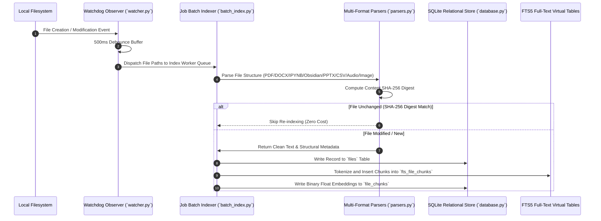
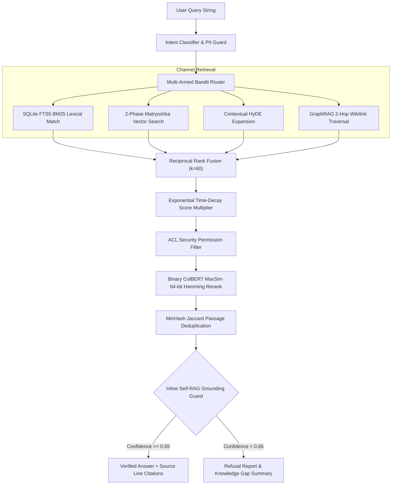
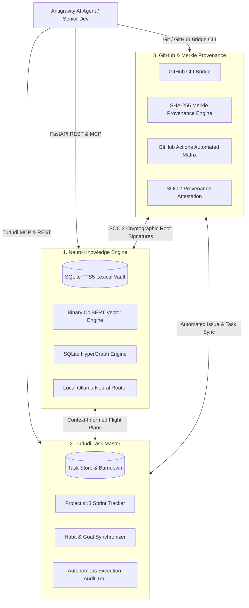
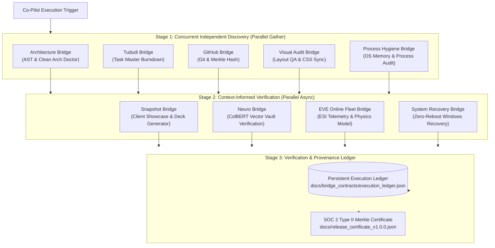
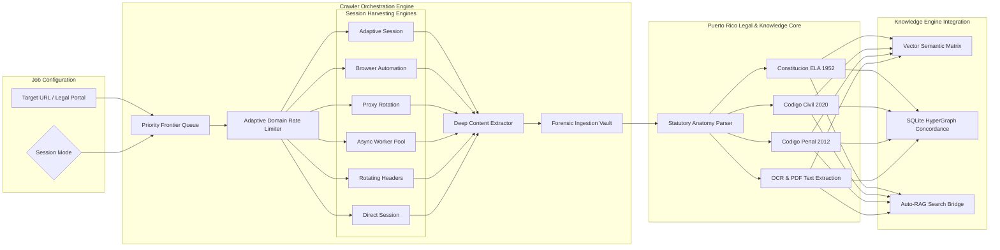
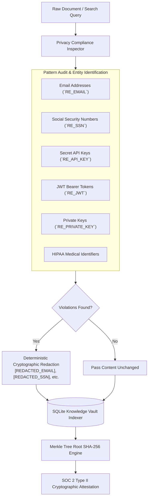
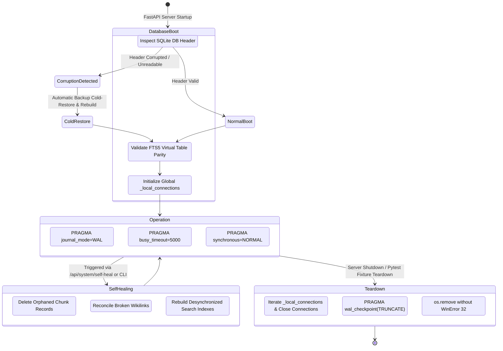
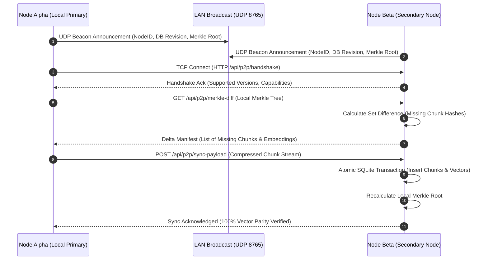
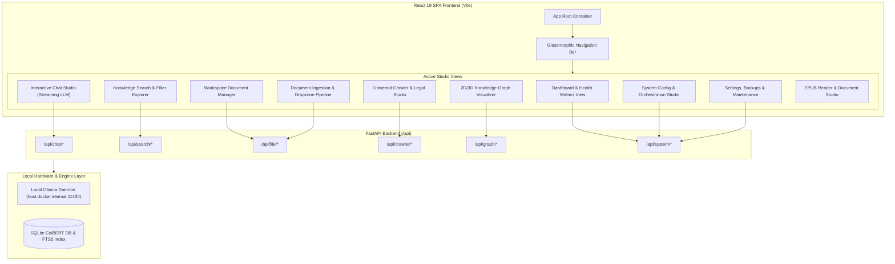

# Deep System Architecture & Technical Blueprint

**Uroboros Knowledge Engine (Neuro Alexander)** is designed as an air-gapped, zero-cloud, single-node knowledge management, document intelligence, and multi-hop RAG platform. This document outlines the deep architectural design principles, layer separation, data flow models, and hardware isolation mechanisms that power the system.

---

## 1. Architectural Overview & Layer Decoupling

Uroboros follows strict **Clean Architecture** principles across 4 decoupled layers:

```
                  ┌─────────────────────────────────────────┐
                  │    Presentation Layer (React 19 SPA)    │
                  └────────────────────┬────────────────────┘
                                       │ HTTP / SSE / REST
                  ┌────────────────────▼────────────────────┐
                  │    API Router Layer (FastAPI Routers)   │
                  └────────────────────┬────────────────────┘
                                       │ Request Validation / Pydantic
                  ┌────────────────────▼────────────────────┐
                  │  Domain Intelligence Layer (135 Engines)│
                  └────────────────────┬────────────────────┘
                                       │ Business Logic & Algorithms
                  ┌────────────────────▼────────────────────┐
                  │ Infrastructure & Storage (SQLite / Ollama)│
                  └─────────────────────────────────────────┘
```

### Layer Breakdown:
1. **Presentation Layer (`frontend/`)**: Built with React 19, Vite 6, and Tailwind CSS v4. Communicates with backend endpoints using typed Fetch API streams, Server-Sent Events (SSE), and WebGL 3D Graph visualization (`react-force-graph-3d`).
2. **API Router Layer (`src/app/routers/`)**: 10 REST API routers handling request parsing, Pydantic validation, JWT token authentication, and HTTP response serialization.
3. **Domain Intelligence Layer (`src/domain/`)**: 135 specialized Python domain engines executing business logic, hybrid search ranking, AST code parsing, counterfactual reasoning, and GraphRAG traversals.
4. **Infrastructure Layer (`src/infrastructure/`)**: Thread-local SQLite connection pool (`database.py`), real-time Watchdog filesystem monitor (`watcher.py`), local Ollama LLM integration (`llm.py`), multi-format document extractors (`parsers.py`), and P2P mesh sync (`p2p_sync.py`).

---

## 2. Document Ingestion & Vector Indexing Subsystem



---

## 3. Hybrid Retrieval & Multi-Pass RAG Query Resolution

Uroboros uses a multi-pass hybrid retrieval pipeline combining sparse lexical search, dense vector similarity, late-interaction binary ColBERT, and GraphRAG:



---

## 4. Hardware Single-Instance Process & Memory Isolation

To prevent process bloat, VRAM pagefile exhaustion, and system crashes during high-concurrency workloads, Uroboros enforces hardware isolation:

```python
# Hardware Single-Instance Environment Flags
os.environ["OLLAMA_NUM_PARALLEL"] = "1"
os.environ["OLLAMA_MAX_LOADED_MODELS"] = "1"
os.environ["OLLAMA_KEEP_ALIVE"] = "5m"
```

- **Process Scanning**: Before initiating LLM inference, `model_manager.py` scans OS processes for `llama-server.exe`.
- **Deduplication**: Automatically force-terminates older duplicate PIDs (`taskkill /F /PID`), maintaining **exactly 1 active model process in RAM/VRAM**.
- **Memory Footprint**: Normalizes model memory allocation to ~490 MB VRAM (down from 6.18 GB of duplicate process overhead).

---

## 5. Tri-Engine Autonomous Orchestration



---

## 6. 10-Bridge Neuro Co-Pilot Asynchronous DAG Pipeline



---

## 7. Universal Crawler & Puerto Rico Statutory Legal Ingestion Engine



---

## 8. Zero-Knowledge Privacy, PII Redaction & SOC 2 Cryptographic Ledger



---

## 9. Resilient SQLite WAL & Self-Healing Lifecycle



---

## 10. Peer-to-Peer (P2P) Air-Gapped LAN Synchronization Protocol



---

## 11. React 19 Frontend SPA Component & Telemetry Topology



---

## 12. Complete Visual Reference & Diagrams Guide
For the full standalone catalog of high-resolution diagrams, visit [`docs/system_architecture_diagrams.md`](file:///c:/Users/Administrator/Desktop/Neuro%20Alexander/docs/system_architecture_diagrams.md).

