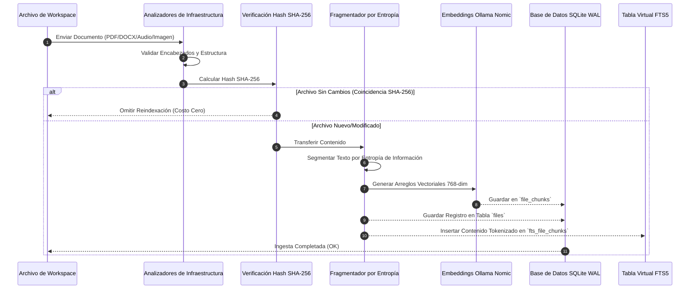

# Motor de Base de Datos de Conocimiento Uroboros (Neuro Alexander)

<p align="center">
  
  
  
  
  
  
  
</p>

---

## Resumen Ejecutivo

**Motor de Conocimiento Uroboros** (Neuro Alexander) es una plataforma de grado empresarial, autocontenida y de cero dependencias externas para la gestión de conocimiento, recuperación semántica e indexación de documentos. Desarrollado con un backend modular en **FastAPI**, motor vectorial y léxico **SQLite FTS5**, integración con **Ollama LLM** local y una interfaz web SPA en **React 18 / Vite**, Uroboros ofrece búsqueda local en tiempo real, análisis estructural, razonamiento RAG multietapa, streaming especulativo de contexto y exploración de conocimiento en gráficos 3D sin depender de servicios en la nube.

---

## 1. Fundamentos Matemáticos y Algoritmos de Recuperación

Uroboros emplea una estrategia de recuperación híbrida multipaso que combina coincidencia léxica, clasificación probabilística, similitud vectorial densa y puntuación de interacción tardía.

### 1.1 Clasificación Léxica Okapi BM25
La puntuación de relevancia probabilística del documento $D$ para la consulta $Q = \{q_1, q_2, \dots, q_n\}$ se calcula como:

$$Score_{BM25}(D, Q) = \sum_{i=1}^{n} IDF(q_i) \cdot \frac{f(q_i, D) \cdot (k_1 + 1)}{f(q_i, D) + k_1 \cdot \left(1 - b + b \cdot \frac{|D|}{avgdl}\right)}$$

Donde:
- $IDF(q_i) = \ln \left( \frac{N - n(q_i) + 0.5}{n(q_i) + 0.5} + 1 \right)$
- $k_1 = 1.5$ (parámetro de saturación de frecuencia de términos)
- $b = 0.75$ (parámetro de normalización de longitud de documento)
- $|D|$ es la longitud del documento en tokens, y $avgdl$ es la longitud promedio de documentos en el corpus.

### 1.2 Fusión de Rango Recíproco (RRF)
Para combinar distribuciones de puntuación entre recuperadores dispersos (BM25) y densos (Vectoriales), RRF calcula una puntuación unificada para el documento $d$:

$$RRF\_Score(d) = \sum_{m \in M} \frac{1}{k + r_m(d)}$$

Donde $M$ es el conjunto de canales de búsqueda y $k = 60$ es la constante de suavizado.

### 1.3 Interacción Tardía Binary ColBERT (MaxSim)
Para alineación de frases a nivel de token, los vectores flotantes de 768 dimensiones se cuantizan en arreglos binarios empaquetados de 768 bits:

$$MaxSim(Q, D) = \sum_{i \in Q} \max_{j \in D} \text{PopCount}(q_i \oplus d_j)$$

---

## 2. Diagramas de Flujo y Secuencia del Sistema

### 2.1 Ingesta de Documentos e Indexación Vectorial



---

## 3. Instalación y Configuración Rápida

1. **Instalar Dependencias**:
   ```bash
   pip install -r requirements.txt
   ```

2. **Inicializar e Indexar**:
   ```bash
   python know.py init
   python know.py index "C:\Ruta\A\Tu\Workspace"
   ```

3. **Iniciar Servidor Web Backend y Frontend**:
   ```bash
   uvicorn src.app.server:app --host 127.0.0.1 --port 8000 --reload
   ```

---

## 4. Guía de Ejecución de Pruebas

Para ejecutar el conjunto completo de más de 670 pruebas automatizadas:
```bash
python -m pytest -q --tb=short -m "not e2e and not slow"
python run_domain_tests.py
```

---

## 5. Licencia

Este proyecto está bajo la Licencia MIT. Consulta el archivo [`LICENSE`](LICENSE) para más detalles.
