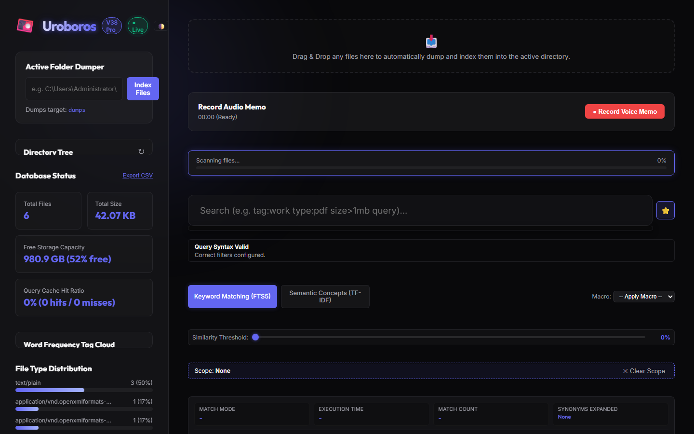
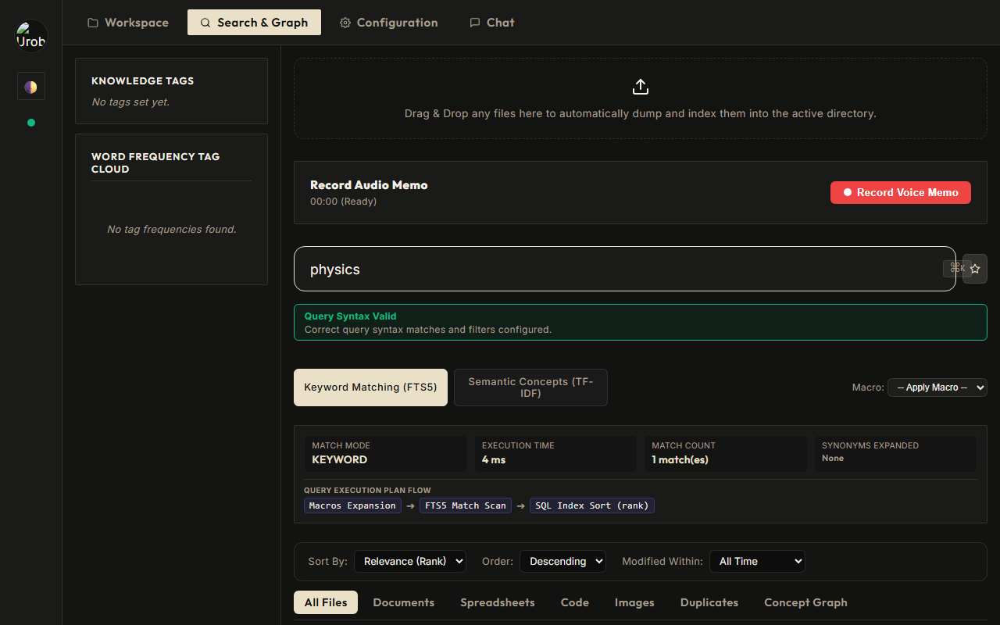
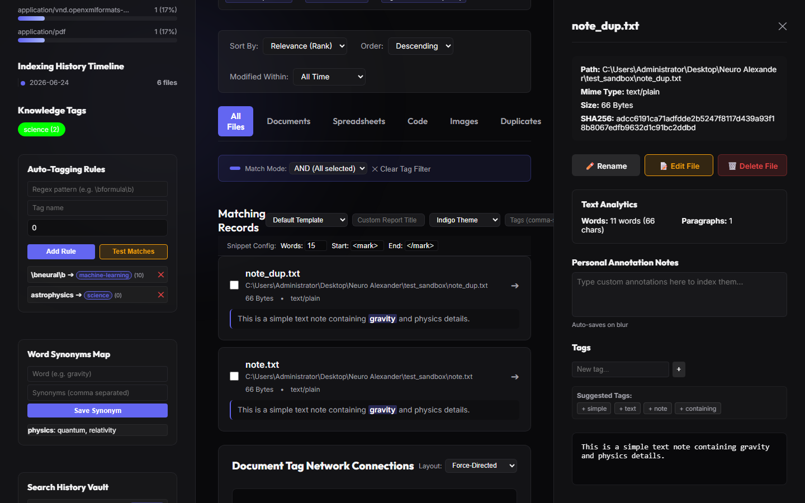
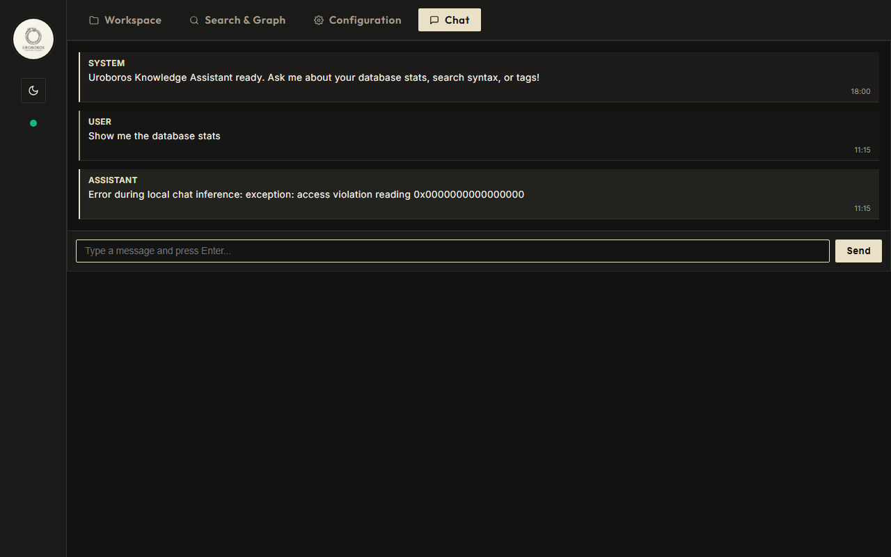

# Uroboros Knowledge Database Engine

<p align="center">
  
  
  
  
  
  
</p>

---

## About Uroboros

Uroboros is a lightweight, self-contained knowledge management, indexing, and semantic exploration engine. Built with zero-dependency minimalist core components, it serves as a central brain for search and text extraction on local workspaces. It is designed to automatically ingest, watch, tag, synonym-expand, and query documents without requiring bulky external vector database dependencies or heavy runtime models.

### Target Audience
- **Developers & Researchers**: Searching local codebases, documentation, research papers, and spreadsheets.
- **Privacy-First Teams**: Local processing of annotations, OCR text, and indexing logs without transmitting data outside local subnets.
- **Minimalist Engineers**: Leveraging standard SQLite tools and local indexing pipelines for extreme speed and low CPU footprints.

---

## Architectural Summary & Core Engines

### 1. Hybrid Search Architecture
Uroboros integrates a two-tier hybrid search system:
- **Lexical/FTS5 Engine**: Native SQLite FTS5 indexes files, annotations, and titles, query-expanding synonym substitutions dynamically.
- **MiniVectorEngine**: A pure-Python Vector Space Model (VSM) using TF-IDF scoring and cosine similarity comparisons to rank concept matches.

### 2. Active Directory Watcher Loop
A background OS file monitor checks directory stats in real-time, executing concurrent `ThreadPoolExecutor` workers to extract contents when files change, uploading snapshots lazily.

### 3. Automated Priority Tagging Rules
Ingested paths are matched against prioritized regular expression rules, executing tagging logic to classify items under custom badges.

---

## Key Features

- **Similarity Range Slider**: Filter semantic matching scores dynamically from the UI slider (0-100%).
- **Stackable Multi-tag Queries**: Stack selection filters using `AND` (intersection) or `OR` (union) tags selectors.
- **Bookmarks & Macros Vault**: Save macros and search parameters to SQLite caches.
- **PDF Report Customizer**: Generate customized ReportLab PDF directories with custom titles and brand accent palettes (*Indigo*, *Crimson*, *Emerald*, *Charcoal*).
- **Periodic DB Backups**: Back up the engine automatically to disk at custom intervals.

---

## System Views Walkthrough

Here is a visual guide to the views and management interface of Uroboros Knowledge Engine:

### 1. Main Dashboard View
The primary command center showing the database status, active directory tree, file type distribution chart, indexing timeline, and word frequency tag cloud.



### 2. Search & Interactive Tag Network Graph
Search files with lexical-semantic search, filter by similarity thresholds, preview text files in real-time, and view the document tag network connection graph.



### 3. Automated Configuration & Rules
Configure regex auto-tagging rules, word synonyms mappings, search bookmarks, backup schedulers, and monitor LAN sync peers.



### 4. Conversational LLM Assistant
Ask the local neural assistant questions about stored knowledge, query statistics, and document summaries with automatic source-citation links.



---

## Installation & Setup

1. **Install Dependencies**:
   ```bash
   pip install -r requirements.txt
   ```

2. **Initialize Database & Scan**:
   Create SQLite tables and scan the local `dumps/` directory:
   ```bash
   python know.py init
   python know.py index dumps
   ```

3. **Start Server**:
   ```bash
   python main.py
   ```
   Open `http://127.0.0.1:8000` inside your browser.

---

## Running Automated Tests

Execute the API routing and database validation test suites:
```bash
pytest test_api.py test_db.py
```
