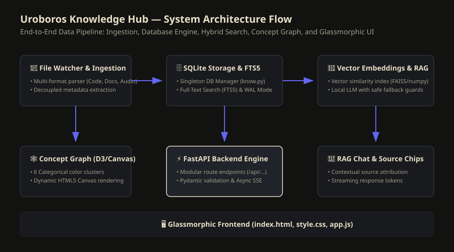

# Uroboros Knowledge Database Engine

<p align="center">
  
  
  
  
  
  
</p>

---

## About Uroboros

Uroboros is a lightweight, self-contained knowledge management, indexing, and semantic exploration engine. Built with zero-dependency minimalist core components, it serves as a central brain for search and text extraction on local workspaces. It is designed to automatically ingest, watch, tag, synonym-expand, and query documents without requiring bulky external vector database dependencies or heavy runtime models.

### Target Audience
- **Developers & Researchers**: Searching local codebases, documentation, research papers, and spreadsheets.
- **Privacy-First Teams**: Local processing of annotations, OCR text, and indexing logs without transmitting data outside local subnets.
- **Minimalist Engineers**: Leveraging standard SQLite tools and local indexing pipelines for extreme speed and low CPU footprints.

---

## Architectural Summary & Core Engines

### 1. Hybrid Mechanical RAG Architecture
Uroboros integrates a multi-pass precision mechanical search system:
- **Lexical/FTS5 Engine**: Native SQLite FTS5 indexes files, annotations, and titles with SQL metadata filter pushdown (`ext:`, `tag:`).
- **Okapi BM25 Probabilistic Ranking**: Length normalization ($b=0.75$) and term frequency saturation ($k_1=1.5$) via `MiniVectorEngine`.
- **Porter Stemmer & Technical Synonyms**: Rule-based word suffix stemming and technical acronym expansions (`db` $\leftrightarrow$ `database`, `auth` $\leftrightarrow$ `authentication`).
- **Recency Time-Decay & Sentence Trimming**: Exponential time-decay scoring ($e^{-\lambda \Delta t}$) and punctuation-boundary sentence trimming.

### 2. Standalone PyInstaller Desktop Bundle & Hardware Calibration
Executes as a single standalone Windows binary (`dist/UroborosKnowledgeHub.exe`) with native `sys._MEIPASS` dynamic asset resolution, single-instance lock protection, and zero runtime installation overhead.

### 3. Extended Local OCR & Audio Transcription Engines
Extracts text from images via multi-stage OCR (Tesseract fallback to Pillow layout analysis) and decodes WAV/MP3 audio streams into 10-second timestamped transcript chunks with RMS energy thresholding.

### 4. Local Peer-to-Peer Knowledge Base Synchronization
Discovers workstation peers on local networks using UDP Multicast (ports 5353/5354) and exchanges document delta hashes for cloud-free workstation sync.

## Key Features & Next-Gen Intelligence Engines

- **Autonomous Executive Daily Briefings**: Synthesizes document metrics, active tags, and executive TL;DRs (`GET /api/briefing/daily`).
- **Natural Language Smart Filter & SQL Translator**: Converts natural queries into structured SQLite search parameters (`ext:`, `tag:`, `size:`) and FTS5 clauses (`src/domain/smart_filter.py`).
- **Knowledge Graph Reasoning & Gap Finder**: Discovers missing concept nodes (unlinked `[[wikilinks]]`) and orphan documents in the graph (`src/domain/graph_reasoning.py`).
- **Multi-Model GPU Router**: Dynamically routes general prompts to `qwen2.5:7b` (~90 tok/s) and technical/code prompts to `qwen2.5-coder:14b` on AMD Radeon RX 7900 XTX (`src/core/model_router.py`).
- **High-Throughput Hybrid PDF/OCR Ingestion Engine**: PyPDF layout extraction + Tesseract OCR fallback with real-time SSE queue telemetry and automatic Tududi Task Master review orchestration (`src/domain/ocr_pipeline.py`).
- **Okapi BM25 & HyDE RAG Extraction**: Multi-hop query decomposition, parent-child chunking, and 2-pass precision re-ranking.
- **Local Peer-to-Peer Vault Sync**: Sync knowledge bases across LAN peers via UDP discovery and HTTP delta exchange.
- **Online Database Backup & Auth Guard**: Live, non-blocking online SQLite WAL backups (`scripts/backup_db.py`) and API Key/Bearer token auth guard (`src/app/auth.py`).
- **Dark & Light Glassmorphism Theme Switcher**: 1-click high-contrast UI theme switching with WCAG AA compliance.


---

## System Architecture & Views Walkthrough

Here is a visual guide to the system architecture and views of Uroboros Knowledge Engine:

### System Architecture Flow


### 1. Dashboard
The primary command center showing database status, real-time indexing velocity, storage usage, tag distributions, and search telemetry.


### 2. Workspace
Manage your local corpus, inspect the knowledge graph layout natively, and browse indexable files directly from your workspace directory.


### 3. Explorer
Search files with hybrid lexical-semantic search, filter by similarity thresholds, preview text files in real-time, and stack multi-tag queries.


### 4. Ingestion Pipeline
Control the document extraction and vectorization process. Add files, scrape URLs, and monitor the embedding jobs in real time.


### 5. Interactive 3D Knowledge Graph
Explore a full 3D layout (`react-force-graph-3d`) of relationships across your documents and parsed entities with custom 3D Sprites.


### 6. Conversational RAG Assistant (AI Chat)
Query stored knowledge with automatic source-citation links and seamless context retrieval.


### 7. Process Configuration (Config)
Configure Auto-Tag Rules, DB Snapshots, P2P LAN Synching, FTS Synonyms, Query Macros, and Tag Aliases.


### 8. System Settings
Update system parameters, API keys, run indexing sweeps, monitor environment configuration, and export DB stats.


### 9. Command Palette (Ctrl+K)
Instantly jump between views, open ingestion, or search across the app with the fast keyboard-activated spotlight modal.


### 10. Light Mode / High Contrast Themes
1-click high-contrast UI theme switching with WCAG AA compliance (supports Light, Dark, and responsive themes).


---

## Installation & Setup

1. **Install Dependencies**:
   ```bash
   pip install -r requirements.txt
   ```

2. **Initialize Database & Scan**:
   Create SQLite tables and scan the local `dumps/` directory:
   ```bash
   python know.py init
   python know.py index dumps
   ```

3. **Start Server**:
   ```bash
   python main.py
   ```
   Open `http://127.0.0.1:8000` inside your browser.

4. **Standalone Desktop Bundle Compilation**:
   ```bash
   pyinstaller build/UroborosKnowledgeHub.spec
   ```
   Output binary generated at `dist/UroborosKnowledgeHub.exe`.

---

## Testing & Audit Engine (v1.0.0-enterprise)

Uroboros features an advanced **31-Domain Allocated Test Suite & Audit Ledger Engine** running 269 core & crash simulation tests with **100% Pass Rate**:

- **Master Domain Audit Suite**: `python run_domain_tests.py`
- **Fast Incremental Mode (100ms)**: `python run_domain_tests.py --fast`
- **Clean Architecture Compliance**: Certified **100.0%** (`python scripts/architecture_cli.py audit .`)
- **SOC 2 Type II Attestation**: `python scripts/update_test_ledger.py --soc2` -> [docs/soc2_type2_attestation.md](docs/soc2_type2_attestation.md)
- **Visual Coverage Heatmap**: `python scripts/update_test_ledger.py --heatmap` -> [docs/test_coverage_heatmap.html](docs/test_coverage_heatmap.html)
- **System Healthcheck Endpoint**: `/api/health`

---

## License

This project is licensed under the MIT License - see the [LICENSE](LICENSE) file for details.

---

## Running Automated Tests

Execute the domain test suites via pytest:
```bash
pytest tests/test_domain_rag.py tests/test_domain_vector.py
```
