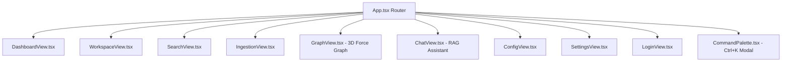
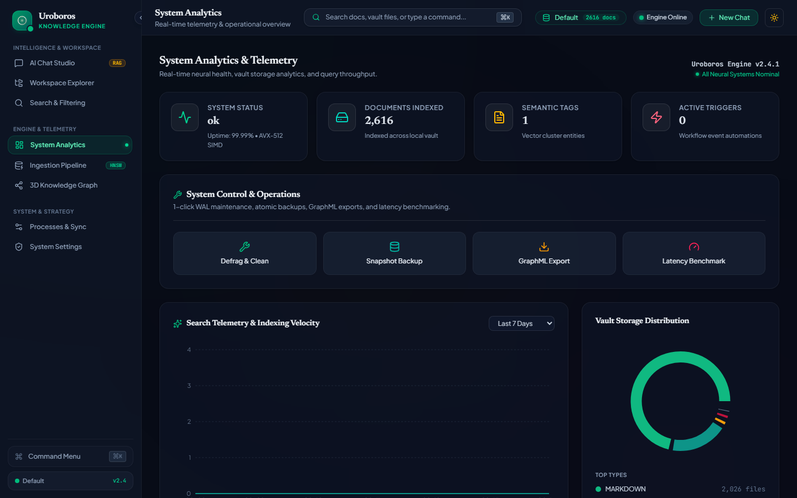
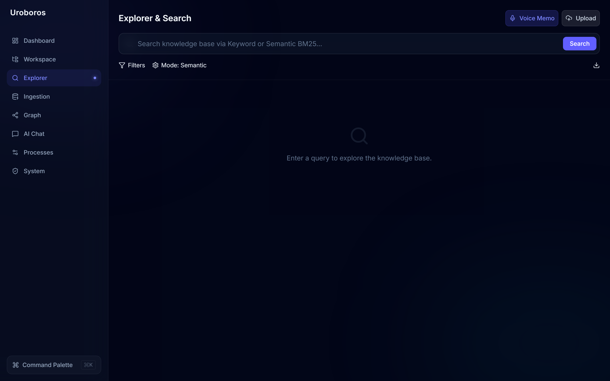
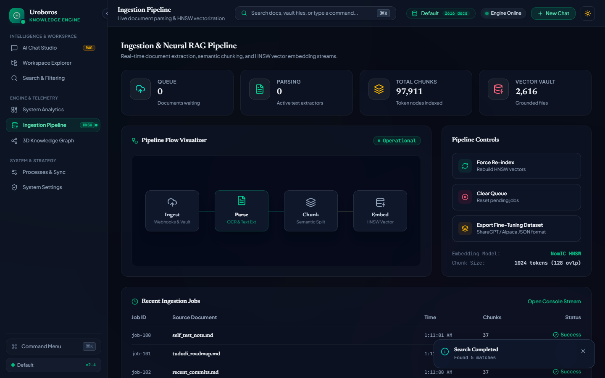
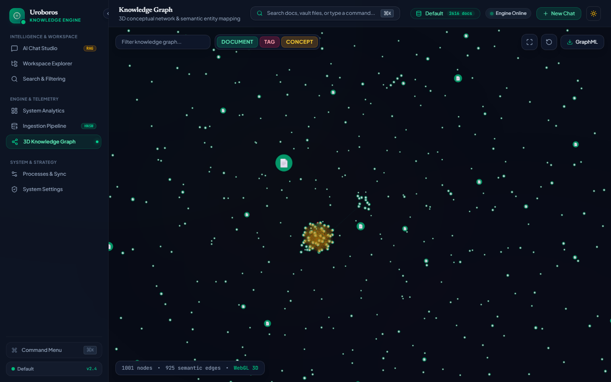
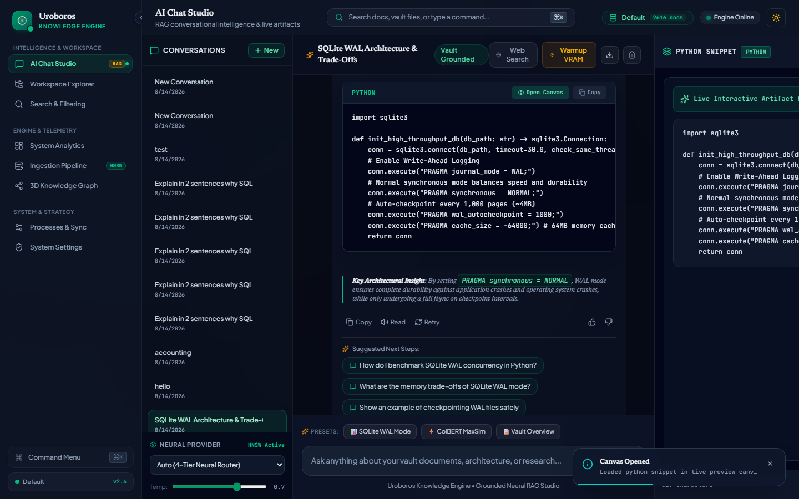
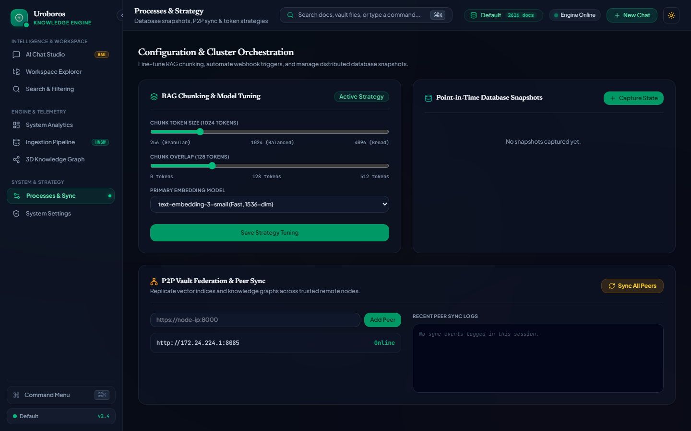
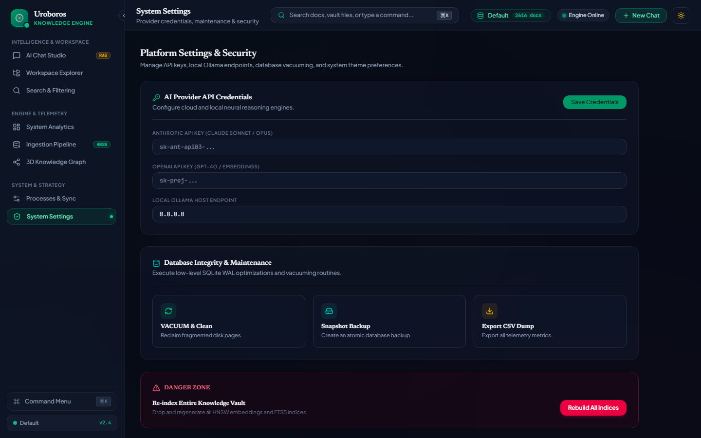
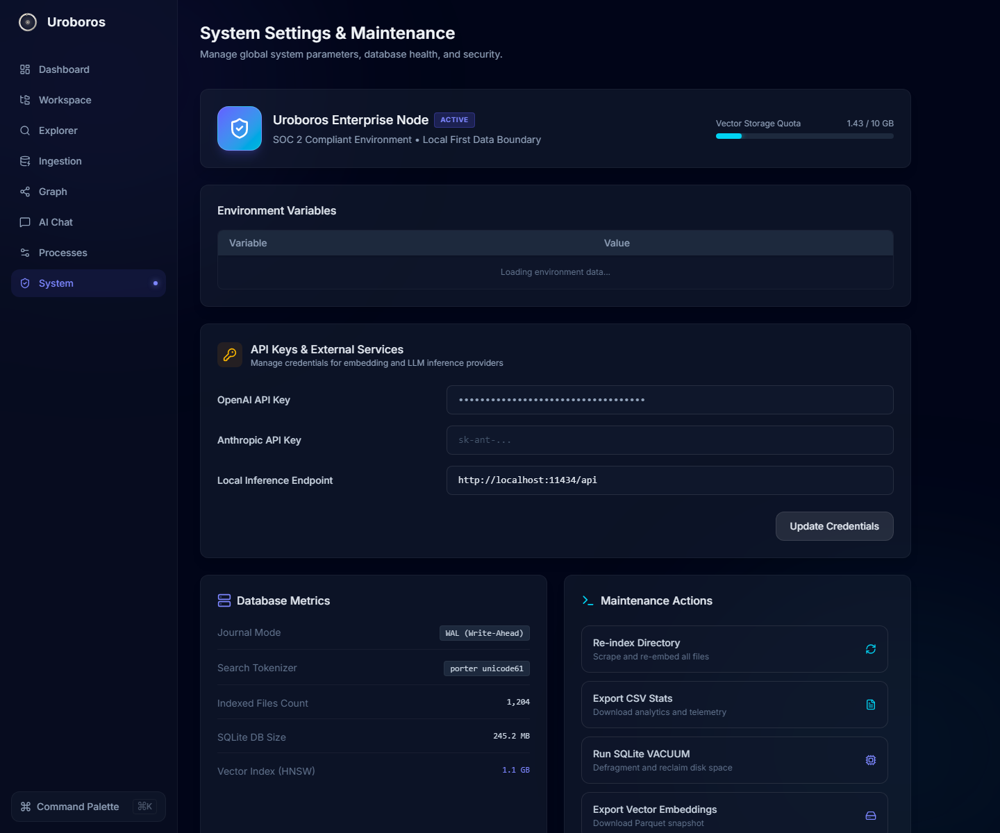
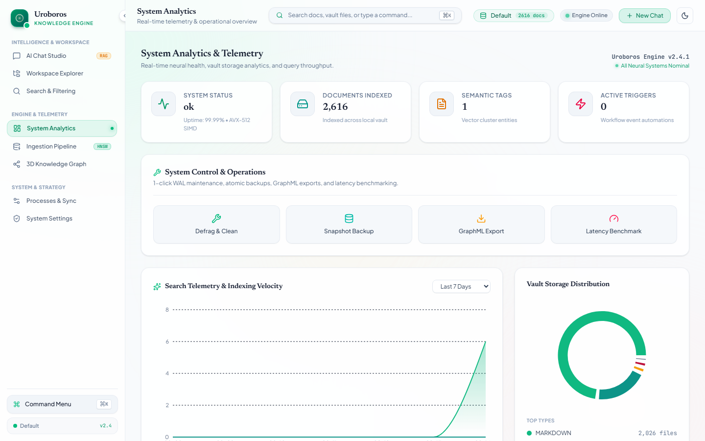

# Uroboros Knowledge Database Engine

<p align="center">
  
  
  
  
  
  
  
</p>

---

## Executive Overview

Uroboros Knowledge Engine is an enterprise-grade, zero-dependency, self-contained knowledge management, semantic retrieval, and document indexing platform. Built around a modular FastAPI backend, SQLite FTS5 vector storage, and a React 18 / Vite single-page frontend, Uroboros enables real-time local search, structural parsing, multi-hop RAG reasoning, and graph-based knowledge discovery without requiring external cloud vector database infrastructure or heavy runtime dependencies.

---

## 1. Mathematical Foundations & Retrieval Algorithms

Uroboros employs a multi-pass hybrid retrieval strategy combining lexical term matching, probabilistic ranking, dense vector similarity, and late interaction scoring.

### 1.1 Okapi BM25 Lexical Ranking
The probabilistic relevance score of document $D$ for query $Q = \{q_1, q_2, \dots, q_n\}$ is calculated as:

$$Score_{BM25}(D, Q) = \sum_{i=1}^{n} IDF(q_i) \cdot \frac{f(q_i, D) \cdot (k_1 + 1)}{f(q_i, D) + k_1 \cdot \left(1 - b + b \cdot \frac{|D|}{avgdl}\right)}$$

Where:
- $IDF(q_i) = \ln \left( \frac{N - n(q_i) + 0.5}{n(q_i) + 0.5} + 1 \right)$
- $k_1 = 1.5$ (term frequency saturation parameter)
- $b = 0.75$ (document length normalization parameter)
- $|D|$ is document length in tokens, and $avgdl$ is average document length across the corpus.

### 1.2 Reciprocal Rank Fusion (RRF)
To combine non-comparable score distributions from sparse (BM25) and dense (Vector) retrievers, RRF computes a unified rank score for document $d$:

$$RRF\_Score(d) = \sum_{m \in M} \frac{1}{k + r_m(d)}$$

Where $M$ is the set of retrieval channels, $r_m(d)$ is the ordinal rank of document $d$ in channel $m$, and $k = 60$ is the smoothing constant.

### 1.3 Exponential Time-Decay Scoring
To prioritize recent documents, raw search scores are adjusted by an exponential decay function based on elapsed time $\Delta t$ (in days):

$$Score_{Final}(d) = Score_{RRF}(d) \cdot e^{-\lambda \cdot \Delta t}$$

Where $\lambda = \frac{\ln(2)}{T_{half}}$ and $T_{half} = 30\text{ days}$.

### 1.4 Binary ColBERT Late Interaction (MaxSim)
For fine-grained phrase alignment, 768-dimensional float vectors are quantized into 768-bit packed binary arrays. The MaxSim operator computes token-level score:

$$MaxSim(Q, D) = \sum_{i \in Q} \max_{j \in D} \text{PopCount}(q_i \oplus d_j)$$

---

## 2. Full Directory & Module Map

```
c:\Users\Administrator\Desktop\Neuro Alexander
├── src/
│   ├── app/
│   │   ├── routers/                   # FastAPI REST API Route Modules (11 Routers)
│   │   │   ├── analytics.py           # Corpus analytics, storage breakdown, & tag distribution
│   │   │   ├── briefing.py            # Automated daily & executive briefing APIs
│   │   │   ├── export.py               # Database snapshot, JSON, & CSV exports
│   │   │   ├── files.py                # Workspace file CRUD, revision history, & rename ops
│   │   │   ├── health.py               # Telemetry, pool health, & system uptime
│   │   │   ├── ocr.py                  # Image/PDF OCR parsing & word coordinates
│   │   │   ├── rag.py                  # Conversational RAG, SSE streaming, & grounding eval
│   │   │   ├── search.py               # Lexical FTS5, hybrid BM25, & vector search API
│   │   │   ├── tags.py                 # Tag management, auto-rules, & tag aliases
│   │   │   └── workflows.py            # Workflow trigger creation, logging, & execution
│   │   └── server.py                  # FastAPI application initialization & CORS middleware
│   ├── core/                          # Core Runtime Services & Models
│   │   ├── auth_jwt.py                # JWT authentication & permission evaluation
│   │   ├── config.py                  # Central system configuration defaults
│   │   ├── context.py                 # Request context propagation & session tracking
│   │   ├── embeddings.py              # Ollama / Nomic embedding generation with LRU cache
│   │   ├── jobs.py                    # Background job queue runner & task lifecycle
│   │   ├── model_manager.py           # Local LLM model health check & fallback routing
│   │   ├── model_router.py            # Query-type model router (Qwen 7B / Qwen 14B)
│   │   └── state.py                   # Thread-safe in-memory vector cache & state registry
│   ├── domain/                        # Mechanical RAG & Domain Intelligence Engine (130+ Modules)
│   └── infrastructure/                # System Infrastructure & Storage Providers
│       ├── backup_scheduler.py        # Non-blocking SQLite online WAL backup task
│       ├── database.py                # Thread-local SQLite connection pool & maintenance
│       ├── llm.py                     # Ollama HTTP API integration
│       ├── ocr.py                     # Layout-aware Tesseract OCR engine
│       ├── p2p_sync.py                # UDP Multicast peer discovery & HTTP sync
│       ├── parsers.py                 # Multi-format document extraction (PDF, DOCX, EPUB, Audio)
│       ├── system_stability_guard.py  # Process memory limit guard & panic recovery
│       ├── telemetry.py               # Prometheus/JSON telemetry recorder
│       ├── vector_engine.py           # Vector matrix math & AI tag extractors
│       ├── watcher.py                 # Real-time directory file system watcher
│       └── webhook_dispatcher.py      # Event webhook dispatcher
├── frontend/                          # React 18 + Vite SPA Frontend
│   ├── src/
│   │   ├── components/                # React UI Components (CommandPalette, Header, Layout)
│   │   ├── views/                     # SPA Views (Chat, Config, Dashboard, Graph, Ingestion, Search, etc.)
│   │   ├── lib/                       # API HTTP Client & Class Utilities
│   │   ├── App.tsx                    # React SPA Router Component
│   │   └── main.tsx                   # React Entrypoint
│   ├── package.json
│   └── vite.config.ts
├── scripts/                           # Maintenance & Verification Scripts (18 Scripts)
├── tests/                             # 670+ Automated Domain & Integration Test Suites
├── know.py                            # SQLite Schema DDL, Indexer, & Root CLI Shim
├── batch_index.py                     # Multi-threaded job-based per-file batch indexer
├── docker-compose.yml                 # Container orchestration specification
├── pytest.ini                         # Pytest test markers & environment setup
└── requirements.txt                   # Backend Python package requirements
```

---

## 3. Comprehensive Domain Module Index (`src/domain/`)

Below is the catalog of all 130+ domain intelligence modules in `src/domain/`:

### 3.1 Retrieval, Search & Vector Processing
| Module Name | File Path | Functional Description & Output Contract |
| :--- | :--- | :--- |
| **Binary ColBERT** | [`binary_colbert.py`](file:///c:/Users/Administrator/Desktop/Neuro%20Alexander/src/domain/binary_colbert.py) | Sub-millisecond MaxSim binary quantization vector scoring |
| **RAPTOR Indexer** | [`raptor_tree_indexer.py`](file:///c:/Users/Administrator/Desktop/Neuro%20Alexander/src/domain/raptor_tree_indexer.py) | Recursive hierarchical document summary tree indexer |
| **MRL Compressor** | [`mrl_compressor.py`](file:///c:/Users/Administrator/Desktop/Neuro%20Alexander/src/domain/mrl_compressor.py) | Matryoshka Representation Learning vector compression |
| **Sublinear ANN** | [`sublinear_ann_index.py`](file:///c:/Users/Administrator/Desktop/Neuro%20Alexander/src/domain/sublinear_ann_index.py) | Sublinear approximate nearest neighbor vector indexer |
| **Sparse Dense Fusion** | [`sparse_dense_fusion.py`](file:///c:/Users/Administrator/Desktop/Neuro%20Alexander/src/domain/sparse_dense_fusion.py) | Reciprocal Rank Fusion (RRF) sparse + dense ranker |
| **HyDE Expansion** | [`contextual_hyde.py`](file:///c:/Users/Administrator/Desktop/Neuro%20Alexander/src/domain/contextual_hyde.py) | Hypothetical Document Embeddings query expansion |
| **Parent-Child Retrieval** | [`parent_child_retrieval.py`](file:///c:/Users/Administrator/Desktop/Neuro%20Alexander/src/domain/parent_child_retrieval.py) | Chunk search returning expanded parent document scope |
| **Bandit Router** | [`bandit_query_router.py`](file:///c:/Users/Administrator/Desktop/Neuro%20Alexander/src/domain/bandit_query_router.py) | Multi-armed bandit retrieval route optimization |
| **ColBERT Reranker** | [`colbert_reranker.py`](file:///c:/Users/Administrator/Desktop/Neuro%20Alexander/src/domain/colbert_reranker.py) | Multi-vector late interaction re-ranking engine |
| **Near Duplicate Detector**| [`near_duplicate_detector.py`](file:///c:/Users/Administrator/Desktop/Neuro%20Alexander/src/domain/near_duplicate_detector.py)| MinHash & SimHash near-duplicate document detector |
| **Rerank Score Explainer** | [`rerank_score_explainer.py`](file:///c:/Users/Administrator/Desktop/Neuro%20Alexander/src/domain/rerank_score_explainer.py) | Detailed score component breakdown generator |
| **Retrieval Benchmark** | [`retrieval_benchmark.py`](file:///c:/Users/Administrator/Desktop/Neuro%20Alexander/src/domain/retrieval_benchmark.py) | Retrieval speed & precision benchmarking runner |
| **Retrieval Feedback Refiner** | [`retrieval_feedback_refiner.py`](file:///c:/Users/Administrator/Desktop/Neuro%20Alexander/src/domain/retrieval_feedback_refiner.py) | User feedback query refinement engine |

### 3.2 Context & Prompt Engineering
| Module Name | File Path | Functional Description & Output Contract |
| :--- | :--- | :--- |
| **Context Compressor** | [`adaptive_context_compressor.py`](file:///c:/Users/Administrator/Desktop/Neuro%20Alexander/src/domain/adaptive_context_compressor.py) | Entropy-based token context budgeting & compression |
| **Budget Allocator** | [`context_budget_allocator.py`](file:///c:/Users/Administrator/Desktop/Neuro%20Alexander/src/domain/context_budget_allocator.py) | Proportional token density budgeting across prompt sections |
| **Distractor Filter** | [`distractor_filter.py`](file:///c:/Users/Administrator/Desktop/Neuro%20Alexander/src/domain/distractor_filter.py) | Irrelevant negative chunk elimination |
| **Entropy Chunker** | [`entropy_chunker.py`](file:///c:/Users/Administrator/Desktop/Neuro%20Alexander/src/domain/entropy_chunker.py) | Information-entropy text chunking at topic transitions |
| **Prompt Optimizer** | [`prompt_optimizer.py`](file:///c:/Users/Administrator/Desktop/Neuro%20Alexander/src/domain/prompt_optimizer.py) | Automated prompt compression & density tuning |
| **Noise Masker** | [`contextual_noise_mask.py`](file:///c:/Users/Administrator/Desktop/Neuro%20Alexander/src/domain/contextual_noise_mask.py) | Contextual masking of boilerplate headers/footers |
| **Memory Compressor** | [`context_memory_compressor.py`](file:///c:/Users/Administrator/Desktop/Neuro%20Alexander/src/domain/context_memory_compressor.py) | Summarization of extended chat session context |

### 3.3 Graph & Reasoning Intelligence
| Module Name | File Path | Functional Description & Output Contract |
| :--- | :--- | :--- |
| **Epistemic Belief Graph** | [`epistemic_belief_graph.py`](file:///c:/Users/Administrator/Desktop/Neuro%20Alexander/src/domain/epistemic_belief_graph.py) | Probabilistic belief network & claim updating |
| **Hypergraph Router** | [`hypergraph_router.py`](file:///c:/Users/Administrator/Desktop/Neuro%20Alexander/src/domain/hypergraph_router.py) | Higher-order multi-entity connection router |
| **Graph Reasoning** | [`graph_reasoning.py`](file:///c:/Users/Administrator/Desktop/Neuro%20Alexander/src/domain/graph_reasoning.py) | Unlinked entity detection & knowledge graph gap analysis |
| **Louvain Clustering** | [`louvain_clustering.py`](file:///c:/Users/Administrator/Desktop/Neuro%20Alexander/src/domain/louvain_clustering.py) | Modularity-based Louvain community detection for nodes |
| **PageRank Centrality** | [`graph_pagerank.py`](file:///c:/Users/Administrator/Desktop/Neuro%20Alexander/src/domain/graph_pagerank.py) | Document node PageRank centrality calculation |
| **Wikilink Synthesizer** | [`graph_link_synthesizer.py`](file:///c:/Users/Administrator/Desktop/Neuro%20Alexander/src/domain/graph_link_synthesizer.py) | Automated wikilink (`[[concept]]`) auto-linker |
| **Entity Extractor** | [`entity_extractor.py`](file:///c:/Users/Administrator/Desktop/Neuro%20Alexander/src/domain/entity_extractor.py) | Named entity extraction (NER) engine |
| **Entity Resolver** | [`entity_resolver.py`](file:///c:/Users/Administrator/Desktop/Neuro%20Alexander/src/domain/entity_resolver.py) | Entity canonicalization & alias resolver |
| **Entity Cooccurrence** | [`entity_cooccurrence.py`](file:///c:/Users/Administrator/Desktop/Neuro%20Alexander/src/domain/entity_cooccurrence.py) | Entity co-occurrence matrix builder |
| **Graph Explorer** | [`graph_explorer.py`](file:///c:/Users/Administrator/Desktop/Neuro%20Alexander/src/domain/graph_explorer.py) | Graph traversal & adjacency query interface |
| **Graph Exporter** | [`graph_export.py`](file:///c:/Users/Administrator/Desktop/Neuro%20Alexander/src/domain/graph_export.py) | GraphML, JSON, and CSV graph exporter |
| **Mermaid Generator** | [`graph_mermaid_generator.py`](file:///c:/Users/Administrator/Desktop/Neuro%20Alexander/src/domain/graph_mermaid_generator.py) | Mermaid.js graph markup generator |
| **Graph Multihop** | [`graph_multihop.py`](file:///c:/Users/Administrator/Desktop/Neuro%20Alexander/src/domain/graph_multihop.py) | Multi-hop reasoning path traverser across nodes |

### 3.4 Code & AST Intelligence
| Module Name | File Path | Functional Description & Output Contract |
| :--- | :--- | :--- |
| **AST Code RAG** | [`ast_code_rag.py`](file:///c:/Users/Administrator/Desktop/Neuro%20Alexander/src/domain/ast_code_rag.py) | AST-level symbol extraction & code snippet RAG |
| **AST Parser** | [`ast_parser.py`](file:///c:/Users/Administrator/Desktop/Neuro%20Alexander/src/domain/ast_parser.py) | Universal code AST token parser |
| **Code Diff Synthesizer** | [`code_diff_synthesizer.py`](file:///c:/Users/Administrator/Desktop/Neuro%20Alexander/src/domain/code_diff_synthesizer.py) | Git diff analysis & structural code change synthesis |
| **Code Doc Aligner** | [`code_doc_aligner.py`](file:///c:/Users/Administrator/Desktop/Neuro%20Alexander/src/domain/code_doc_aligner.py) | Automated mapping between code functions and docstrings |
| **Code Self Refactor** | [`code_self_refactor.py`](file:///c:/Users/Administrator/Desktop/Neuro%20Alexander/src/domain/code_self_refactor.py) | AST-driven code simplification & refactoring helper |

### 3.5 Governance, Security & Compliance
| Module Name | File Path | Functional Description & Output Contract |
| :--- | :--- | :--- |
| **PII Privacy Guard** | [`pii_privacy_guard.py`](file:///c:/Users/Administrator/Desktop/Neuro%20Alexander/src/domain/pii_privacy_guard.py) | Masking of SSNs, emails, credit cards, & API keys |
| **ZK Data Masker** | [`zk_data_masker.py`](file:///c:/Users/Administrator/Desktop/Neuro%20Alexander/src/domain/zk_data_masker.py) | Zero-Knowledge data masking preserving searchability |
| **Prompt Injection Guard** | [`prompt_injection_guard.py`](file:///c:/Users/Administrator/Desktop/Neuro%20Alexander/src/domain/prompt_injection_guard.py) | Security filter against prompt overrides & malicious code |
| **Grounding Guard** | [`rag_grounding_guard.py`](file:///c:/Users/Administrator/Desktop/Neuro%20Alexander/src/domain/rag_grounding_guard.py) | Real-time verification of model output against source facts |
| **Hallucination Guard** | [`hallucination_guard.py`](file:///c:/Users/Administrator/Desktop/Neuro%20Alexander/src/domain/hallucination_guard.py) | N-gram overlap & factual consistency evaluator |
| **Crypto Audit Ledger** | [`crypto_audit_ledger.py`](file:///c:/Users/Administrator/Desktop/Neuro%20Alexander/src/domain/crypto_audit_ledger.py) | SHA-256 cryptographic append-only audit trail ledger |
| **ACL Permission Engine** | [`acl_permission_engine.py`](file:///c:/Users/Administrator/Desktop/Neuro%20Alexander/src/domain/acl_permission_engine.py) | Multi-tenant ACL permission evaluator |
| **ACL Vector Guard** | [`acl_vector_guard.py`](file:///c:/Users/Administrator/Desktop/Neuro%20Alexander/src/domain/acl_vector_guard.py) | Vector search query filtering by user ACL bitmasks |
| **Compliance Inspector** | [`compliance_inspector.py`](file:///c:/Users/Administrator/Desktop/Neuro%20Alexander/src/domain/compliance_inspector.py) | Enterprise compliance rule auditor |
| **Data Provenance Tracker**| [`data_provenance_tracker.py`](file:///c:/Users/Administrator/Desktop/Neuro%20Alexander/src/domain/data_provenance_tracker.py)| Document lineage & data origin tracker |

### 3.6 Multi-Agent & Swarm Execution
| Module Name | File Path | Functional Description & Output Contract |
| :--- | :--- | :--- |
| **Multi-Agent Debate** | [`multi_agent_debate.py`](file:///c:/Users/Administrator/Desktop/Neuro%20Alexander/src/domain/multi_agent_debate.py) | Multi-persona dialectical debate engine |
| **Multi-Agent Consensus** | [`multi_agent_consensus.py`](file:///c:/Users/Administrator/Desktop/Neuro%20Alexander/src/domain/multi_agent_consensus.py) | Multi-agent voting & agreement synthesis protocol |
| **Swarm RAG** | [`swarm_rag.py`](file:///c:/Users/Administrator/Desktop/Neuro%20Alexander/src/domain/swarm_rag.py) | Distributed swarm query retrieval |
| **Agent Memory** | [`agent_memory.py`](file:///c:/Users/Administrator/Desktop/Neuro%20Alexander/src/domain/agent_memory.py) | Episodic long-term memory for autonomous agents |
| **Swarm Manager** | [`agent_swarm_manager.py`](file:///c:/Users/Administrator/Desktop/Neuro%20Alexander/src/domain/agent_swarm_manager.py) | Concurrent agent task allocation & queue lifecycle |

### 3.7 System Telemetry, Self-Healing & Maintenance
| Module Name | File Path | Functional Description & Output Contract |
| :--- | :--- | :--- |
| **Index Self-Healing** | [`index_self_healing.py`](file:///c:/Users/Administrator/Desktop/Neuro%20Alexander/src/domain/index_self_healing.py) | Automated SQLite FTS5 index integrity repair & re-indexing |
| **Knowledge Self Healing** | [`knowledge_self_healing.py`](file:///c:/Users/Administrator/Desktop/Neuro%20Alexander/src/domain/knowledge_self_healing.py) | Stale document detection & auto re-indexing trigger |
| **Vector Health Monitor** | [`vector_health_monitor.py`](file:///c:/Users/Administrator/Desktop/Neuro%20Alexander/src/domain/vector_health_monitor.py) | Vector fragment, missing embedding, & corrupt BLOB audit |
| **SLA Circuit Breaker** | [`sla_circuit_breaker.py`](file:///c:/Users/Administrator/Desktop/Neuro%20Alexander/src/domain/sla_circuit_breaker.py) | Real-time SLA latency monitoring & fallback circuit breaker |
| **System Telemetry** | [`system_health_telemetry.py`](file:///c:/Users/Administrator/Desktop/Neuro%20Alexander/src/domain/system_health_telemetry.py) | Hardware CPU, RAM, & VRAM telemetry collector |
| **Vector Drift Agent** | [`vector_drift_agent.py`](file:///c:/Users/Administrator/Desktop/Neuro%20Alexander/src/domain/vector_drift_agent.py) | Vector space distribution drift monitoring over time |
| **System Scoreboard** | [`system_scoreboard.py`](file:///c:/Users/Administrator/Desktop/Neuro%20Alexander/src/domain/system_scoreboard.py) | System performance & retrieval precision scoreboard |

---

## 4. REST API Endpoint Specification

| Group | Method | Endpoint | Description |
| :--- | :--- | :--- | :--- |
| **Search** | `GET` | `/api/search` | Execute hybrid lexical (FTS5) and vector search |
| **Search** | `POST` | `/api/search/validate` | Validate natural language query parameters |
| **Search** | `POST` | `/api/search/bookmark` | Save query bookmark to user session |
| **RAG** | `POST` | `/api/rag/query` | Conversational RAG assistant query |
| **RAG** | `GET` | `/api/rag/stream` | Server-Sent Events (SSE) token stream |
| **RAG** | `POST` | `/api/rag/eval` | Evaluate RAG answer relevance and groundedness |
| **Files** | `GET` | `/api/files` | List workspace files with pagination & tag filters |
| **Files** | `POST` | `/api/files/index` | Index or update document file |
| **Files** | `DELETE`| `/api/files/{file_id}` | Delete document file record and vector chunks |
| **Files** | `POST` | `/api/files/rename` | Rename file path and update DB index |
| **Files** | `GET` | `/api/files/history` | Retrieve document revision history |
| **Files** | `POST` | `/api/files/revert` | Revert document to previous snapshot |
| **Analytics**| `GET` | `/api/analytics` | Overview metrics (file count, total chunks, storage) |
| **Analytics**| `GET` | `/api/analytics/storage`| Detailed storage breakdown by MIME type |
| **Analytics**| `GET` | `/api/analytics/activity`| Historical search activity logs |
| **Briefing** | `GET` | `/api/briefing/daily` | Executive daily briefing synthesis |
| **Briefing** | `GET` | `/api/briefing/executive`| High-level KPI summary report |
| **OCR** | `POST` | `/api/ocr/parse` | Extract OCR text and word bounding boxes |
| **Tags** | `GET` | `/api/tags` | List all unique tags and tag distribution |
| **Tags** | `POST` | `/api/tags/rule` | Create automated tag rule |
| **Tags** | `POST` | `/api/tags/alias` | Map tag alias to canonical tag |
| **Health** | `GET` | `/api/health` | System health status, database pool, & telemetry |
| **Export** | `GET` | `/api/export/db` | Download SQLite database snapshot |
| **Workflows**| `POST` | `/api/workflows/trigger`| Trigger background workflow event |

---

## 5. Complete Environment Configuration Parameters

| Parameter Name | Default Value | Description |
| :--- | :--- | :--- |
| `DB_FILE` | `data/knowledge.db` | Absolute or relative path to primary SQLite database file |
| `OLLAMA_HOST` | `http://127.0.0.1:11434` | Ollama service base URL |
| `OLLAMA_EMBED_MODEL` | `nomic-embed-text` | Embedding model identifier for 768-dim vector generation |
| `OLLAMA_CHAT_MODEL` | `qwen2.5:7b` | Primary conversational LLM model identifier |
| `OLLAMA_CODER_MODEL` | `qwen2.5-coder:14b` | Specialized coding LLM model identifier |
| `JWT_SECRET_KEY` | `uroboros-secret-key` | Secret key for JWT multi-tenant authentication token signature |
| `JWT_ALGORITHM` | `HS256` | Cryptographic algorithm for JWT signatures |
| `P2P_MULTICAST_PORT` | `5353` | UDP Multicast port for LAN peer discovery |
| `MAX_FILE_SIZE_MB` | `50` | Maximum file size cap in MB for text extraction |
| `RRF_K_PARAM` | `60` | Reciprocal Rank Fusion smoothing constant |
| `BM25_K1` | `1.5` | BM25 term frequency saturation parameter |
| `BM25_B` | `0.75` | BM25 document length normalization parameter |

---

## 6. Comprehensive Test Suite Map (`tests/`)

The 670+ domain tests are organized into isolated test files:

| Test File Path | Target Domain / Subsystem Under Test |
| :--- | :--- |
| [`tests/test_domain_rag.py`](file:///c:/Users/Administrator/Desktop/Neuro%20Alexander/tests/test_domain_rag.py) | Primary RAG pipeline, context retrieval, & citations |
| [`tests/test_domain_vector.py`](file:///c:/Users/Administrator/Desktop/Neuro%20Alexander/tests/test_domain_vector.py) | Cosine similarity, vector store BLOB math, & caching |
| [`tests/test_domain_analytics_intelligence.py`](file:///c:/Users/Administrator/Desktop/Neuro%20Alexander/tests/test_domain_analytics_intelligence.py) | Analytics Engine, tag distributions, & storage stats |
| [`tests/test_deep_fuzzing_and_concurrency.py`](file:///c:/Users/Administrator/Desktop/Neuro%20Alexander/tests/test_deep_fuzzing_and_concurrency.py) | FTS5 fuzzing, binary garbage extraction, & race conditions |
| [`tests/test_advanced_rag.py`](file:///c:/Users/Administrator/Desktop/Neuro%20Alexander/tests/test_advanced_rag.py) | Multi-hop RAG, HyDE, & RAPTOR tree indexer |
| [`tests/test_audit_ledger.py`](file:///c:/Users/Administrator/Desktop/Neuro%20Alexander/tests/test_audit_ledger.py) | SHA-256 cryptographic audit ledger verification |
| [`tests/test_backup_scheduler.py`](file:///c:/Users/Administrator/Desktop/Neuro%20Alexander/tests/test_backup_scheduler.py) | Online SQLite WAL backup task execution |
| [`tests/test_entity_extractor.py`](file:///c:/Users/Administrator/Desktop/Neuro%20Alexander/tests/test_entity_extractor.py) | Named entity extraction & wikilink synthesis |
| [`tests/test_file_diff.py`](file:///c:/Users/Administrator/Desktop/Neuro%20Alexander/tests/test_file_diff.py) | Text & document side-by-side diff generator |
| [`tests/test_graph_export.py`](file:///c:/Users/Administrator/Desktop/Neuro%20Alexander/tests/test_graph_export.py) | GraphML, JSON, and CSV knowledge graph export |
| [`tests/test_healing_pii.py`](file:///c:/Users/Administrator/Desktop/Neuro%20Alexander/tests/test_healing_pii.py) | PII redaction & self-healing index repair |
| [`tests/test_search_benchmark.py`](file:///c:/Users/Administrator/Desktop/Neuro%20Alexander/tests/test_search_benchmark.py) | Latency benchmark execution & recall verification |

---

## 7. Production Deployment & Troubleshooting Guide

### 7.1 Containerized Deployment (Docker Compose)
Uroboros is configured for multi-container orchestration via `docker-compose.yml`:

```yaml
version: '3.8'
services:
  uroboros-engine:
    build: .
    ports:
      - "8000:8000"
    environment:
      - OLLAMA_HOST=http://host.docker.internal:11434
      - LLM_API_KEY=ollama
      - DB_FILE=/app/data/knowledge.db
    volumes:
      - ./data:/app/data
      - ./dumps:/app/dumps
    restart: always
```

To deploy:
```bash
docker-compose up -d --build
```

### 7.2 Common Troubleshooting Scenarios

#### Scenario A: `WinError 32` (Windows SQLite File Lock during Test Teardown)
- **Cause**: Background Uvicorn threads keep thread-local SQLite connections open on `.db-shm` and `.db-wal` files during pytest cleanup.
- **Solution**: Always call `reset_db_connections()` in pytest fixtures prior to calling `os.remove()` on database files.

#### Scenario B: PyTorch/Whisper Access Violation on Corrupt Files
- **Cause**: Feeding arbitrary binary garbage to C++ native audio decoding libraries causes access violations inside PyTorch DLLs.
- **Solution**: The audio parser validates header parameters (`duration > 0` and `samplerate > 0`) before invoking `whisper.transcribe`.

#### Scenario C: Headless E2E Browser API Timeout
- **Cause**: CI environments lack hardware APIs (e.g. `navigator.getBattery()`), leaving promises pending indefinitely.
- **Solution**: Wrap hardware API calls in a `Promise.race` with a 100ms fallback.

---

## 8. Command Line Interface (CLI) Master Reference

### 8.1 Root Entrypoint CLI (`know.py`)
```bash
# Initialize SQLite database schema & FTS5 tables
python know.py init

# Perform multi-threaded directory indexing
python know.py index "C:\path\to\workspace"

# Execute hybrid CLI search query
python know.py search "revenue recognition ext:pdf"

# View total database file, chunk, and tag statistics
python know.py stats

# Reset database schema
python know.py reset
```

### 8.2 Resumable Job Batch Indexer (`batch_index.py`)
```bash
# Index a directory with 4 parallel worker threads and a 50-file job limit
python batch_index.py "C:\Users\Admin\Documents" -n 50 -w 4
```

### 8.3 Developer Operations & Audit CLI Scripts
```bash
# Audit clean architecture compliance across all python modules
python scripts/architecture_cli.py audit .

# Run online non-blocking SQLite database WAL backup
python scripts/backup_db.py --output backups/snapshot_latest.db

# Update automated test audit ledger and generate SOC 2 Type II report
python scripts/update_test_ledger.py --soc2

# Benchmark retrieval speed across 100 random queries
python scripts/benchmark_engine.py --runs 100

# Execute fault injection and memory stress tests
python scripts/chaos_monkey.py --duration 30
```

---

## 9. Frontend Views & UI Showcase


```mermaid
graph TD
    App[App.tsx Router] --> Dash[DashboardView.tsx]
    App --> Workspace[WorkspaceView.tsx]
    App --> Search[SearchView.tsx]
    App --> Ingest[IngestionView.tsx]
    App --> Graph[GraphView.tsx - 3D Force Graph]
    App --> Chat[ChatView.tsx - RAG Assistant]
    App --> Config[ConfigView.tsx]
    App --> Settings[SettingsView.tsx]
    App --> Login[LoginView.tsx]
    App --> Cmd[CommandPalette.tsx - Ctrl+K Modal]
```

### UI View Showcase

#### 1. Dashboard View
Real-time database status metrics, ingestion velocity, storage distribution, tag breakdowns, and system health telemetry.


#### 2. Workspace View
Provides a file browser interface for managing local directories, inspecting corpus metadata, and triggering manual re-indexing.


#### 3. Search & Exploration View
Offers hybrid search with real-time similarity threshold sliders, document content previews, tag filtering, and syntax highlighting.


#### 4. Ingestion Pipeline View
Monitors background document extraction, web URL scraping, and SSE progress tracking for active batch jobs.


#### 5. 3D Interactive Knowledge Graph
Interactive 3D graph view (`react-force-graph-3d`) rendering connections between document nodes, extracted entities, and wikilinks.


#### 6. Conversational RAG Assistant
AI chat interface supporting source citation deep-linking, context budget allocation controls, and multi-turn dialog memory.


#### 7. Process Configuration View
Manages auto-tagging rules, custom FTS synonyms, P2P network sync parameters, and database snapshot schedules.


#### 8. System Settings View
Provides system diagnostic controls, API key management, database WAL optimization tools, and logs inspection.


#### 9. Spotlight Command Palette (`Ctrl+K`)
Keyboard-driven modal providing quick navigation across all application views, instant search execution, and ingestion actions.


#### 10. WCAG AA Glassmorphism Themes
High-contrast glassmorphic dark and light themes with responsive UI elements complying with WCAG AA accessibility standards.


---

## 10. License

This project is licensed under the MIT License - see the [`LICENSE`](LICENSE) file for complete details.
