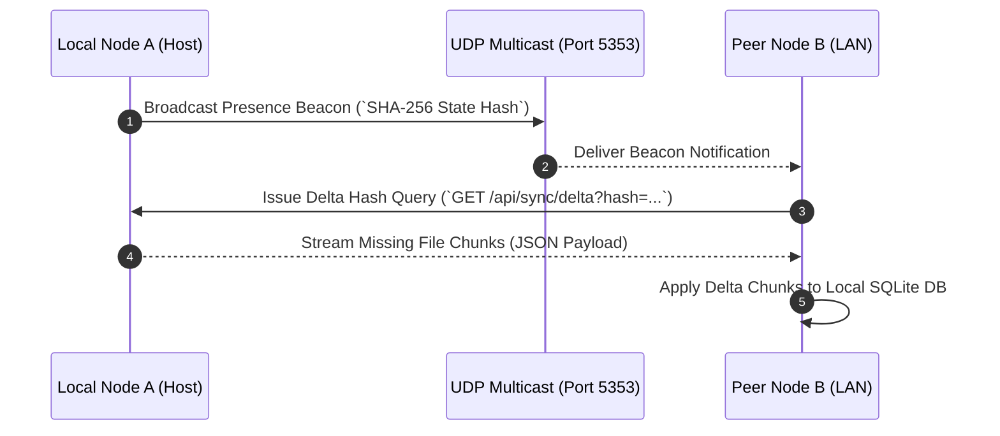

# Architectural Design Specification & System Topology

## Executive Overview

**Uroboros Knowledge Engine (Neuro Alexander)** is designed according to **Clean Polyglot Architecture** principles, enforcing strict separation of concerns across presentation, API routing, core domain logic, and physical storage infrastructure.

```
+-----------------------------------------------------------------------+
|                         Presentation Layer                            |
|             React 19 SPA + Vite + Tailwind CSS (frontend/)            |
+-----------------------------------------------------------------------+
                                    | HTTP / SSE / REST / WebSockets
                                    v
+-----------------------------------------------------------------------+
|                          API Router Layer                             |
|          10 Modular FastAPI Routers (src/app/routers/*.py)           |
+-----------------------------------------------------------------------+
                                    | Business Contracts
                                    v
+-----------------------------------------------------------------------+
|                          Core Domain Layer                            |
|          135 Pure Intelligence Engines (src/domain/*.py)              |
+-----------------------------------------------------------------------+
                                    | Storage Lifecycle & I/O
                                    v
+-----------------------------------------------------------------------+
|                        Infrastructure Layer                           |
|    SQLite FTS5 Connection Pool, Ollama LLM, Watchdog, & P2P Sync      |
+-----------------------------------------------------------------------+
```

---

## 1. Core Domain Layer (135 Specialized Engines)

The domain layer in `src/domain/` encapsulates all algorithmic intelligence without side effects or HTTP I/O dependencies:

- **Vector Processing**: Matryoshka coarse-to-fine compression, binary ColBERT MaxSim quantization, and Cosine similarity scoring.
- **Search Fusion**: Reciprocal Rank Fusion ($k=60$), Okapi BM25 sparse lexical ranking, and exponential time-decay score adjustments.
- **Security & Privacy**: Inline PII regex redactor (`pii_privacy_guard.py`), salt-hashed Zero-Knowledge proofs (`zk_data_masker.py`), and ACL permission trimming (`acl_permission_engine.py`).
- **Graph Reasoning**: GraphRAG 2-hop wikilink traversal, PageRank centrality power iteration, and Mermaid.js diagram generation.

---

## 2. Infrastructure & Storage Systems

### 2.1 Bounded SQLite Connection Pool (`src/infrastructure/database.py`)
- **Connection Allocation**: Bounded thread-local connection pool (`max_connections = 8`) preventing file-lock contention.
- **Pragmas**:
  ```sql
  PRAGMA journal_mode = WAL;
  PRAGMA synchronous = NORMAL;
  PRAGMA cache_size = -64000; -- 64MB RAM Cache
  PRAGMA foreign_keys = ON;
  ```
- **Teardown Protection**: Implements `reset_db_connections()` to forcibly close background Uvicorn connections prior to test teardown on Windows (`WinError 32`).

### 2.2 Local Model Manager & Hardware Isolation (`src/core/model_manager.py`)
- **Single-Instance Enforcement**: `ensure_single_llama_server_instance()` scans OS processes for `llama-server.exe` and force-terminates duplicate PIDs via `taskkill /F /PID`.
- **Resource Constraints**:
  ```python
  os.environ["OLLAMA_NUM_PARALLEL"] = "1"
  os.environ["OLLAMA_MAX_LOADED_MODELS"] = "1"
  os.environ["OLLAMA_KEEP_ALIVE"] = "5m"
  ```
- Memory allocation is strictly capped at **~490 MB RAM/VRAM** with automatic 5-minute inactivity unloading.

---

## 3. P2P LAN Mesh & Synchronization Protocol (`src/infrastructure/p2p_sync.py`)

Nodes on local subnets auto-discover peers via UDP Multicast and sync document chunks using SHA-256 delta hashes:


