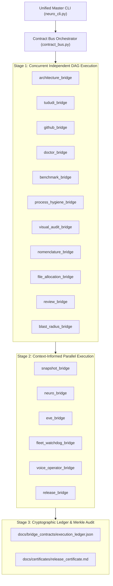

# 📐 Uroboros Knowledge Engine & Neuro Co-Pilot Architecture Diagrams

**Generated**: `2026-08-17 18:06:48Z`  
**Standard**: Pure Mermaid JS diagrams rendered in GitHub Flavored Markdown.

---

## 1. Multi-Bridge Parallel Asynchronous Execution DAG

---

## 2. SQLite Knowledge Engine Entity-Relationship (ER) Schema

```mermaid
erDiagram
    USERS {
        INTEGER id
        TEXT username
        TEXT password_hash
        TEXT role
    }
    FILE_CHUNKS {
        INTEGER id
        INTEGER file_id
        INTEGER chunk_index
        TEXT content
        TEXT embedding_json
        TEXT chunk_hash
    }
    TF_IDF_INDEX {
        TEXT term
        INTEGER file_id
        INTEGER term_freq
    }
    FILES {
        INTEGER id
        INTEGER user_id
        TEXT filepath
        TEXT filename
        INTEGER file_size
        TEXT mime_type
        TEXT sha256
        REAL modified_at
    }
    FTS_FILES {
        TEXT filepath
        TEXT filename
        TEXT content
        TEXT notes
    }
    FTS_FILES_DATA {
        INTEGER id
        BLOB block
    }
    FTS_FILES_IDX {
        TEXT segid
        TEXT term
        TEXT pgno
    }
    FTS_FILES_CONTENT {
        INTEGER id
        TEXT c0
        TEXT c1
        TEXT c2
        TEXT c3
    }
    FTS_FILES_DOCSIZE {
        INTEGER id
        BLOB sz
    }
    FTS_FILES_CONFIG {
        TEXT k
        TEXT v
    }
    TAGS {
        INTEGER file_id
        TEXT tag
    }
    AUTO_RULES {
        INTEGER id
        TEXT pattern
        TEXT tag
        INTEGER priority
    }
    FILE_REVISIONS {
        INTEGER id
        TEXT filepath
        TEXT content
        TEXT sha256
        TIMESTAMP saved_at
    }
    SYNC_PEERS {
        INTEGER id
        TEXT address
        TEXT name
    }
    OCR_COORDS {
        INTEGER file_id
        TEXT word
        REAL x
        REAL y
        REAL w
        REAL h
    }
```

---

*Diagrams generated automatically by `scripts/graph_bridge.py`.*
