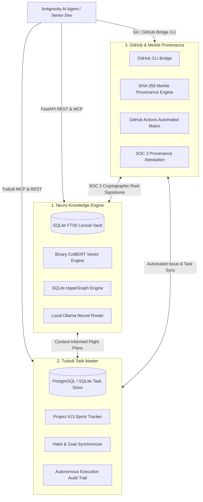
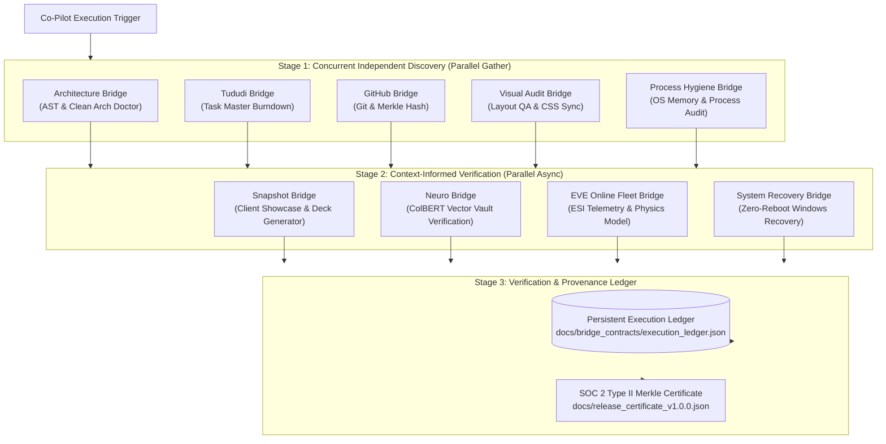
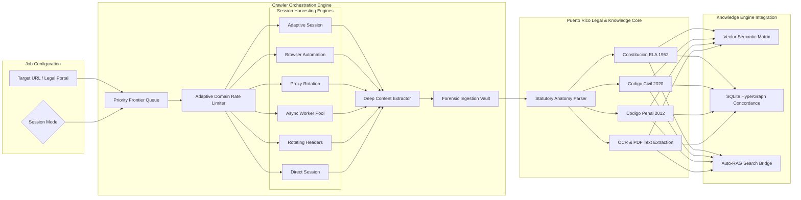
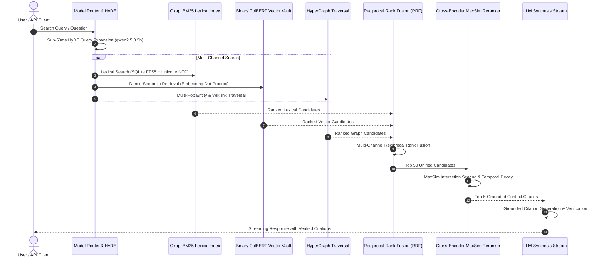
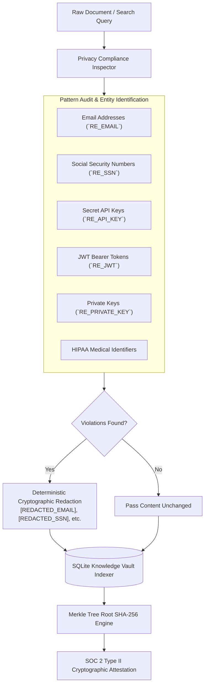
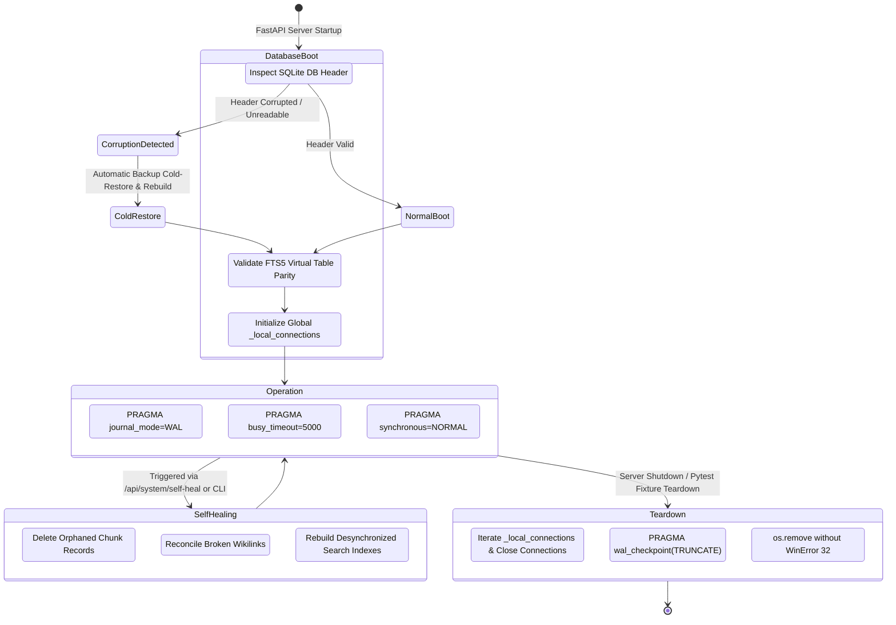
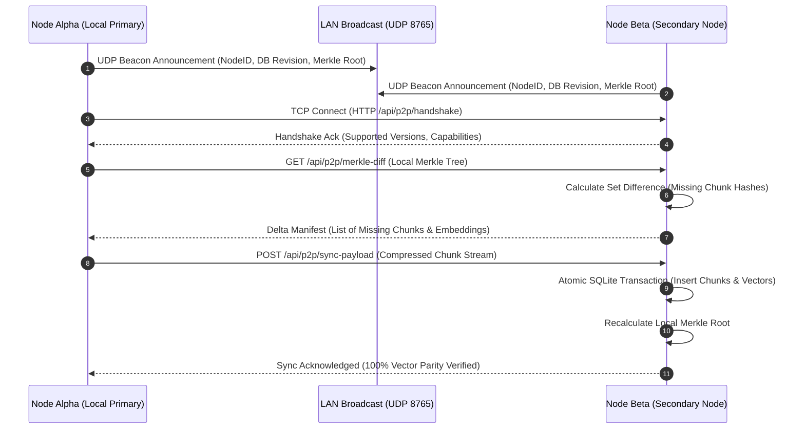
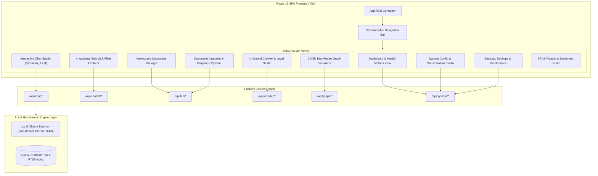

# Uroboros Knowledge Engine: Comprehensive System Architecture Diagrams

This document contains architectural diagrams rendered natively via GitHub Flavored Markdown (Mermaid.js), modeling the complete topology, asynchronous pipelines, data flows, and security controls across the **Uroboros Knowledge Engine (Neuro Alexander)**.

---

## Table of Contents
1. [Sovereign Tri-Engine Autonomous Orchestration](#1-sovereign-tri-engine-autonomous-orchestration)
2. [10-Bridge Neuro Co-Pilot Asynchronous DAG Pipeline](#2-10-bridge-neuro-co-pilot-asynchronous-dag-pipeline)
3. [Universal Crawler & Legal Intelligence Subsystem](#3-universal-crawler--legal-intelligence-subsystem)
4. [5-Pass Hybrid Retrieval Pipeline](#4-5-pass-hybrid-retrieval-pipeline)
5. [Zero-Knowledge Privacy, PII Redaction & SOC 2 Ledger](#5-zero-knowledge-privacy-pii-redaction--soc-2-ledger)
6. [Resilient SQLite WAL & Self-Healing Lifecycle](#6-resilient-sqlite-wal--self-healing-lifecycle)
7. [Peer-to-Peer LAN Mesh Knowledge Replication Protocol](#7-peer-to-peer-lan-mesh-knowledge-replication-protocol)
8. [React 19 Frontend SPA Component & Telemetry Topology](#8-react-19-frontend-spa-component--telemetry-topology)

---

## 1. Sovereign Tri-Engine Autonomous Orchestration

The Uroboros Knowledge Engine is powered by a synchronized Tri-Engine architecture binding local semantic intelligence, autonomous task management, and cryptographic source control:

---

## 2. 10-Bridge Neuro Co-Pilot Asynchronous DAG Pipeline

The Neuro Co-Pilot executes an asynchronous 3-stage dependency graph to validate code, contracts, visual assets, and system hygiene in parallel:

---

## 3. Universal Crawler & Legal Intelligence Subsystem

The Universal Crawler provides multi-session stealth crawling, legal document parsing, and automatic ingestion into the local knowledge vault:

---

## 4. 5-Pass Hybrid Retrieval Pipeline

The search engine executes a multi-pass retrieval pipeline combining lexical, probabilistic, vector, interaction, and graph ranking:

---

## 5. Zero-Knowledge Privacy, PII Redaction & SOC 2 Ledger

All incoming content is inspected and sanitized before indexing to guarantee zero privacy leakage:

---

## 6. Resilient SQLite WAL & Self-Healing Lifecycle

The database subsystem provides corruption detection, automatic schema self-healing, and thread-local connection lifecycle guarantees:

---

## 7. Peer-to-Peer LAN Mesh Knowledge Replication Protocol

Multiple local nodes synchronize knowledge vector deltas across local area networks without internet connectivity:

---

## 8. React 19 Frontend SPA Component & Telemetry Topology

The single-page web client provides responsive glassmorphic interfaces connected to local backend endpoints:

