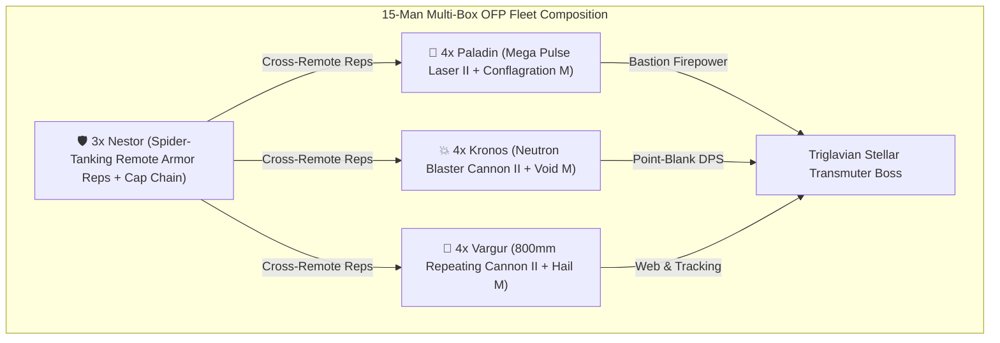

# Pochven Observatory Flashpoint (OFP) Multi-Box Blueprint

The highest liquid ISK printing PvE engine in EVE Online (3.5 Billion ISK per site payout).

---

## 💰 Observatory Flashpoint (OFP) Metrics
- **Target Fleet Size**: **Exactly 15 Pilots** (Payout drops if > 15 pilots on grid).
- **Site Payout**: **3.5 Billion ISK Total** ($pprox$ **233.3 Million ISK per pilot** per site).
- **Site Clear Duration**: **12 – 15 Minutes**.
- **Net Hourly Yield**: **~850 Million to 1.1 Billion ISK/hr per pilot**.

---

## 🚀 15-Box Optimal Fleet Archetype

