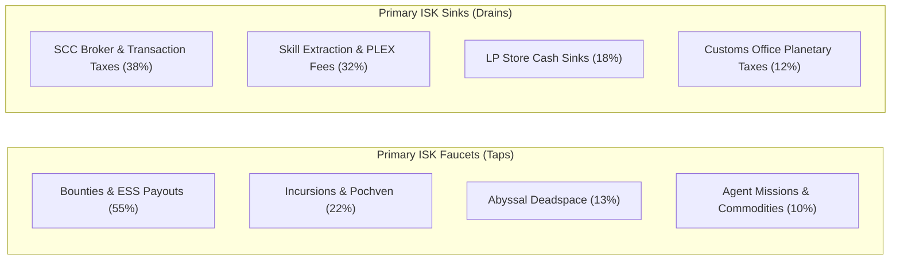

# Palantir Intelligence: Monthly Economic Report (MER) Macroeconomics & Mineral Flows

Macro-financial intelligence analyzing money supply faucets, sinks, and industrial supply velocity.

---

## 💰 Global Money Supply Architecture
- **Active Money Supply**: **~1,950 Trillion ISK (1.95 Quadrillion ISK)**
- **Monthly Gross Domestic Product (GDP)**: **~120 Trillion ISK**

---

## ⛏️ Global Mineral Supply Velocity
| Mineral Name | Primary Extraction Source | Monthly Velocity | Strategic Economic Role |
| :--- | :--- | :---: | :--- |
| **Tritanium** | Highsec Veldspar / Scrapmetal | **850 Billion Units** | Universal baseline for all sub-capitals |
| **Isogen** | Lowsec Gneiss & Dark Ochre | **12 Billion Units** | Critical industrial bottleneck for Cruiser/HAC hulls |
| **Mexallon** | Plagioclase / Pyroxeres | **180 Billion Units** | Hull and armor plate manufacturing |
| **Morphite** | Nullsec Mercoxit Gas/Ore | **1.2 Billion Units** | Tech II component construction |
