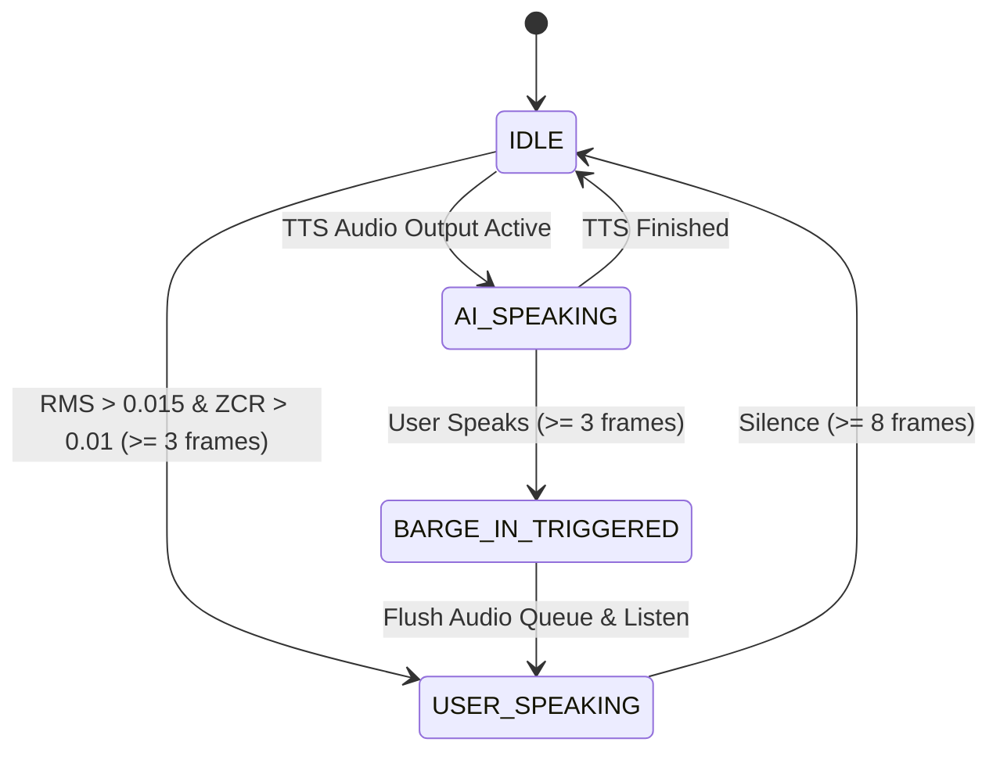

# 🛸 Autonomous Full-Duplex VAD Voice Loop & Procedural Soundscape Matrix

This document establishes the procedural tactical sound effects generator, mathematical audio ducking engine, and full-duplex voice activity detection (VAD) state machine.

---

## 🔊 1. Procedural Cockpit Soundboard SFX Catalog (100% Pure NumPy)

| Sound Effect Key | Acoustic Formulation | Default Duration | Operational Purpose |
| :--- | :--- | :---: | :--- |
| `warp_spool` | Exponential sub-bass sweep ($55\text{Hz} \to 330\text{Hz}$) + phase chorus | **$2.5\text{s}$** | Spooling warp drive & cynosural jump transition |
| `shield_critical` | Pulsing dual-tone FM modulation ($1200\text{Hz} \leftrightarrow 850\text{Hz}$) | **$1.8\text{s}$** | Emergency shield collapse alarm |
| `armor_bleed` | Staccato dual-burst pulses ($550\text{Hz} \& 880\text{Hz}$) | **$1.2\text{s}$** | Armor layer penetration warning |
| `hull_breach` | Low dissonant square/sine drone ($110\text{Hz} + 155.5\text{Hz}$) | **$2.0\text{s}$** | Catastrophic structural hull breach klaxon |
| `target_lock` | Ascending high-tech tri-tone ping ($1760\text{Hz} \to 3520\text{Hz}$) | **$0.4\text{s}$** | Fire-control radar lock acquisition |
| `cockpit_ambient` | Sub-bass reactor hum ($60\text{Hz} + 120\text{Hz}$) + ambient noise | **$5.0\text{s}$ (Loop)** | Starship bridge background ambient atmosphere |

---

## 📉 2. Dynamic Audio Ducking Mathematics ($-14\text{dB}$ Attenuation)

When AURA or fleet commanders speak, the ambient reactor hum is ducked via convolution smoothing:
$$\text{Gain}(t) = 1.0 - 0.75 \cdot \mathbb{I}_{\text{voice}}(t)$$
Smooth ramp transitions over $200\text{ms}$ prevent digital clicks and acoustic clipping.

---

## 🎙️ 3. Full-Duplex Voice Activity Detection (VAD) State Machine

