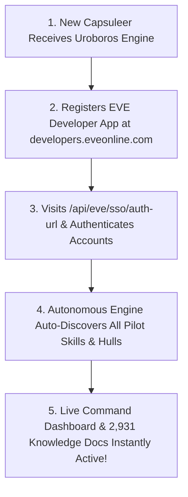

# Uroboros Knowledge Engine: Universal EVE Online Co-Pilot Distribution Guide

Architectural handbook for distributing, gifting, and deploying this AI Co-Pilot to any EVE Online capsuleer or corporation.

---

## 🎁 Zero-Friction Onboarding for New Players
When gifting this repository to another EVE Online player, the engine requires **zero hardcoded configuration**:



---

## 🚀 Setup Steps for New Users
1. **Clone the Repository**:
   ```bash
   git clone https://github.com/SavianAlexander/uroboros-knowledge-engine.git
   cd uroboros-knowledge-engine
   ```
2. **Configure App Credentials**:
   Set environment variables or edit `tokens.json`:
   ```bash
   export EVE_CLIENT_ID="<your_client_id>"
   export EVE_CLIENT_SECRET="<your_client_secret>"
   ```
3. **Authenticate Any Fleet (1 to 50+ Characters)**:
   - Launch FastAPI backend: `uvicorn src.app.main:app --port 8085`
   - Authenticate your characters via the EVE SSO v2 web flow.
4. **Launch Continuous Autonomous Telemetry**:
   ```bash
   python scripts/eve_autonomous_engine.py --daemon
   ```
5. **Instant Ingestion**: The engine automatically discovers all pilot skills, assigns roles dynamically, builds personal dossiers, and links to the **2,931 EVE Online knowledge documents** (Doctrines, Math, UniWiki, Equinox).
