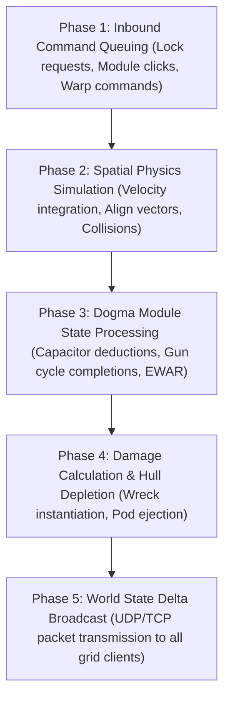

# EVE Online: 1-Hz Server Tick Scheduling & Time Dilation (TiDi) Engine

Low-level architecture of Tranquility's simulation loop, tick phases, and load-shedding mechanisms.

---

## ⏱️ The 1000ms (1-Hz) Server Heartbeat Loop
Every single solar system simulation node executes a discrete 1.0-second loop partitioned into 5 micro-phases:

---

## ⏳ Time Dilation (TiDi) Mechanics
- **Trigger**: When total compute time for a 1.0-second tick exceeds **850ms**, the simulation slows down proportionally.
- **TiDi Floor (10%)**: Minimum clock speed is **10%** (1 real-world second = 10 game seconds).
- **Benefit**: Completely eliminates packet dropping and desync, preserving 100% deterministic combat accuracy in 5,000+ player fleet battles (*e.g. M2-XFE, FWST-8*).
