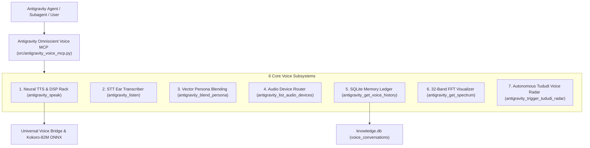

# 🌌 Antigravity Omniscient Neural Voice Matrix & Full-Duplex MCP Suite

This document defines the 6-engine omniscient voice subsystem for Antigravity, unifying local neural speech synthesis, vector persona blending, Speech-to-Text (STT) ear transcription, hardware audio device routing, SQLite conversational memory, real-time FFT spectrum analysis, and autonomous Tududi task radar.

---

## 🏛️ 1. Omniscient 6-Engine Topology

---

## 🎛️ 2. Comprehensive MCP Tool Registry

| Tool Identifier | Subsystem / Capability | Key Arguments |
|---|---|---|
| `antigravity_speak` | Master Kokoro neural voice dispatcher with True-Peak limiter and DSP presets | `text`, `persona`, `speed`, `dsp_preset`, `priority`, `sfx_intro` |
| `antigravity_announce_task` | Specialized milestone audio broadcaster | `task_name`, `state` (STARTED, COMPLETED, FAILED), `details` |
| `antigravity_voice_brief` | Multi-bullet executive briefing with clause pauses | `title`, `items` (array of bullet strings), `persona` |
| `antigravity_play_sfx` | Pure procedural tactical SFX generator | `sfx_name` (`target_lock`, `warp_spool`, `shield_critical`, etc.) |
| `antigravity_blend_persona` | Linear interpolation of Kokoro 512-D voice embedding tensors | `weights` (e.g. `{"bf_emma": 0.7, "af_bella": 0.3}`), `blend_name` |
| `antigravity_listen` | Speech-to-Text audio and microphone transcriber | `audio_path`, `duration_seconds` |
| `antigravity_list_audio_devices` | Enumerate physical/virtual audio render endpoints | None |
| `antigravity_get_voice_history` | Query persistent dialogue memory and turn metrics | `limit`, `session_id` |
| `antigravity_get_spectrum` | 32-band log-frequency FFT spectrum for glassmorphic UI | `num_bands` |
| `antigravity_trigger_tududi_radar` | Execute immediate Tududi task radar deadline check & voice alert | None |
| `antigravity_configure_voice` | Runtime default persona, speed, and DSP adjustments | `default_persona`, `default_speed`, `default_dsp` |
| `antigravity_get_status` | Query engine telemetry, memory, and active instance | None |

---

## 🧬 3. Vector Persona Blending Mathematical Formulation

Given $N$ voice embedding vectors $\mathbf{v}_1, \mathbf{v}_2, \dots, \mathbf{v}_N \in \mathbb{R}^{512}$ in `voices.bin` and user weights $w_1, w_2, \dots, w_N \ge 0$:
$$\tilde{w}_i = \frac{w_i}{\sum_{j=1}^N w_j}, \quad \mathbf{v}_{\text{blend}} = \sum_{i=1}^N \tilde{w}_i \mathbf{v}_i$$
The resulting vector $\mathbf{v}_{\text{blend}}$ is passed directly into the Kokoro-82M style diffusion transformer, yielding a signature vocal timbre without neural retraining.
