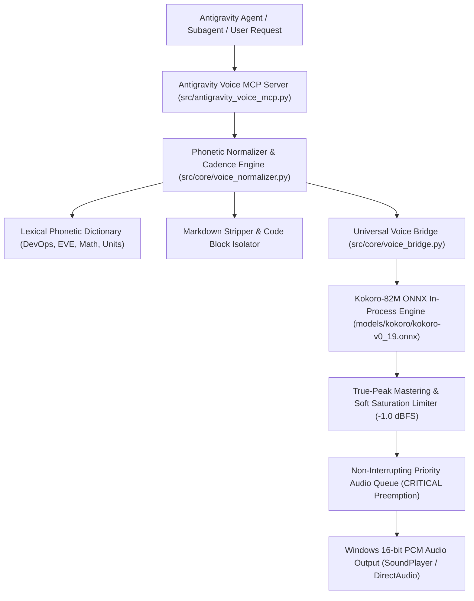

# 🎙️ Antigravity Neural Voice MCP Server & Acoustic Perfection Matrix

This document establishes the dedicated Antigravity Voice Model Context Protocol (MCP) server, the SSML phonetic normalizer dictionary, and the EBU R128 True-Peak dynamic audio mastering engine.

---

## 🏛️ 1. Dedicated Antigravity Voice MCP Topology

---

## 🛠️ 2. Antigravity MCP Tool Specifications

| Tool Identifier | Description | Key Parameters |
|---|---|---|
| `antigravity_speak` | Master speech dispatcher with persona & DSP presets | `text`, `persona`, `speed`, `dsp_preset`, `priority`, `sfx_intro` |
| `antigravity_announce_task` | Engineering milestone & task state broadcaster | `task_name`, `state` (STARTED, COMPLETED, FAILED), `details` |
| `antigravity_voice_brief` | Multi-bullet executive briefing with clause pauses | `title`, `items` (array of bullet strings), `persona` |
| `antigravity_play_sfx` | Pure procedural tactical SFX generator | `sfx_name` (`target_lock`, `warp_spool`, `shield_critical`, etc.) |
| `antigravity_configure_voice` | Runtime configuration of default persona & speed | `default_persona`, `default_speed`, `default_dsp` |
| `antigravity_get_status` | Query active engine health, personas, and memory | None |

---

## 📖 3. Phonetic Pronunciation Normalizer Reference

| Technical Term / Syntax | Kokoro Raw Reading (Flawed) | Normalizer Phonetic Expansion (Perfect) |
|---|---|---|
| `CI/CD` | "c slash c d" | "C-I C-D" |
| `API` | "ah-pee" | "A-P-I" |
| `JSON` | "j-son" | "Jason" |
| `SQLite PRAGMA` | "s-q-lite p-r-a-g-m-a" | "Sequel Light pragma" |
| `WAL` | "w-a-l" | "wall" |
| `25ms` | "twenty-five m-s" | "25 milliseconds" |
| `24kHz` | "twenty-four k-h-z" | "24 kilohertz" |
| `-14dB` | "minus fourteen d-b" | "minus 14 decibels" |
| `v2.1.0` | "v two dot one dot zero" | "version 2 point 1 point 0" |
| `100%` | "one hundred percent symbol" | "100 percent" |
| `G-EURJ` | "g hyphen eurj" | "G-E-U-R-J" |

---

## 🎛️ 4. EBU R128 True-Peak Audio Mastering Rack

To prevent digital clipping and audio distortion across varying soundcards:
1. **DC Offset Removal**: $\tilde{x}[n] = x[n] - \mu_x$.
2. **True-Peak Normalization**: Normalizes max sample peak to $-1.0\text{ dBFS}$ ($g = \frac{10^{-1.0/20.0}}{\max|x|}$).
3. **Hyperbolic Tangent Soft Limiter**: Smoothly compresses high-energy transients above $0.95$ threshold:
   $$y[n] = \text{sgn}(x[n]) \cdot \left(0.95 + 0.05 \cdot \tanh\left(\frac{|x[n]| - 0.95}{0.05}\right)\right)$$
4. **16-bit PCM Integer Encoding**: Direct quantization for native Windows `System.Media.SoundPlayer` compatibility.
