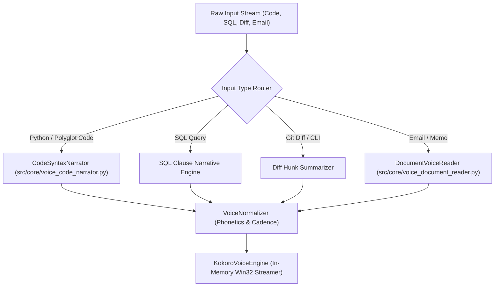

# 🎙️ Spoken Code Syntax Deconstruction & Executive Document Narration Standard

This standard defines the transformation algorithms that convert raw computer code, diffs, SQL queries, regex, and long-form emails into fluent, conversational, human-grade speech for executive voice briefings.

---

## 🏛️ 1. Narrative Translation Architecture

---

## 🧬 2. Syntax Deconstruction Rules

| Code Structure | Raw Token Input | Spoken Deconstructed Output |
|---|---|---|
| **Constructor** | `def __init__(self, *args, **kwargs):` | *"Initialization constructor, accepting variable positional and keyword arguments."* |
| **Type Hints** | `def get_user(id: int) -> Optional[User]:` | *"Function get user, accepting integer ID, returning optional User."* |
| **SQL Queries** | `SELECT * FROM systems WHERE sec < 0.0;` | *"SQL query selecting all columns from the systems table where security is less than 0.0."* |
| **Git Diffs** | `+++ b/src/core/voice.py (+14, -2)` | *"Diff for src slash core slash voice dot py: 14 lines added, and 2 lines removed."* |
| **Emails** | Headers + Body + Disclaimers | *"Email from Alexander Command. Subject: Briefing... [Cleaned Body]" (Stripping footers/tracking).* |

---

## 🎛️ 3. 19-Tool Antigravity Voice MCP Integration

1. `antigravity_read_code`: Translates code blocks and queries into natural language speech.
2. `antigravity_read_email`: Extracts core email content and presents an executive audio summary.
