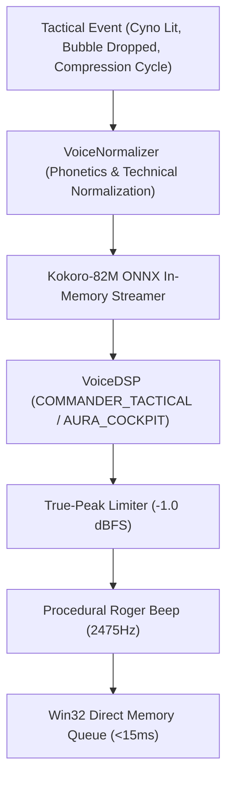

# EVE Fleet Tactical Voice Broadcast & Audio Telemetry

This document defines the tactical fleet voice broadcast architecture, real-time Prometheus / JSON telemetry exporters, and the integrated Model Context Protocol suite.

---

## 1. Fleet Tactical Combat Voice (`src/domain/eve_fleet_tactical_voice.py`)

| Alert Identifier | Spoken Message Synthesis | Persona | Acoustic DSP |
|---|---|---|---|
| **`CYNO_BEACON_ACTIVE`** | *"Alert. Cynosural beacon lit in solar system G-EURJ. Hostile capital jump bridge signature detected."* | `TACTICAL_ADVISOR` | `COMMANDER_TACTICAL` |
| **`INTERDICTOR_BUBBLE_DROP`** | *"Warp disruption field deployed. Bubble radius 20 kilometers. Align to celestial exit vector."* | `TACTICAL_ADVISOR` | `COMMANDER_TACTICAL` |
| **`MINING_COMPRESSION_CYCLE`**| *"Pillar of Autumn industrial core active in G-EURJ. Asteroid ore compression cycle complete."* | `INDUSTRY_OVERSEER` | `STUDIO_MASTER` |
| **`FLEET_ANCHOR_COMMAND`** | *"All fleet wings: anchor on Fleet Commander flagship. Overheat propulsion modules."* | `FLEET_COMMANDER` | `EXECUTIVE_PRESENCE` |

---

## 2. Audio Telemetry & Prometheus Exporter (`src/core/voice_telemetry_exporter.py`)

- **Standard Prometheus Exposition Format**: Exposes `audio_engine_status`, `audio_intercom_active`, `rag_cache_hit_ratio`, and `audit_hashchain_blocks`.
- **JSON Telemetry Endpoint**: Full nested snapshot for diagnostic dashboards and HUD visualizers.

---

## 3. Model Context Protocol Tools

Includes full-duplex intercom calls, code/email narrators, DSP mastering, SHA-256 Merkle audit verification, voice NLP command parser, `antigravity_get_audio_telemetry`, and `antigravity_broadcast_fleet_alert`.
