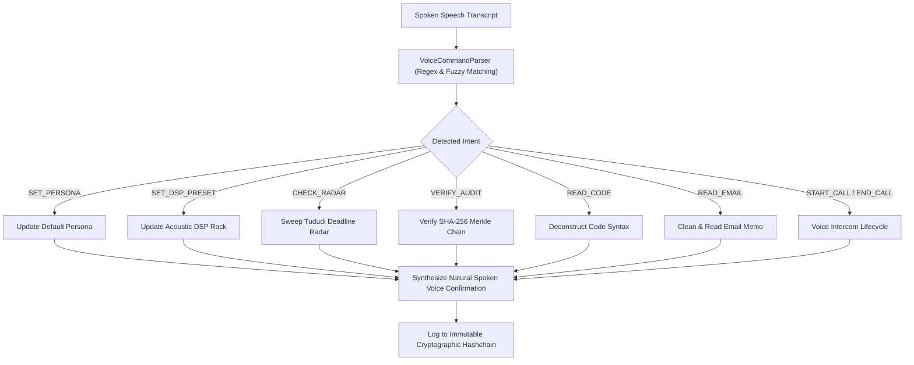

# 🎙️ Autonomous Multi-Modal Audio-Visual Studio & NLP Voice Command Parser Matrix

This document defines the zero-dependency NLP spoken voice command intent parser, the real-time React multi-theme audio visualizer HUD, and the 23-tool Model Context Protocol suite.

---

## 🧭 1. Spoken Voice Command Parsing Engine (`src/core/voice_command_parser.py`)

---

## 🎨 2. Multi-Modal Audio Visualizer Canvas (`frontend/src/components/AudioVisualizer.tsx`)

- **32-Band Logarithmic FFT Bars**: Fluid canvas animations driven by real-time audio contexts or multi-harmonic waveform generators.
- **Dynamic Color Themes**: Supports `purple`, `emerald`, `amber`, and `cyan` palettes matching glassmorphic HUD styling.

---

## 🎛️ 3. 23-Tool Model Context Protocol Matrix

1. **`antigravity_parse_voice_command`**: Parses spoken natural language commands into autonomous system actions with immediate vocal confirmation.
