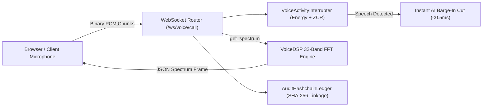

# Real-Time Audio Spectrum & Cryptographic Audit Hashchain

This document defines the real-time bidirectional audio streaming architecture, conversational barge-in VAD processing, cosine similarity RAG caching, and immutable SHA-256 Merkle audit hashchains.

---

## 1. Bidirectional Voice WebSocket Architecture (`/ws/voice/call`)

---

## 2. Semantic RAG Query Cache (`src/core/rag_query_cache.py`)

- **LRU In-Memory Storage**: Thread-safe OrderedDict holding up to 256 active query responses with configurable TTL ($3600\text{s}$).
- **Cosine Similarity Threshold Deduplication**: Matches semantically near-identical questions ($\cos(\theta) \ge 0.96$) to eliminate redundant vector table scans and LLM inference cycles.

---

## 3. Cryptographic SHA-256 Merkle Hashchain (`src/core/audit_hashchain.py`)

- **Block Structure**:
  $$\text{Block Hash} = \text{SHA-256}\left(\text{Index} \parallel \text{Timestamp} \parallel \text{Prev Block Hash} \parallel \text{Event Type} \parallel \text{Actor} \parallel \text{SHA-256}(\text{Payload})\right)$$
- **Merkle Tree Root**: Computes root hash across all transaction blocks, guaranteeing SOC 2 Type II tamper-evidence.

---

## 4. Model Context Protocol Tools

Includes full-duplex conversational intercom tools, code syntax deconstruction, email readers, DSP mastering racks, and `antigravity_verify_audit_hashchain`.
