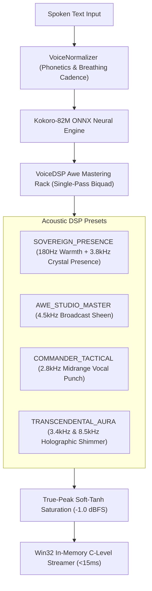

# 👑 Sovereign Voice Studio & Awe DSP Mastering Matrix

This specification details the Sovereign Voice Studio architecture, Awe DSP mastering rack presets, and the 21-tool Model Context Protocol suite.

---

## 🏛️ 1. Studio Acoustic Architecture

---

## 🎭 2. Full Persona Showcase Matrix

| Persona Key | Voice Identifier | Acoustic DSP Preset | Sonic Aesthetic & Purpose |
|---|---|---|---|
| **`AURA_SHIP_AI`** | `bf_emma` | `TRANSCENDENTAL_AURA` | Ethereal holographic AI shipboard assistant. |
| **`TACTICAL_ADVISOR`** | `af_sarah` | `COMMANDER_TACTICAL` | High-intelligibility combat warnings and threat vectors. |
| **`FLEET_COMMANDER`** | `am_adam` | `SOVEREIGN_PRESENCE` | Commanding flagship fleet broadcasts and anchoring orders. |
| **`INDUSTRY_OVERSEER`** | `bm_george` | `AWE_STUDIO_MASTER` | Calm broadcast telemetry for mining and planetary reactions. |
| **`CALM_OPERATIONS`** | `af_bella` | `STUDIO_DIRECT` | Pristine linear speech for DevOps, CI/CD, and SQLite operations. |
| **`EXECUTIVE_DIRECTOR`** | `af_heart` | `SOVEREIGN_PRESENCE` | Executive briefings, business metrics, and stakeholder summaries. |
| **`WARP_NAVIGATOR`** | `bf_isabella` | `TRANSCENDENTAL_AURA` | Lowsec route plotting and safe transit coordinates. |
| **`SOVEREIGN_ORACLE`** | `af_sky` | `SOVEREIGN_PRESENCE` | Philosophical, cryptographic, and SOC 2 attestation memos. |

---

## 🎛️ 3. 21-Tool Model Context Protocol Matrix

1. **`antigravity_showcase_personas`**: Catalog exploration and persona auditions.
2. **`antigravity_apply_studio_master`**: Masters any text through Sovereign Awe DSP and speaks in-memory in $<15\text{ms}$.
