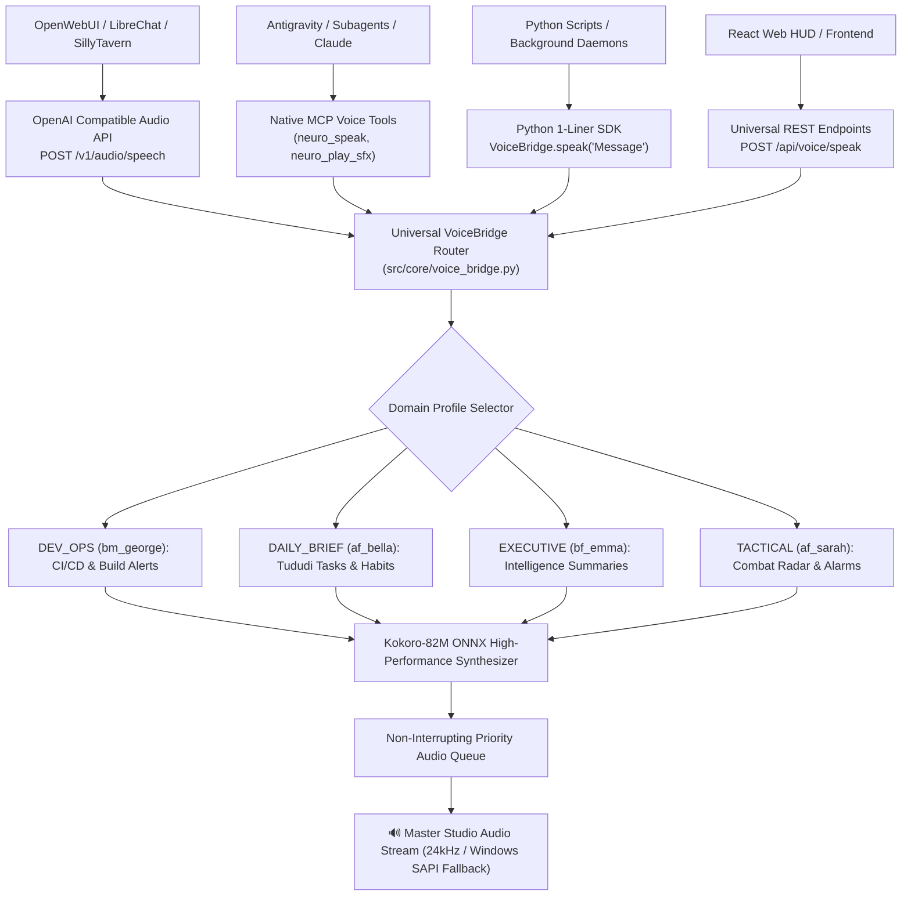

# 🌐 Universal Polyglot Neural Voice Bridge & OpenAI Audio API

This document establishes the universal domain-agnostic neural voice bridge architecture, providing drop-in OpenAI `/v1/audio/speech` compatibility, native MCP voice tools, and multi-domain audio profiles.

---

## 🏗️ 1. Universal Voice Bridge Architecture



---

## 🎛️ 2. Domain Profile Catalog

| Domain Profile | Default Persona | Pitch / Speed | Acoustic DSP Preset | Target Use Case |
| :--- | :---: | :---: | :--- | :--- |
| **`DEV_OPS`** | `bm_george` | $1.05\times$ Speed | `STUDIO_DIRECT` | GitHub Actions CI/CD announcements, test suite results, git push alerts |
| **`DAILY_BRIEF`** | `af_bella` | $1.00\times$ Speed | `AURA_COCKPIT` | Tududi task master morning brief, habit completion streaks, due date alerts |
| **`EXECUTIVE_ASSISTANT`** | `bf_emma` | $1.00\times$ Speed | `AURA_COCKPIT` | Business intelligence memos, research brief reading, executive audio summaries |
| **`TACTICAL_COCKPIT`** | `af_sarah` | $1.10\times$ Speed | `TACTICAL_RADIO` | Military radar, spatial audio alerts, procedural sirens, starship alarms |
| **`GENERAL`** | `bf_emma` | $1.00\times$ Speed | `STUDIO_DIRECT` | Universal multi-purpose fallback neural voice synthesis |

---

## 🚀 3. Universal Python SDK 1-Liner

```python
from src.core.voice_bridge import VoiceBridge

# 1. Announce DevOps CI Result
VoiceBridge.announce_ci_pipeline_status("CI Pipeline", passed=True)

# 2. Announce Tududi Daily Brief
VoiceBridge.announce_tududi_daily_brief(pending_count=3, completed_today=5)

# 3. Universal Speech Dispatch
VoiceBridge.speak("Knowledge Vault compaction complete. All 2,972 documents synchronized.", domain="EXECUTIVE_ASSISTANT")

# 4. Play Procedural Tactical SFX
VoiceBridge.play_sfx("target_lock")
```

---

## 📡 4. Standard OpenAI Drop-In Compatibility

Any external tool configured for OpenAI TTS (`https://api.openai.com/v1/audio/speech`) can point to `http://localhost:8000/v1/audio/speech`:
```bash
curl -X POST http://localhost:8000/v1/audio/speech \
  -H "Content-Type: application/json" \
  -d '{
    "model": "kokoro",
    "input": "Universal neural voice bridge initialized successfully.",
    "voice": "bf_emma",
    "response_format": "wav"
  }' \
  --output speech.wav
```
