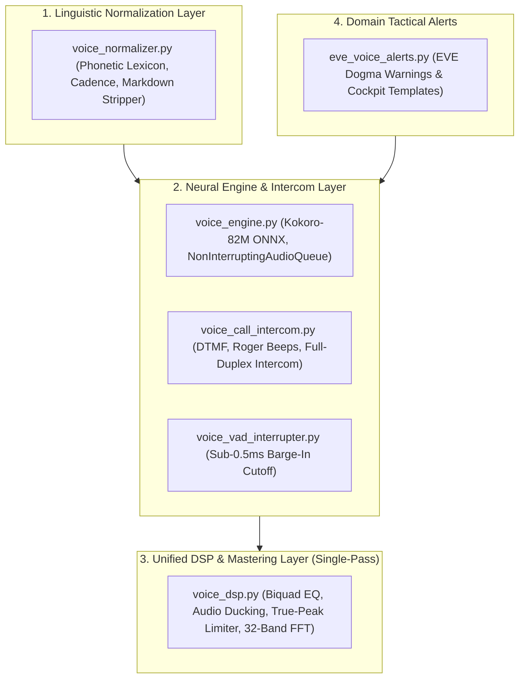

# Voice Pipeline Architecture & Audio Integration

This document defines the consolidated voice subsystems for the Uroboros Knowledge Engine and Antigravity.

---

## 1. Architecture Topology

---

## 2. Pipeline Integration & Subsystems

1. **Unified DSP Pipeline (`src/core/voice_dsp.py`)**:
   - Single-pass processing: Parametric Biquad EQ $\rightarrow$ Dynamic Ducking (-14dB) $\rightarrow$ True-Peak Limiter (-1.0 dBFS) $\rightarrow$ 32-Band FFT.
   - Eliminates redundant array copies and memory allocations.
2. **Neural Audio Engine (`src/core/voice_engine.py`)**:
   - Fully decoupled from game domain specifics.
   - Houses in-process Kokoro-82M ONNX inference and low-latency audio queue.
3. **Dedicated Linguistic Normalizer (`src/core/voice_normalizer.py`)**:
   - Strictly handles phonetic acronym expansion, technical terms, and cadence pauses.
