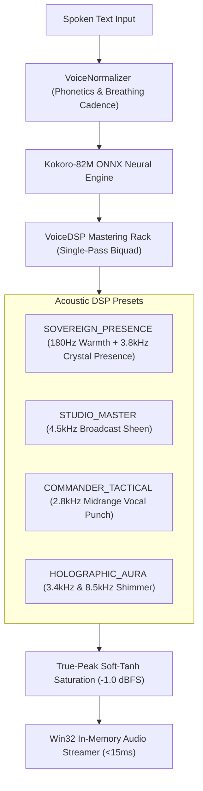

# Voice Studio Architecture & DSP Mastering

This specification details the Voice Studio architecture, DSP mastering rack presets, and the integrated Model Context Protocol suite.

---

## 1. Studio Acoustic Architecture

---

## 2. Persona Catalog Matrix

| Persona Key | Voice Identifier | Acoustic DSP Preset | Sonic Profile & Purpose |
|---|---|---|---|
| **`AURA_SHIP_AI`** | `bf_emma` | `HOLOGRAPHIC_AURA` | Holographic AI shipboard assistant. |
| **`TACTICAL_ADVISOR`** | `af_sarah` | `COMMANDER_TACTICAL` | High-intelligibility combat warnings and threat vectors. |
| **`FLEET_COMMANDER`** | `am_adam` | `SOVEREIGN_PRESENCE` | Flagship fleet broadcasts and anchoring orders. |
| **`INDUSTRY_OVERSEER`** | `bm_george` | `STUDIO_MASTER` | Broadcast telemetry for mining and planetary reactions. |
| **`CALM_OPERATIONS`** | `af_bella` | `STUDIO_DIRECT` | Linear speech for DevOps, CI/CD, and SQLite operations. |
| **`EXECUTIVE_DIRECTOR`** | `af_heart` | `SOVEREIGN_PRESENCE` | Executive briefings, business metrics, and stakeholder summaries. |
| **`WARP_NAVIGATOR`** | `bf_isabella` | `HOLOGRAPHIC_AURA` | Lowsec route plotting and transit coordinates. |
| **`ORACLE_ADVISOR`** | `af_sky` | `SOVEREIGN_PRESENCE` | Cryptographic and SOC 2 attestation memos. |

---

## 3. Model Context Protocol Tools

1. **`antigravity_showcase_personas`**: Catalog exploration and persona auditions.
2. **`antigravity_apply_studio_master`**: Masters speech through DSP filters with in-memory low-latency streaming.
