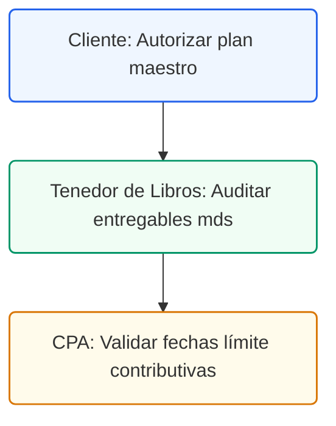

# Índice de Control Maestro y Entregables
## Guía de Navegación y Flujo de Implementación Contable y Fiscal

### Control de Documentos / Document Control
*   **Versión / Version:** 2.8
*   **Fecha / Date:** July 10, 2026
*   **Autor / Author:** Roberto Alejandro Morales Pérez
*   **Estado / Status:** Activo / Índice Maestro
*   **Proyecto:** Reconfiguración y Cumplimiento Fiscal de Práctica Dental (Puerto Rico)

---

## 1. Introducción
Este documento sirve como el punto de entrada principal para el proyecto de reestructuración fiscal y cumplimiento contable de la clínica dental. Su propósito es guiar al consultor, al cliente y a su CPA a través de la documentación técnica y estratégica en el orden secuencial recomendado para su correcta comprensión e implementación.

---

## 2. Secuencia Recomendada de Lectura e Entregables (Carpeta `documents/`)
A continuación se presenta la secuencia sugerida para la revisión de los entregables de este proyecto.

> **Importante:** Este índice consolidado representa la secuencia de trabajo y cumplimiento fiscal aprobada. Cualquier cambio en la configuración de QuickBooks Desktop local o en las cuentas de SURI debe ser coordinado con el Tenedor de Libros y validado por el CPA externo antes de su ejecución física.

Para asegurar una transición fluida al nuevo modelo contable y fiscal, se recomienda revisar y ejecutar los entregables en el siguiente orden consecutivo:

*   **Documento [01]: Guía de Preparación de Reunión** ([Markdown Source](file:///c:/Users/Administrator/Desktop/Quickbooks/documents/mds/01_Guia_Preparacion_Reunion.md) | [PDF Compilado](file:///c:/Users/Administrator/Desktop/Quickbooks/documents/01_Guia_Preparacion_Reunion.pdf))
    *   *Propósito:* Preparar la entrevista con la administración de la clínica dental, detallando los pilares contributivos básicos de Puerto Rico (IVU, Retenciones del 10%, Ley 60 y Patente Municipal) y proveyendo un cuestionario de descubrimiento.
*   **Documento [02]: Informe de Optimización Contributiva** ([Markdown Source](file:///c:/Users/Administrator/Desktop/Quickbooks/documents/mds/02_Informe_Optimizacion_Contributiva_PR.md) | [PDF Compilado](file:///c:/Users/Administrator/Desktop/Quickbooks/documents/02_Informe_Optimizacion_Contributiva_PR.pdf))
    *   *Propósito:* Analizar la conversión de la práctica a una estructura S-Corp / P.S.C. para reducir la tasa del 33% al 4%, optimizar el salario W-2 del dueño, comidas de negocios (50% vs. 100%) y beneficios marginales exentos.
*   **Documento [03]: Plantilla de Mapeo: QuickBooks a SURI** ([Markdown Source](file:///c:/Users/Administrator/Desktop/Quickbooks/documents/mds/03_Plantilla_Mapeo_Quickbooks_SURI.md) | [PDF Compilado](file:///c:/Users/Administrator/Desktop/Quickbooks/documents/03_Plantilla_Mapeo_Quickbooks_SURI.pdf))
    *   *Propósito:* Plantilla de flujo de trabajo que ilustra entradas diarias de transacciones (laboratorios con retención del 10%, cobros de IVU) y su posterior radicación mensual y anual en el portal SURI de Hacienda.
*   **Documento [04]: Guía de Referencia: Catálogo de Cuentas a SURI** ([Markdown Source](file:///c:/Users/Administrator/Desktop/Quickbooks/documents/mds/04_Guia_Referencia_Catalogo_Cuentas_QBO.md) | [PDF Compilado](file:///c:/Users/Administrator/Desktop/Quickbooks/documents/04_Guia_Referencia_Catalogo_Cuentas_QBO.pdf))
    *   *Propósito:* Detallar la configuración de las 66 cuentas en QBO, las fórmulas de depreciación residual del CRIM (10%/20% mínimo) y el manual operacional completo para la integración con ADP Payroll (con entrada de diario modelo).
*   **Documento [05]: Guía de Auditoría de Arbitrios Municipales** ([Markdown Source](file:///c:/Users/Administrator/Desktop/Quickbooks/documents/mds/05_Guia_Auditoria_Arbitrios_Municipales.md) | [PDF Compilado](file:///c:/Users/Administrator/Desktop/Quickbooks/documents/05_Guia_Auditoria_Arbitrios_Municipales.pdf))
    *   *Propósito:* Analizar los 6 riesgos locales críticos comúnmente ignorados (como reclamar la exención de $50,000 del CRIM, decretos de patentes, IVU en laboratorios, exclusiones de SINOT y comisiones de procesadores de tarjetas).
*   **Documento [06]: Guía de Incentivos y Subsidios Fiscales** ([Markdown Source](file:///c:/Users/Administrator/Desktop/Quickbooks/documents/mds/06_Guia_Incentivos_Subsidios_Fiscales.md) | [PDF Compilado](file:///c:/Users/Administrator/Desktop/Quickbooks/documents/06_Guia_Incentivos_Subsidios_Fiscales.pdf))
    *   *Propósito:* Oportunidades estatutarias para maximizar flujo de caja, incluyendo Sección 179 (depreciación acelerada de equipos), créditos federales WOTC, alquiler comercial propio (*self-rental loop*) y fideicomisos de retiro.
*   **Documento [07]: Guía de Integración: QuickBooks y Mailchimp** ([Markdown Source](file:///c:/Users/Administrator/Desktop/Quickbooks/documents/mds/07_Guia_Integracion_QuickBooks_Mailchimp.md) | [PDF Compilado](file:///c:/Users/Administrator/Desktop/Quickbooks/documents/07_Guia_Integracion_QuickBooks_Mailchimp.pdf))
    *   *Propósito:* Explicar el flujo de conexión entre QuickBooks Online y Mailchimp, detallando la segmentación automática basada en ventas (compras de retail vs. servicios clínicos) y estableciendo el protocolo obligatorio de seguridad de datos HIPAA.
*   **Documento [08]: Guía de Comunicación: Método STAR** ([Markdown Source](file:///c:/Users/Administrator/Desktop/Quickbooks/documents/mds/08_Guia_Comunicacion_Metodo_STAR.md) | [PDF Compilado](file:///c:/Users/Administrator/Desktop/Quickbooks/documents/08_Guia_Comunicacion_Metodo_STAR.pdf))
    *   *Propósito:* Detallar el marco Situation-Task-Action-Result para redactar correos, chats y llamadas con clientes de manera profesional, clara y accionable.
*   **Documento [09]: Guía de Selección de Versión de QuickBooks Desktop** ([Markdown Source](file:///c:/Users/Administrator/Desktop/Quickbooks/documents/mds/09_Guia_Seleccion_Version_QuickBooks.md) | [PDF Compilado](file:///c:/Users/Administrator/Desktop/Quickbooks/documents/09_Guia_Seleccion_Version_QuickBooks.pdf))
    *   *Propósito:* Proveer análisis formal para la selección de QuickBooks Desktop Enterprise Platinum hospedado localmente (LAN/VPN) con control avanzado de inventario (FIFO), nómina local e integración bancaria.
*   **Documento [11]: Alternativas a Ley 60 y Estructuras Corporativas** ([Markdown Source](file:///c:/Users/Administrator/Desktop/Quickbooks/documents/mds/11_Alternativas_Ley_60_y_Estructuras_Corporativas.md) | [PDF Compilado](file:///c:/Users/Administrator/Desktop/Quickbooks/documents/11_Alternativas_Ley_60_y_Estructuras_Corporativas.pdf))
    *   *Propósito:* Detallar alternativas contributivas bajo el régimen general (como la Contribución Opcional sobre ingresos de servicios) y aclarar los rumores del 60% de exención municipal, dividendos inter-corporativos y límites de gastos entre partes relacionadas.
*   **Documento [12]: Guía de Inicialización Contable y Onboarding en QuickBooks** ([Markdown Source](file:///c:/Users/Administrator/Desktop/Quickbooks/documents/mds/12_Guia_Inicializacion_Onboarding_QuickBooks.md) | [PDF Compilado](file:///c:/Users/Administrator/Desktop/Quickbooks/documents/12_Guia_Inicializacion_Onboarding_QuickBooks.pdf))
    *   *Propósito:* Proveer un protocolo paso a paso para la inicialización local segura de QuickBooks Desktop Enterprise Platinum, perfiles de registro de licencias y la autorización bancaria para feeds automatizados.
*   **Documento [13]: Guía de Arquitectura de Invoicing e Integración de Ingresos** ([Markdown Source](file:///c:/Users/Administrator/Desktop/Quickbooks/documents/mds/13_Guia_Arquitectura_Facturacion_Ingresos.md) | [PDF Compilado](file:///c:/Users/Administrator/Desktop/Quickbooks/documents/13_Guia_Arquitectura_Facturacion_Ingresos.pdf))
    *   *Propósito:* Detallar la configuración de cuentas por cobrar en QuickBooks, el mapeo técnico de campos de base de datos de OpenDental a QuickBooks (anónimos bajo HIPAA) y plantillas de facturación para copagos y reclamaciones a aseguradoras.
*   **Documento [14]: Registro de Proveedores y Guía de Accesos del Tenedor de Libros** ([Markdown Source](file:///c:/Users/Administrator/Desktop/Quickbooks/documents/mds/14_Guia_Registro_Proveedores_Acceso_Tenedor.md) | [PDF Compilado](file:///c:/Users/Administrator/Desktop/Quickbooks/documents/14_Guia_Registro_Proveedores_Acceso_Tenedor.pdf))
    *   *Propósito:* Estructurar la base de datos de proveedores del consultorio dental, regular las retenciones en el origen del 10% por servicios profesionales, definir los accesos contables y portales gubernamentales del Tenedor de Libros y proveer plantillas de autorización comercial.
*   **Documento [15]: Guía de Requerimiento de Datos para el Tenedor de Libros** ([Markdown Source](file:///c:/Users/Administrator/Desktop/Quickbooks/documents/mds/15_Ficha_Requerimiento_Datos_Tenedor.md) | [PDF Compilado](file:///c:/Users/Administrator/Desktop/Quickbooks/documents/15_Ficha_Requerimiento_Datos_Tenedor.pdf))
    *   *Propósito:* Protocolo de datos y expediente transaccional requerido para el procesamiento diario, semanal, mensual y anual de la contabilidad de la clínica dental.

<!-- pagebreak -->

## 3. Certificaciones Académicas y Profesionales (Carpeta `Certifications/`)
Lista de credenciales oficiales completadas y archivadas:
1.  **[01_Banking_and_Accounting_Level_1_Certificate.pdf](file:///c:/Users/Administrator/Desktop/Quickbooks/Certifications/01_Banking_and_Accounting_Level_1_Certificate.pdf)**
2.  **[02_Expenses_and_Vendors_Level_1_Certificate.pdf](file:///c:/Users/Administrator/Desktop/Quickbooks/Certifications/02_Expenses_and_Vendors_Level_1_Certificate.pdf)**
3.  **[03_Sales_and_Customers_Level_1_Certificate.pdf](file:///c:/Users/Administrator/Desktop/Quickbooks/Certifications/03_Sales_and_Customers_Level_1_Certificate.pdf)**
4.  **[04_Banking_and_Accounting_Level_2_Certificate.pdf](file:///c:/Users/Administrator/Desktop/Quickbooks/Certifications/04_Banking_and_Accounting_Level_2_Certificate.pdf)**
5.  **[05_Expenses_and_Vendors_Level_2_Certificate.pdf](file:///c:/Users/Administrator/Desktop/Quickbooks/Certifications/05_Expenses_and_Vendors_Level_2_Certificate.pdf)**
6.  **[06_Sales_and_Customers_Level_2_Certificate.pdf](file:///c:/Users/Administrator/Desktop/Quickbooks/Certifications/06_Sales_and_Customers_Level_2_Certificate.pdf)**
7.  **[07_Reporting_and_Financial_Planning_Level_2_Certificate.pdf](file:///c:/Users/Administrator/Desktop/Quickbooks/Certifications/07_Reporting_and_Financial_Planning_Level_2_Certificate.pdf)**
8.  **[08_Understanding_AI_Certificate.pdf](file:///c:/Users/Administrator/Desktop/Quickbooks/Certifications/08_Understanding_AI_Certificate.pdf)**
9.  **[09_Using_Intuits_AI_Agents_Certificate.pdf](file:///c:/Users/Administrator/Desktop/Quickbooks/Certifications/09_Using_Intuits_AI_Agents_Certificate.pdf)**
10. **[10_Intuit_Bookkeeping_ProAdvisor_Badge.png](file:///c:/Users/Administrator/Desktop/Quickbooks/Certifications/10_Intuit_Bookkeeping_ProAdvisor_Badge.png)**
11. **[11_QuickBooks_Online_Level_1_Badge.png](file:///c:/Users/Administrator/Desktop/Quickbooks/Certifications/11_QuickBooks_Online_Level_1_Badge.png)**
12. **[12_Client_Advisory_Services_Foundations_Badge.png](file:///c:/Users/Administrator/Desktop/Quickbooks/Certifications/12_Client_Advisory_Services_Foundations_Badge.png)**
13. **[13_ProAdvisor_Academy_History_Summary.png](file:///c:/Users/Administrator/Desktop/Quickbooks/Certifications/13_ProAdvisor_Academy_History_Summary.png)**

---

## 4. Catálogo de Cuentas Listo para Importar
*   **Archivo:** [qbo_coa_dentist.csv](file:///c:/Users/Administrator/Desktop/Quickbooks/csv_imports/qbo_coa_dentist.csv)
*   **Instrucciones de Importación:** En QuickBooks Online, vaya a *Configuración (Gear Icon) -> Importar Datos -> Catálogo de Cuentas* y seleccione este archivo para precargar las 66 cuentas del consultorio.
---
---

## 5. Ruta de Ejecución y Plan de Acción
A continuación se detalla el flujo de trabajo secuencial recomendado para validar el plan contable del consultorio dental:

### Lista de Tareas Operacionales:
*   `[ ]` **[CLIENTE]** Autorizar el inicio del proceso de auditoría maestro y control de entregables contables.
*   `[ ]` **[TENEDOR DE LIBROS]** Auditar cada entregable técnico y verificar que todos los archivos fuente en `documents/mds/` compilan limpiamente a PDF.
*   `[ ]` **[CPA]** Validar el calendario de fechas límite contributivas y fiscales federales/estatales.
