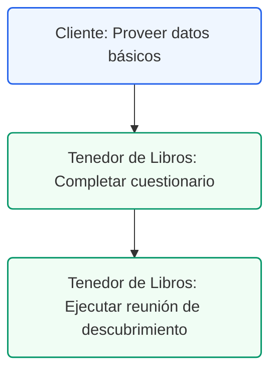

# Guía de Preparación: Descubrimiento Contable y Fiscal
## Marco de Preparación Operacional para la Administración del Consultorio Dental

### Control de Documentos / Document Control
*   **Versión / Version:** 3.1
*   **Fecha / Date:** July 10, 2026
*   **Autor / Author:** Roberto Alejandro Morales Pérez
*   **Estado / Status:** Activo / Entregable de Preparación
*   **Proyecto:** Reconfiguración y Cumplimiento Fiscal de Práctica Dental (Puerto Rico)

---

## 1. Introducción
Para asegurar que nuestra próxima reunión de descubrimiento sea de alto valor y nos permita trazar una ruta de cumplimiento y optimización fiscal efectiva, este documento detalla los pilares del régimen contributivo de Puerto Rico aplicados al sector dental y provee el cuestionario de preparación de datos operativos.

---

## 2. Pilares Contributivos del Sector Dental en Puerto Rico

La administración del consultorio debe considerar las siguientes regulaciones locales en sus operaciones diarias:

### A. Impuesto sobre Ventas y Uso (IVU)
*   **Servicios Clínicos (Exentos):** Los servicios profesionales de salud provistos por médicos y dentistas autorizados están **exentos** del cobro del IVU (Artículo 4010.01 del Código de Rentas Internas de PR). No se factura IVU a pacientes ni a planes médicos.
*   **Venta de Productos (Tributables):** Las ventas directas de bienes tangibles (por ejemplo, cepillos eléctricos, pastas especializadas, kits de blanqueamiento) **no están exentas** y están sujetas a la tasa estándar del **11.5%** (10.5% estatal reportado en SURI y 1.0% municipal reportado al ayuntamiento).
*   **IVU en Compras (B2B):** La oficina paga IVU (11.5% en materiales o 4% en servicios profesionales recibidos) en sus compras de insumos. Estos pagos se registran como gastos o costo de activos en QuickBooks, ya que no se recuperan como créditos al no cobrar la clínica IVU en sus servicios principales.

### B. Retención del 10% en el Origen (Servicios Profesionales)
*   **Regla General:** Todo pago por servicios profesionales prestados en Puerto Rico (incluyendo laboratorios dentales y dentistas contratistas) que supere los **$500** en el año natural está sujeto a una **retención del 10%** en el origen por parte del consultorio.
*   **Relevos de Retención:** Los proveedores pueden presentar un **Certificado de Relevo de Retención (Formulario SC 2756)** de Hacienda para aplicar una retención del 0%, 3% o 5%.
*   **Responsabilidad de la Clínica:** La administración del consultorio es responsable de retener, depositar mensualmente en SURI (Formulario 480.9B) y reportar las informativas anuales correspondientes (Formulario 480.6SP).

### C. Decreto de Exención bajo Ley 60 (Médicos Cualificados)
*   Los profesionales de la salud con decretos vigentes (Ley 60-2019 / anterior Ley 14-2017) tributan a una tasa fija del **4%** sobre el ingreso neto de sus servicios clínicos exentos y disfrutan de exenciones en dividendos.

### D. Patente Municipal y CRIM
*   **Patente Municipal:** Impuesto cobrado por el ayuntamiento local sobre el volumen de ventas brutas del año anterior.
*   **CRIM:** Contribución anual sobre la propiedad mueble (computadoras, sillones, equipo clínico) en uso en el consultorio.

<!-- pagebreak -->

## 3. Cuestionario de Preparación Operacional
La administración del consultorio debe revisar las siguientes preguntas previo a la reunión para facilitar la recopilación de datos:

### Estructura Corporativa y Representación Fiscal
Se solicita responder a las siguientes preguntas clave para el levantamiento inicial de información.

> **Nota:** La información recopilada en este cuestionario inicial servirá de base para configurar los módulos de inventario FIFO en QuickBooks Desktop Enterprise y estructurar el tratamiento de retenciones del 10% en SURI.

1.  *¿Bajo qué entidad legal opera la clínica (Corporación de Servicios Profesionales (CSP), LLC, o individuo)?*
2.  *¿Los dentistas socios poseen un Decreto de Exención Contributiva (Ley 60 / Ley 14) vigente?*
3.  *¿Quién es el CPA responsable de radicar las planillas corporativas y patentes municipales vigentes?*

### Flujo de Ventas y Cobros
4.  *¿Se realizan ventas directas de productos de higiene oral o tratamientos estéticos al detal?*
5.  *¿Qué software clínico se utiliza para el registro de pacientes (ej. Dentrix, Open Dental) y cómo se procesan las reclamaciones de planes médicos?*
6.  *¿Cómo se registran actualmente en el sistema de contabilidad los depósitos bancarios de los planes médicos?*

### Nómina, Proveedores y Subcontratistas
7.  *¿El personal clínico y administrativo está clasificado bajo W-2 o mediante servicios profesionales (1099/Informática)?*
8.  *¿Qué servicios específicos procesa su plataforma de nómina (ej. ADP Payroll) y si se radican automáticamente los trimestrales locales (Form 499 R-1B)?*
9.  *¿Se solicita activamente el Certificado de Relevo (SC 2756) a los laboratorios dentales antes de emitir pagos?*
10. *¿Qué medidas de seguridad y anonimización de datos (HIPAA) se aplican al extraer reportes de facturación para la contabilidad?*

---

## 4. Lista de Cotejo de Requisitos para el Inicio de la Reconfiguración Contable

La administración de la clínica debe preparar copias de los siguientes documentos para la reunión de arranque:
*   [ ] Copia del Certificado de Registro de Comerciante de SURI del consultorio.
*   [ ] Copias de los Certificados de Relevo de Retención (SC 2756) vigentes de sus suplidores principales.
*   [ ] El último reporte de nómina patronal emitido por ADP o su procesador actual.
*   [ ] El reporte de ingresos brutos y desglose de cobros de planes médicos del último mes.
*   [ ] El balance actual de activos fijos (sillas dentales, equipo radiológico) para la planificación del CRIM.
---
---

## 4. Ruta de Ejecución y Plan de Acción
Para ejecutar la fase de descubrimiento contable con éxito, siga los siguientes pasos:

### Lista de Tareas Operacionales:
*   `[ ]` **[CLIENTE]** Proveer información básica del consultorio dental al asesor contable (estructura legal, licencias, contacto del CPA).
*   `[ ]` **[TENEDOR DE LIBROS]** Completar el cuestionario de preparación operacional recopilando datos de facturación histórica y nómina.
*   `[ ]` **[TENEDOR DE LIBROS]** Ejecutar la reunión presencial o virtual utilizando esta guía para alinear los pilares de la transición.
*   `[ ]` **[CPA]** Coordinar la revisión de la estructura fiscal propuesta a partir de los datos recopilados en la reunión.
