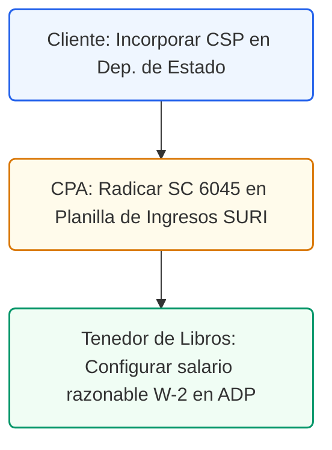

# Informe de Optimización Contributiva - Práctica Dental
## Reestructuración Corporativa y Estrategias Fiscales en PR

### Control de Documentos / Document Control
*   **Versión / Version:** 2.8
*   **Fecha / Date:** July 10, 2026
*   **Cliente / Client:** Clínica de Odontología General / General Dentistry Practice
*   **Autor / Author:** Roberto Alejandro Morales Pérez
*   **Estado / Status:** Activo / Entregable Final

---

## 1. Resumen Ejecutivo
Este informe presenta un análisis estratégico de optimización contributiva diseñado para la práctica dental en Puerto Rico. Los profesionales médicos en Puerto Rico que operan como individuos enfrentan tasas progresivas de contribución sobre ingresos de hasta el **33%** a nivel personal, y de hasta el **37.5%** a nivel corporativo si operan como corporaciones regulares, además de la doble tributación sobre dividendos, la Patente Municipal sobre ingresos brutos y la contribución sobre la propiedad mueble del CRIM.

A través del aprovechamiento del **Código de Incentivos de Puerto Rico (Ley 60-2019)** y del **Código Municipal (Ley 107-2020)**, una práctica dental cualificada puede reducir legalmente su tasa efectiva de contribución sobre ingresos a un rango de entre el **0% y el 4%**, eximir el pago de dividendos y mitigar significativamente las patentes y contribuciones de la propiedad mueble.

<!-- pagebreak -->

## 2. Incentivos Fiscales de Puerto Rico y Marcos Legales

### A. Ley 60 - Decreto de Médico Cualificado
Bajo la **Ley 60-2019**, los dentistas que obtienen un *Decreto de Médico Cualificado* reciben los siguientes beneficios fiscales:
*   **Tasa Impositiva Preferencial:** Tasa fija de contribución sobre ingresos del **4%** sobre el ingreso neto derivado de la prestación de servicios médicos/dentales clínicos.
*   **Exención en Dividendos:** **Exención del 100%** en la distribución de dividendos o beneficios acumulados por la corporación derivados de los servicios médicos del decreto (hasta $250,000 anuales o según autorizado).
*   **Requisitos Clave:**
    *   Mantener licencia activa para practicar la odontología en Puerto Rico.
    *   Ser residente de buena fe de Puerto Rico.
    *   Cumplir con un mínimo de **180 horas de servicio comunitario** anuales (según certificado por el Departamento de Salud).

### B. Ley 60 - Decreto de Servicios de Exportación (Turismo Dental)
Si la práctica dental ofrece servicios de consultoría remota, facturación, laboratorios o atrae pacientes no residentes de Puerto Rico (Turismo Dental):
*   **Tasa Preferencial:** Tasa fija corporativa del **4%** sobre el ingreso neto derivado de los servicios de exportación (Sección 2031.01).
*   **Exención en Dividendos:** **100% de exención** sobre las distribuciones de dividendos procedentes de esta actividad.

### C. Ley 60 - Jóvenes Empresarios
Para dentistas entre **16 y 35 años** que establecen una nueva práctica en Puerto Rico:
*   **Exención de Ingresos:** **Exención del 100%** sobre los primeros **$500,000** de ingresos brutos generados por el nuevo negocio durante sus primeros **3 años** de operación.
*   **Exenciones Adicionales:** **100% de exención** en Patente Municipal y CRIM (propiedad mueble) durante ese mismo periodo de 3 años.

### D. Exenciones Municipales (Ley 107-2020)
La Patente Municipal grava el volumen de negocios bruto (usualmente 0.50% para servicios). Bajo el Código Municipal (**Ley 107-2020**), los municipios tienen la facultad de conceder exenciones parciales o totales de patente y CRIM a clínicas médicas para incentivar la inversión local y el acceso a la salud.

### E. Optimización Salarial Corporativa (P.S.C. / S-Corp)
Si el dentista no posee un decreto de Ley 60, puede estructurar su práctica como una **Corporación de Servicios Profesionales (P.S.C.)** o una **LLC** con elección de conducto (S-Corp). En lugar de retirar todas las ganancias como salario (sujeto a las tasas personales ordinarias de hasta el 33% más el impuesto federal de nómina del 15.3%), se auto-paga un "Salario Razonable" (W-2) y distribuye el remanente como dividendos (tributando a una tasa especial del **15%** y libre de impuestos de nómina federales).
<!-- pagebreak -->

## 3. Comparación Cuantitativa de Escenarios Fiscales

Asumiendo una práctica con:
*   **Ingresos Brutos:** $400,000
*   **Gastos Operacionales:** $100,000
*   **Ingreso Neto (Pre-Impuestos):** $300,000
*   *Nota: Para el escenario de Joven Empresario, el ingreso bruto total de $400,000 queda por debajo del límite de $500,000, por lo que toda la ganancia está exenta.*

| Métrica Fiscal | Escenario A: Individuo / LLC Ordinaria | Escenario B: P.S.C. (Sin Decreto - Salario/Div) | Escenario C: Ley 60 Médico Cualificado (4%) | Escenario D: Joven Empresario (Ley 60 - 0%) |
| :--- | :---: | :---: | :---: | :---: |
| **Ingreso Bruto** | $400,000 | $400,000 | $400,000 | $400,000 |
| **Gastos** | $100,000 | $100,000 | $100,000 | $100,000 |
| **Ingreso Neto** | $300,000 | $300,000 | $300,000 | $300,000 |
| **Salario W-2** | N/A (Draw) | $120,000 | $60,000 | N/A |
| **Contribución Corp.** | N/A | $45,801 | $9,357 | $0 |
| **Contribución Indiv.** | $80,721 | $26,250 | $6,810 | $0 |
| **FICA / Medicare (15.3%)**| $30,564 | $18,360 (Sobre $120k) | $9,180 (Sobre $60k) | $0 |
| **Impuesto Div. (15%)** | $0 | $18,350 | $0 (Exento) | $0 (Exento) |
| **Patente Municipal (0.5%)**| $2,000 | $2,000 | $2,000 | $0 (Exento) |
| **Carga Fiscal Total** | **$113,285** | **$110,761** | **$27,347** | **$0** |
| **Tasa Efectiva Real** | **37.76%** | **36.92%** | **9.12%** | **0.00%** |

<!-- pagebreak -->

## 4. Exposición al Impuesto Federal de Autoempleo (FICA/Medicare) y Mitigación

### El Riesgo: Formulario 1040-SS
Los residentes de Puerto Rico están exentos de pagar el impuesto federal de ingresos sobre su ingreso de fuentes locales, pero **siguen sujetos al impuesto federal de nómina (FICA/Medicare)**. Si se opera como un conducto puro (proprietorship, sociedad o LLC transparente) en Puerto Rico, todo el ingreso neto operativo está sujeto al **15.3% de Autoempleo** reportado en el **Formulario 1040-SS**.

Dado que los decretos de la Ley 60 son de origen local (estatales), **no pueden eximir del pago de impuestos federales**. Por lo tanto, un dentista con decreto que opere como conducto pagaría el 4% local, pero seguiría pagando el 15.3% federal sobre toda su ganancia operativa de \$300,000.

### La Mitigación: Estructura Corporativa (P.S.C.) con Decreto
Para mitigar esto, se debe operar como una **P.S.C. (Regular Corporation)**:
1.  La corporación contrata al dentista como empleado.
2.  Se establece un **Salario Razonable** (ej. $60,000). Únicamente esta porción salarial tributa el 15.3% de FICA/Medicare.
3.  El ingreso remanente de la corporación (ej. $240,000) tributa la tasa fija preferencial del **4%** bajo el decreto.
4.  La corporación distribuye las ganancias netas post-impuestos al dentista en forma de dividendos. Estos dividendos están **100% exentos** de contribución sobre ingresos en Puerto Rico y **libres de impuestos federales FICA/Medicare**, evitando de esta manera el cobro del 15.3% de autoempleo federal.

---

## 5. Alimentos y Comidas de Negocios en Puerto Rico (PR IRC)

### A. Límite General de Deducción del 50%
Bajo la **Sección 1033.17(a)(1)** del Código de Rentas Internas de Puerto Rico (PR IRC), la deducción para alimentos, bebidas y entretenimiento está limitada al **50%** del monto gastado. Estos gastos deben ser ordinarios, necesarios y contar con la documentación de sustanciación correspondiente.

*   **Diferencia Crítica con Ley Federal (EE. UU.):** A diferencia del código federal de EE. UU. (TCJA) que eliminó por completo la deducción de gastos de entretenimiento, en Puerto Rico los gastos de entretenimiento directamente relacionados con la práctica dental (ej. seminarios, actividades de mercadeo) **siguen siendo deducibles al 50%**.

#### Requisitos de Sustanciación (Sección 1033.17(b))
Se debe mantener evidencia de:
1.  **Monto:** Costo total de la comida o entretenimiento.
2.  **Fecha y Hora:** Cuándo ocurrió.
3.  **Lugar:** Ubicación física del establecimiento.
4.  **Propósito de Negocio:** El tema discutido (ej. coordinación de casos, mercadeo).
5.  **Relación de Negocios:** Nombre y posición de las personas presentes (ej. laboratorios, dentistas asociados).

### B. Excepciones con Deducción al 100%
Bajo la **Sección 1033.17(a)(2)** del PR IRC, los siguientes gastos de comida y bebidas están exentos del límite del 50% y son **100% deducibles** para el patrono:
1.  **Actividades Sociales y Recreativas para Empleados (Sección 1033.17(a)(2)(D)):** Fiestas de Navidad, días de picnic corporativos y actividades abiertas a todo el personal.
2.  **Comidas en el Establecimiento para Conveniencia del Patrono (Sección 1033.17(a)(2)(B)):** Almuerzos provistos al personal durante turnos continuos para mantener la clínica abierta o atender emergencias. Estas comidas están exentas de impuestos sobre ingresos de nómina para el empleado bajo la **Sección 1032.06** (Fringe Benefits).
3.  **Meriendas de Pacientes y Reuniones Públicas (Sección 1033.17(a)(2)(E)):** Café, agua y refrigerios provistos en la sala de espera de la clínica para los pacientes (promocionales y exentos).
4.  **Break Room de Empleados (Sección 1032.06):** Cafés, refrescos, aguas y meriendas en la nevera de la clínica para consumo de los empleados. Son deducibles al 100% para la empresa y exentos para el empleado (beneficios *de minimis*).

<!-- pagebreak -->

## 6. Beneficios Marginales Exentos de Impuestos (Fringe Benefits)

### A. Vales de Comida (Vales de Alimentos / Ticket Restaurant)
*   **Tratamiento del Empleado:** Exentos de contribución sobre ingresos de Puerto Rico y exentos de retención de nómina hasta **$8.00 por día laborado** (Sección 1031.02(a)(2)(L)).
*   **Tratamiento del Patrono:** Deducible al **100%** por la corporación dental (exentos del límite del 50% de comidas).
*   **Requisitos:** Deben ser canjeables únicamente por alimentos y no ser convertibles en efectivo.

### B. Seguros de Salud Pagados por el Patrono (Plan Médico)
*   **Tratamiento del Empleado/Propietario W-2:** Las aportaciones patronales para planes médicos están **100% exentas** de contribución sobre ingresos de Puerto Rico (Sección 1031.02(a)(2)(C)) y exentas de FICA/Medicare.
*   **Tratamiento del Patrono:** **100% deducible** como gasto de operaciones de la clínica dental.
*   **Dueños de LLC por Conducto (Self-Employed):** No pueden excluirlo como beneficio de empleado. Deben pagarlo de forma personal y reclamarlo como deducción sobre la línea en su Planilla personal (Formulario 482) bajo la Sección 1033.15(a)(4). Esto no les reduce la base imponible de FICA/Medicare federal (Form 1040-SS).

### C. Vehículos de la Empresa, Concesión y Límites de Lujo (Sección 1033.07(a)(3))
Los automóviles están sujetos a estrictos límites de deducción:
1.  **Límite de Capitalización de Lujo:** El valor máximo depreciable de un vehículo es de **$30,000**. Cualquier exceso del costo sobre los $30,000 es **estrictamente no deducible**.
2.  **Depreciación:** Método de línea recta sobre una vida útil mínima de **5 años** (deducción máxima de **$6,000 anuales**).
3.  **Límite de Gastos Operacionales (Gas, Seguros, Mantenimiento):** Limitados en proporción al costo:
    $$\text{Porcentaje Deducible} = \frac{\$30,000}{\text{Costo Real del Auto}}$$
    *Ejemplo:* Si el auto costó $60,000, solo el 50% de los gastos operativos de gas y mantenimiento serán deducibles por el negocio.
4.  **Reembolso de Millaje (Plan de Cuentas Reconciliables):** Reembolso de millas reales utilizadas para el negocio (según bitácora diaria) libre de impuestos para el empleado y deducible al 100% para el patrono hasta las tasas de Hacienda (similar a las tasas federales).

<!-- pagebreak -->

## 7. Gestión de Riesgos, Protección de Activos y Seguridad HIPAA

### 7.1 Perfil de Riesgo Contributivo
*   **Riesgo Bajo:** Deducciones por Sección 179 (expansión acelerada de equipo clínico), plan médico y meriendas *de minimis* de empleados.
*   **Riesgo Medio:** Asignación de salario razonable y transacciones de alquiler propio (alquiler de local al propio dueño). Requiere un estudio de mercado para documentar el canon de alquiler y los salarios promedio de dentistas similares en la región.

### 7.2 Protección de Activos
Operar como P.S.C. limita la responsabilidad personal del dentista. Al colocar el local comercial o los equipos pesados bajo una entidad legal LLC de bienes raíces independiente y arrendársela a la clínica dental, se aísla la propiedad comercial de cualquier demanda por impericia médica (malpractice) que ocurra en la práctica clínica.

### 7.3 Privacidad de Datos y HIPAA en QuickBooks
Como entidad cubierta por la ley HIPAA, la clínica dental **tiene estrictamente prohibido** registrar datos médicos protegidos (PHI) o nombres de pacientes en QuickBooks Online. Todas las facturas y cobros registrados en QBO deben ingresarse bajo asientos resúmenes diarios (ej. "Cobros Clínicos del Día") sin detallar identidades de pacientes, los cuales quedan debidamente custodiados en el sistema seguro Open Dental.

### 7.3.1 Procedimiento Operativo Estándar (SOP) para Cumplimiento con HIPAA en QuickBooks Online

Para salvaguardar la privacidad de la información médica protegida (PHI) de los pacientes y cumplir estrictamente con la legislación federal HIPAA, la clínica dental debe implementar el siguiente Procedimiento Operativo Estándar (SOP) en su contabilidad:

1. **Anonimización del Registro de Clientes**: Queda estrictamente prohibido crear cuentas individuales en QuickBooks Online con nombres de pacientes, números de seguro social, números de teléfono o expedientes clínicos. Todos los ingresos y cobros deben registrarse bajo un cliente único genérico denominado "Pacientes de Servicios Dentales Clínicos" (Código de Sistema: `CLI-DENT-01`).
2. **Descripción Genérica de Servicios**: Al registrar recibos de pago (Sales Receipts) o facturas (Invoices) en QBO, la descripción de los artículos debe ser enteramente genérica (por ejemplo, "Servicios Clínicos Odontológicos" o "Tratamiento Dental Consolidado"). No se permite ingresar códigos ADA (American Dental Association) de procedimientos específicos, descripciones detalladas de tratamientos o anotaciones clínicas que revelen diagnósticos.
3. **Prohibición de Documentación Clínica Adjunta**: Está totalmente prohibido cargar planes de tratamiento, reclamaciones de planes médicos o copias de facturas individuales en la función de "Attachments" de QuickBooks Online.
4. **Reconciliación mediante Lote Diario**: La correspondencia entre el flujo de caja y la facturación de pacientes se realizará cruzando el total del recibo de venta en QBO con el número de lote diario del software Open Dental (por ejemplo, "Lote Diario Open Dental #20260705-A"). El reporte detallado que identifica a los pacientes específicos se mantendrá bajo llave o en archivos cifrados en el servidor local de la clínica, fuera de QBO.
5. **Auditorías Trimestrales de Datos**: El Oficial de Cumplimiento de la clínica seleccionará al azar el 10% de las facturas de QBO de manera trimestral para auditar que no contengan datos PHI. Cualquier infracción será eliminada de inmediato y el personal responsable será re-adiestrado en un periodo no mayor de 48 horas.

### 7.4 Estrategia de Salida y Reversibilidad
La disolución de la corporación o la venta de la práctica dental conlleva la liquidación de activos, lo que genera ganancias de capital sujetas a tributación ordinaria sobre el valor del equipo (tomógrafos, sillas dentales). Sin embargo, los fondos mantenidos bajo fideicomisos cualificados de retiro pueden mantenerse diferidos hasta la distribución real de los beneficios.

### 7.5 Lista de Cotejo para Defensa en Auditoría y Estrategia de Reversibilidad

#### A. Lista de Cotejo para Defensa en Auditoría (Audit Defense Strategy Checklist / The Defense File)
En previsión de una auditoría tributaria por parte del Departamento de Hacienda de Puerto Rico (SURI) o del Servicio de Rentas Internas Federal (IRS), la corporación de práctica dental debe mantener permanentemente en su archivo físico y digital ("Expediente de Defensa") la siguiente documentación de soporte para los últimos cinco (5) años fiscales:

- [ ] **Decreto de Médico Cualificado de Ley 60-2019** (o Ley 14-2017) vigente y debidamente firmado por el Secretario del Departamento de Desarrollo Económico y Comercio (DDEC).
- [ ] **Certificados Anuales de Cumplimiento (Certificates of Good Standing)** vigentes, emitidos por la Oficina de Exención Contributiva (OEC).
- [ ] **Certificación de Servicios Comunitarios** anual aprobada por el Departamento de Salud de Puerto Rico, que evidencie el cumplimiento mínimo de 180 horas de servicio comunitario obligatorio.
- [ ] **Estudio de Compensación Razonable de Mercado** preparado por un CPA o economista independiente que valide el salario W-2 anual del el Odontólogo Propietario (fijado en $60,000) frente a las ganancias corporativas distribuidas como dividendos.
- [ ] **Contrato de Arrendamiento Comercial** vigente entre la corporación (P.S.C.) y la LLC de bienes raíces propia, acompañado de un informe de canon de alquiler comparable en la zona comercial de San Juan para sustentar el gasto de renta.
- [ ] **Licencias y Colegiación Activas** de la Junta Examinadora de Dentistas de Puerto Rico y del Colegio de Cirujanos Dentistas de Puerto Rico.
- [ ] **Declaraciones Informativas Radicadas (Formulario 480.6SP)** correspondientes a todos los laboratorios dentales y contratistas del periodo, junto con copias de sus Certificados de Relevo de Retención (Formulario SC 2756) para justificar los pagos efectuados sin retención.
- [ ] **Bitácora Diaria de Millaje (Mileage Log)**: Registro detallado de millas recorridas para fines comerciales indicando fecha, destino, propósito de negocio y millaje inicial/final, junto con los recibos de mantenimiento del vehículo de la corporación.
- [ ] **Expediente de Gastos de Comidas de Negocios**: Registro que detalle la fecha de la comida, el nombre y relación comercial del comensal, el propósito de negocios específico (conforme a la regla del 50% de Hacienda) y el recibo original detallado del restaurante.
- [ ] **Resoluciones Corporativas de Beneficios Marginales**: Copia de las resoluciones de la Junta de Directores que autorizan y estructuran el plan médico corporativo, el reembolso de auto y los vales de comida exentos de impuestos para los empleados.

#### B. Estrategia de Reversibilidad Corporativa (Reversibility & Exit Analysis / Exit Strategy)
Si por cambios regulatorios, de negocio o personales, se requiriera deshacer la estructura corporativa (P.S.C.) y volver a operar bajo conducto (Sociedad o Propiedad Única):

1. **Revocación Voluntaria del Decreto**: Se debe presentar una solicitud de renuncia formal ante la OEC del DDEC. La tasa preferencial del 4% y la exención en dividendos cesarán en la fecha de efectividad determinada por la resolución de la OEC, aplicando la tasa contributiva general de corporaciones (hasta 37.5%) a los ingresos devengados a partir de esa fecha.
2. **Conversión a Corporación de Individuo**: Se radicará el Formulario SC 2640 en SURI para seleccionar el tratamiento contable de conducto bajo la Sección 1007.01 del Código de Rentas Internas de Puerto Rico. Esto elimina la doble tributación corporativa, pero reactiva la exposición al 15.3% del impuesto federal de autoempleo (FICA/Medicare) en el Formulario 1040-SS sobre toda la ganancia operativa de la clínica.
3. **Disolución y Liquidación de Activos (Sección 1034.04)**: En caso de cese de operaciones, la transferencia de los equipos dentales (tomógrafos, sillas dentales) al patrimonio del el Odontólogo Propietario se tratará fiscalmente como una venta a valor de mercado. La plusvalía (diferencia entre el valor de mercado y el costo neto en libros depreciado) tributará como ganancia de capital, y los fondos acumulados remanentes tributarán como dividendos de liquidación al tipo general del 15% a nivel individual.

<!-- pagebreak -->

## 8. Presupuesto de Transición e Implementación

Para asegurar una transición exitosa a la estructura corporativa de P.S.C. y al régimen fiscal preferencial de la Ley 60, se proyecta el siguiente presupuesto detallado de implementación (costo fijo no recurrente):

| Concepto de Gasto | Descripción Técnica | Costo Fijo |
| :--- | :--- | :---: |
| **Incorporación y Registro en SURI** | Derechos del Departamento de Estado, sellos digitales y obtención del número de identificación patronal federal (EIN). | $650 |
| **Trámite de Decreto Ley 60** | Honorarios profesionales para recopilación de credenciales, preparación de propuesta y radicación de solicitud ante la OEC y DDEC. | $3,500 |
| **Suscripción de QBO Plus (12 meses)** | Costo de la suscripción anual de QuickBooks Online Plus ($85/mes) que incluye inventario y 5 usuarios. | $1,020 |
| **Servicios de Configuración del Tenedor de Libros** | Configuración inicial de cuentas contables, saldos de apertura, mapeo en SURI y enlace técnico con Open Dental. | $1,800 |
| **Configuración de Nómina en ADP** | Cargo de implementación de nómina, cálculo de salario razonable y automatización de depósitos estatales/federales. | $450 |
| **Estudio de Compensación y Renta** | Certificación independiente por CPA del salario razonable y tasación de mercado para sustentar el contrato de arrendamiento. | $1,200 |
| **Adiestramiento de Personal (6 horas)** | Capacitación técnica a la recepcionista sobre flujo de A/P y protocolos de confidencialidad HIPAA. | $600 |
| **Presupuesto Total de Transición** | **Monto total requerido para completar la transición legal, contable y operativa.** | **$9,220** |

*Nota: Este costo único de transición se recupera en su totalidad en un periodo aproximado de 1.8 meses, gracias al ahorro fiscal mensual derivado de la reducción de la tasa efectiva del 37.76% (individuo) al 9.12% (P.S.C. Ley 60).*
---
---

## 5. Ruta de Ejecución y Plan de Acción
El plan de transición al nuevo modelo de S-Corp (Entidad Conducto) requiere los siguientes pasos coordinados:

### Lista de Tareas Operacionales:
*   `[ ]` **[CLIENTE]** Registrar e incorporar la práctica dental como Corporación de Servicios Profesionales (C.S.P.) en el portal del Departamento de Estado de PR.
*   `[ ]` **[CPA]** Radicar la elección de Entidad Conducto utilizando el **Modelo SC 6045** adjunto a la Planilla de Contribución sobre Ingresos Corporativa en el portal **SURI** de Hacienda.
*   `[ ]` **[TENEDOR DE LIBROS]** Configurar el salario razonable W-2 del dentista socio en la plataforma de nómina (ej. ADP Payroll) para alinear las retenciones patronales.
