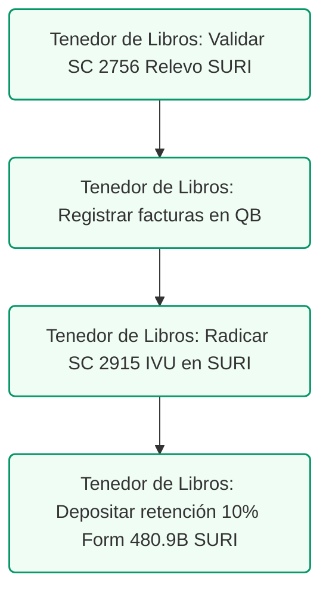

# Plantilla de Mapeo: QuickBooks $\rightarrow$ SURI
## Guía de Configuración Técnica para la Oficina Dental

### Control de Documentos / Document Control
*   **Versión / Version:** 2.4
*   **Fecha / Date:** July 10, 2026
*   **Autor / Author:** Roberto Alejandro Morales Pérez
*   **Estado / Status:** Final / Reconciled

---

## 1. Estructura del Catálogo de Cuentas (Chart of Accounts)

El catálogo de cuentas estructurado sirve como base para organizar las finanzas de la clínica dental.

> [!NOTE]  
> Los nombres de cuenta en esta plantilla conceptual se describen en español. Para la importación y configuración final en QuickBooks Online, se deben utilizar los nombres y códigos estandarizados en inglés detallados en la *Guía de Referencia QuickBooks-SURI* y en el archivo de importación CSV correspondiente.

### Cuentas de Ingresos (Revenue / Income)
Para oficinas dentales con médicos exentos o bajo decretos de Ley 60 / Ley 14:
*   **4000 - Ingresos por Servicios Dentales (Exentos de IVU)**
    *   *Uso:* Copagos de pacientes, deducibles y reembolsos de planes médicos (Triple-S, MCS, First Medical, etc.).
*   **4100 - Ingresos bajo Decreto de Exención (Ley 60 - 4%)**
    *   *Uso:* Ingresos del médico cualificado exentos bajo decreto estatal (tasa fija del 4%).
*   **4200 - Ventas de Productos Clínicos (Sujetos a IVU - 11.5%)**
    *   *Uso:* Venta de cepillos eléctricos, pastas dentales, kits de blanqueamiento.
*   **4900 - Otros Ingresos (No Exentos / No Decreto)**
    *   *Uso:* Intereses devengados, venta de activos, etc.

### Cuentas de Pasivo (Liabilities)
Para manejar las retenciones de Hacienda y depósitos mensuales:
*   **2100 - Retenciones por Pagar a Hacienda (10% Retención)**
    *   *Uso:* Retención del 10% (o la tasa correspondiente) sobre servicios profesionales de laboratorios, dentistas asociados y contratistas.
*   **2200 - IVU por Pagar (Sales Tax Payable)**
    *   *Uso:* Acumulación del IVU cobrado en la venta de productos (10.5% Hacienda estatal y 1.0% Municipio).
*   **2300 - Retenciones de Nómina por Pagar (SURI / IRS)** *(si no las procesa ADP automáticamente)*
    *   *Uso:* Impuestos retenidos a empleados (499 R-1B).

<!-- pagebreak -->

## 2. Flujo de Trabajo en QuickBooks y su Conciliación en SURI

### A. Pago a Contratistas y Retención del 10% (Formulario 480.6SP)
1.  **Registro de la Factura (Bill):**
    *   Al recibir la factura de un laboratorio por \$1,000, regístrela en QuickBooks:
        *   **Gasto (Dental Lab Expense):** Debita \$1,000.
        *   **Cuentas por Pagar (Accounts Payable):** Acredita \$1,000.
2.  **Registro del Pago (Pay Bill) con Retención:**
    *   Si el laboratorio no tiene relevo (aplica el 10% de retención):
        *   **Pago Neto al Proveedor (Cash/Bank):** Debita/Gira \$900.
        *   **Retenciones por Pagar (10% Withholding Liability):** Acredita \$100.
3.  **Depósito Mensual en SURI (Formulario 480.9B):**
    *   Antes del día 15 del mes siguiente, ingrese a SURI y pague los \$100.
    *   En QuickBooks, registre un gasto/pago cargado a **2100 - Retenciones por Pagar a Hacienda** por \$100 para liquidar la cuenta de pasivo.

### B. Declaración de IVU Mensual (Formulario SC 2915)
1.  En SURI, al radicar la planilla mensual, Hacienda le pedirá:
    *   *Ventas Exentas:* Debe coincidir con el balance del mes de la cuenta **4000 / 4100** de QuickBooks.
    *   *Ventas Tributables:* Debe coincidir con el balance de la cuenta **4200** de QuickBooks.
    *   *Impuesto Recaudado:* Debe cuadrar con la cuenta **2200 - IVU por Pagar** antes de emitir el pago a Hacienda.

### C. Conciliación de Nómina con ADP
1.  ADP retirará fondos de la cuenta de banco de la clínica bajo dos conceptos comunes:
    *   *Net Payroll:* Pago neto a los empleados.
    *   *Payroll Taxes:* Retenciones de impuestos estatales (SURI) y federales (IRS).
2.  **Asiento de Diario Mensual (Payroll Journal Entry):**
    *   **Debitar:** Gastos de Salarios (Salaries Expense) por el salario bruto.
    *   **Debitar:** Gastos de Seguro Social/Medicare Patronal (Payroll Tax Expense).
    *   **Acreditar:** Banco (por los retiros de ADP).

### D. Cumplimiento de Privacidad y HIPAA en QuickBooks Online
1.  **Regla de Oro:** Jamás ingrese nombres de pacientes, números de seguro social, ni códigos de procedimientos clínicos (ADA codes) en QuickBooks Online.
2.  **Registro de Ventas:** Las facturas o recibos de ventas en QBO se deben registrar bajo un cliente genérico (ej. "Ventas Clínicas Diarias") utilizando el reporte diario consolidado de Open Dental como documento de soporte físico adjunto.

### E. Gestión del Cambio y Capacitación del Personal de Recepción
1.  **Rutina Semanal:** Capacitar a la recepcionista para que cada viernes escanee y cargue en la pestaña de *Attachments* de QuickBooks todas las facturas de laboratorios dentales y contratistas del periodo.
2.  **Verificación de Retenciones:** Asegurar que el personal administrativo verifique que el sistema haya calculado automáticamente la retención del 10% (o tasa de relevo aplicable) antes de autorizar el pago del neto al suplidor.

### F. Procedimiento Operativo Estándar (SOP) de HIPAA para Registro y Conciliación en QuickBooks Online (HIPAA Data Scrubbing SOP) (HIPAA Data Scrubbing SOP) (HIPAA Data Scrubbing SOP) (HIPAA Data Scrubbing SOP) (HIPAA Data Scrubbing SOP) (HIPAA Data Scrubbing SOP) (HIPAA Data Scrubbing SOP) (HIPAA Data Scrubbing SOP) (HIPAA Data Scrubbing SOP) (HIPAA Data Scrubbing SOP) (HIPAA Data Scrubbing SOP) (HIPAA Data Scrubbing SOP) (HIPAA Data Scrubbing SOP) (HIPAA Data Scrubbing SOP) (HIPAA Data Scrubbing SOP) (HIPAA Data Scrubbing SOP) (HIPAA Data Scrubbing SOP)

Para garantizar que el flujo de datos entre el sistema clínico Open Dental y QuickBooks Online no vulnere la privacidad del paciente bajo la ley federal HIPAA, el personal administrativo aplicará el siguiente SOP de registro diario:

1. **Asiento Consolidado Diario**: Los ingresos del día se registrarán mediante un único "Sales Receipt" o "Deposit" en QBO. Queda estrictamente prohibido detallar nombres o tratamientos individuales. El cliente asignado en la transacción de QBO será siempre el cliente genérico "Servicios Dentales Clínicos Consolidados" (ID: `CLI-DENT-01`).
2. **Mapeo de Clasificación de Ingresos**: 
   - Los ingresos provenientes de copagos y planes médicos irán a la cuenta **4000 - Ingresos por Servicios Dentales (Exentos de IVU)**.
   - Los ingresos de Ley 60 irán a la cuenta **4100 - Ingresos bajo Decreto de Exención (Ley 60 - 4%)**.
   - Los ingresos por venta de productos irán a la cuenta **4200 - Ventas de Productos Clínicos (Sujetos a IVU - 11.5%)**.
3. **Referencias de Conciliación**: En el campo "Memo" se ingresará la fecha de operación y el código de lote clínico (ej. "Conciliación Lote Open Dental #20260705-01"). No se colocarán descripciones de tratamientos dentales ni nombres de planes médicos en los detalles de las transacciones de QBO.
4. **Resguardo de Documentos de Soporte**: El reporte diario físico impreso de Open Dental (con los nombres de los pacientes y los métodos de pago) será archivado en la carpeta de auditoría diaria dentro del archivador de seguridad bajo llave en la oficina de administración.

<!-- pagebreak -->

## 3. Lista de Cotejo para Auditoría SURI y Reversibilidad del Mapeo

### A. Lista de Cotejo para Auditoría SURI (Controles de Conciliación)
El CPA externo y el personal contable deben utilizar esta lista de cotejo para validar mensualmente que el mapeo contable en QuickBooks Online coincida con las declaraciones en la plataforma SURI del Departamento de Hacienda:

- [ ] **Conciliación de Cuentas por Pagar (A/P)**: Verificar que toda factura de laboratorio o contratista con retención del 10% esté registrada adecuadamente cargando la retención a la cuenta `2100 - Retenciones por Pagar a Hacienda`.
- [ ] **Cuadre de Informativas 480.6SP**: Validar que la sumatoria de las facturas pagadas a contratistas en QBO coincida con el acumulador de retenciones e informativas radicadas al fin de año en SURI.
- [ ] **Verificación de Relevo SC 2756**: Confirmar que no se haya omitido la retención del 10% a ningún contratista que carezca de un Certificado de Relevo vigente archivado.
- [ ] **Casillero de Ventas Exentas**: Asegurar que las ventas registradas en las cuentas `4000` y `4100` coincidan con el monto de Ventas Exentas reportado en el Formulario SC 2915 (Planilla Mensual de IVU).
- [ ] **Pasivo por IVU Pendiente**: Conciliar mensualmente el balance de la cuenta `2200 - IVU por Pagar` contra el pago definitivo radicado en SURI por concepto de IVU estatal y municipal.

### C. Protocolo de Gestión de Accesos Delegados en SURI (Acceso Seguro)
Para garantizar la seguridad de la información financiera del consultorio y evitar el uso compartido de la contraseña principal del doctor, la gerencia de la clínica dental configurará el acceso delegado para el consultor en la plataforma SURI siguiendo este protocolo:

1.  **Inicio de Sesión Principal:** El doctor (el Odontólogo Propietario) iniciará sesión en su portal de SURI utilizando sus credenciales maestras.
2.  **Sección de Administración:** Dirigirse a la pestaña de **Administración / Perfil** y seleccionar la opción de **Administrar Cuentas y Accesos**.
3.  **Añadir Representante Autorizado:** Seleccionar la opción **Añadir Representante / Especialista**.
4.  **Identificación del Especialista:** Ingresar el número de identificación tributaria o Specialist ID de su consultor / Tenedor de Libros (Roberto Alejandro Morales Perez).
5.  **Permisos Restringidos y Específicos:**
    *   **Permiso Concedido:** Habilitar únicamente los derechos de *Preparación y Radicación* (Prepare and File) para las planillas mensuales de IVU (SC 2915) y depósitos de retenciones (SC 480.9B).
    *   **Permiso Denegado:** Queda estrictamente prohibido otorgar permisos de *Administración de Cuentas Bancarias* (cambio de rutas de depósitos/pagos automáticos) o de *Administrador Maestro*.
6.  **Confirmar y Archivar:** Validar el registro. SURI enviará un correo de confirmación a ambas partes, habilitando al consultor a trabajar con su propio usuario seguro.

<!-- pagebreak -->

## 4. Presupuesto y Plan de Costos de Transición del Sistema

La implementación, migración y parametrización técnica de esta plantilla de mapeo en QuickBooks Online Plus conllevan el siguiente presupuesto operativo estructurado:

- **Suscripción Anual a QuickBooks Online Plus**: $1,020 ($85 mensuales para permitir contabilidad A/P e inventario minorista).
- **Servicios Profesionales de Migración e Importación de Catálogo (COA)**: $900 (Asesor / Tenedor de Libros para la depuración e importación del catálogo contable de 66 cuentas en QBO).
- **Mapeo Contable y Parametrización en SURI**: $600 (Alineación técnica de las cuentas de ingresos y retenciones de QBO con los formularios de radicación automática en SURI).
- **Integración de Nómina con ADP**: $350 (Servicio de configuración del enlace de ADP General Ledger a las subcuentas de nómina de la clínica).
- **Adiestramiento de Personal y Protocolo HIPAA**: $400 (4 horas de capacitación al personal de recepción sobre registro consolidado y cuentas por pagar sin PHI).
- **Costo Total de Transición del Sistema**: **$3,270** (Inversión no recurrente para garantizar la integridad contable y el cumplimiento de Hacienda y HIPAA).

<!-- pagebreak -->

## 5. Glosario de Términos para QuickBooks y SURI

*   **Información de Comerciante**: Registro de comerciante requerido en SURI que define el código NAICS de la práctica dental y certifica su exención de IVU.
*   **Retención en el Origen**: Proceso de restar el 10% a los pagos de contratistas independientes para reportarlo directamente a Hacienda en nombre del proveedor.
*   **SC 2756 (Waiver)**: Certificación oficial que entrega un proveedor al cliente para evitar la retención del 10% o reducirla al 3%/5%.
*   **480.6SP**: Formulario anual radicado en SURI para declarar todos los pagos a contratistas y las retenciones ejecutadas en el año.
---
---

## 3. Protocolo de Acceso de Delegados en SURI
Para permitir que el Tenedor de Libros (**Roberto Alejandro Morales Perez**) y el CPA externo radiquen y concilien las planillas mensuales de IVU y retenciones, el Dentista Propietario debe autorizar el acceso en el portal de Hacienda siguiendo este protocolo:

1.  **Ingresar a SURI:** Acceda con sus credenciales principales a [suri.hacienda.pr.gov](https://suri.hacienda.pr.gov).
2.  **Menú de Cuentas:** Diríjase a la pestaña **Cuentas** y seleccione la opción **Administrar Accesos de Representantes** en el menú de configuración lateral.
3.  **Añadir Representante:** Haga clic en **Añadir Delegado / Representante**.
4.  **Ingresar Datos:** Ingrese el ID de usuario de SURI del representante contable autorizado.
5.  **Definir Permisos:** Asigne privilegios de **Radicación y Pago (Read/Write)** para las cuentas correspondientes:
    *   *IVU (Impuesto sobre Ventas y Uso)*: Para radicar la Planilla Mensual (SC 2915).
    *   *Retenciones en el Origen*: Para depositar las retenciones del 10% a laboratorios dentales (Formulario 480.9B).
6.  **Confirmación:** Complete la autenticación de seguridad y confirme la delegación.

---

## 4. Validación de Certificados de Relevo de Retención (Modelo SC 2756)
Para asegurar que los pagos a laboratorios dentales y subcontratistas están exentos de la retención del 10%, el Tenedor de Libros debe validar los certificados de relevo presentados por los proveedores en el portal público de Hacienda:

1.  **Acceso Público:** Ingrese a la página de inicio de SURI en [suri.hacienda.pr.gov](https://suri.hacienda.pr.gov) (no requiere credenciales).
2.  **Selección de Menú:** Oprima el botón **Validar un certificado o licencia** en el panel de servicios públicos.
3.  **Tipo de Documento:** Seleccione **Certificado de Relevo de Retención** en el menú desplegable.
4.  **Ingresar Códigos:** Registre el número de certificado impreso en el documento y los últimos 4 dígitos del Seguro Social Patronal (FEIN) del proveedor.
5.  **Verificación Contable:** Presione **Validar**. Si el sistema confirma su validez, configure el proveedor en QuickBooks Desktop como exento; de lo contrario, retenga el 10% y deposítelo antes del día 15 vía Formulario 480.9B.

---

## 5. Conciliación de Comisiones de Procesadores (Evertec / ATH Móvil Business)
Cuando los pacientes pagan mediante ATH Móvil Business o terminales Evertec, el depósito neto recibido en el banco de la clínica dental es menor que la transacción bruta debido al cobro de comisiones (generalmente de 1.5% a 2.5%). Para asegurar la integridad contable:

*   **Registro Bruto**: Se registra el recibo de pago por el total cobrado al paciente (ej. $100.00) afectando la cuenta **1210 - Cuentas por Cobrar: Pacientes**.
*   **Asiento de Comisión**: Se registra un asiento de diario o regla de banco para separar la comisión del procesador:
    *   *Débito (Gasto)*: **5160 - Cargos Bancarios y Comisiones de Procesadores** ($2.00)
    *   *Débito (Banco)*: **1100 - Banco Operacional** ($98.00)
    *   *Crédito (Cuentas por Cobrar)*: **1210 - Cuentas por Cobrar: Pacientes** ($100.00)

## 6. Radicación Mensual de Planilla de Retenciones de Servicios (Formulario 480.9A)
Además del depósito de dinero efectuado no más tarde del día 15, el consultorio dental debe radicar una planilla informativa mensual en SURI para declarar los pagos y las contribuciones retenidas sobre servicios profesionales:

*   **Formulario:** **Planilla Mensual de Contribución Retenida sobre Pagos por Servicios Prestados (Formulario 480.9A)**.
*   **Fecha Límite:** No más tarde del **día 10 del mes siguiente** al cual corresponden las retenciones.
*   **Radicación en SURI:** Ingrese con acceso delegado $\rightarrow$ Cuentas de Retención en el Origen $\rightarrow$ Radicar Planilla Informativa Mensual.

## 7. Verificación del Certificado de Registro de Comerciante de SURI
Para evitar la retención o cobro indebido del IVU (Impuesto sobre Ventas y Uso) en la facturación de servicios clínicos, el consultorio dental debe mantener su Registro de Comerciante actualizado:
*   **Código NAICS Principal**: **621210** (Offices of Dentists).
*   **Designación del Certificado**: Debe figurar como **Agente No Retenedor** para la localidad correspondiente a los servicios odontológicos.
*   **Inspección Anual**: El Certificado de Registro de Comerciante debe imprimirse y exhibirse en un lugar visible al público en la recepción de la clínica dental, de acuerdo con el Código de Rentas Internas de Puerto Rico.

## 8. Conciliación Trimestral de Nómina vs. SURI
Al cierre de cada año contributivo, el Tenedor de Libros debe conciliar los salarios y retenciones declarados en los formularios federales y locales:
1.  **Formularios Federales**: Cuadrar el total de salarios reportados en los cuatro trimestres del **Formulario 941-PR** con el total acumulado en el **Formulario W-2PR** (Comprobante de Retención).
2.  **Formularios Locales (DTRH)**: Comparar la nómina reportada al Departamento del Trabajo en los formularios trimestrales **PR-UI-10** (Desempleo) con los gastos de salarios registrados en QuickBooks en la cuenta **5000 - Salarios y Jornales**.
3.  **Conciliación Anual en SURI**: Verificar que las retenciones locales acumuladas en las cuentas de retención de patronos en SURI coincidan con los comprobantes W-2PR radicados electrónicamente antes del **31 de enero**.

## 5. Ruta de Ejecución y Plan de Acción
El proceso mensual de conciliación contable y radicación en SURI sigue esta secuencia de tareas:

### Lista de Tareas Operacionales:
*   `[ ]` **[TENEDOR DE LIBROS]** Validar Certificados de Relevo (**Modelo SC 2756**) en SURI y registrar las facturas en QuickBooks eximiendo o aplicando la retención del 10%.
*   `[ ]` **[TENEDOR DE LIBROS]** Radicar la Planilla Mensual de IVU (**Modelo SC 2915**) antes del día 20 de cada mes (Menú: SURI -> Cuentas de IVU -> Radicar Planilla).
*   `[ ]` **[TENEDOR DE LIBROS]** Procesar y depositar las retenciones del 10% a contratistas (**Formulario 480.9B**) antes del día 15 de cada mes en SURI.
*   `[ ]` **[CLIENTE]** Autorizar las conciliaciones bancarias mensuales y la radicación de planillas en SURI.
*   `[ ]` **[CPA]** Realizar la auditoría de cierre de año cruzando las planillas informativas 480 con el total de gastos en QuickBooks.
