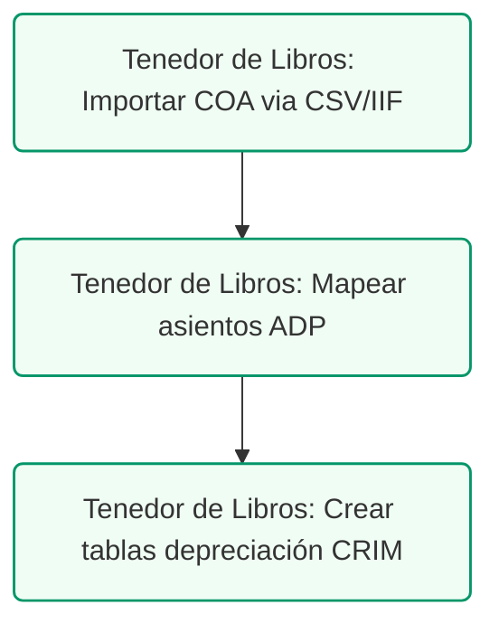

# Mapeo de Catálogo de Cuentas: QBO a SURI
## Mapeo de Nómina ADP, CRIM y Cumplimiento en PR

### Control de Documentos / Document Control
*   **Versión / Version:** 2.1
*   **Fecha / Date:** July 10, 2026
*   **Referencia / Document Ref:** QBO-SURI-REF-DENTIST-ES-01
*   **Cliente / Client:** Clínica de Odontología General / General Dentistry Practice
*   **Autor / Author:** Roberto Alejandro Morales Pérez
*   **Estado / Status:** Activo / Entregable Final

---

## 1. Mapeo del Catálogo de Cuentas a Formularios de SURI y Municipios

Esta sección detalla la relación directa entre las cuentas contables de la clínica en QuickBooks Online (QBO) y las radicaciones mensuales y anuales requeridas por el Departamento de Hacienda a través del portal **SURI** y los municipios:

| Cuenta en QuickBooks (QBO) | Formulario SURI / Obligación Municipal | Frecuencia de Radicación |
| :--- | :--- | :--- |
| **4000 - Clinical Exempt Revenue** | SC 2915 (Planilla Mensual de IVU) | Mensual (Día 20) |
| **4100 - Retail Taxable Revenue** | SC 2915 (Planilla Mensual de IVU) | Mensual (Día 20) |
| **4200 - Retail Exempt Revenue** | SC 2915 (Planilla Mensual de IVU) | Mensual (Día 20) |
| **4300 - Rental Income / B2B (4% IVU)** | SC 2915 (Planilla Mensual de IVU) | Mensual (Día 20) |
| **1200 - SURI 10% Withholding Receivable** | Crédito en Formulario 480.30 (Planilla Corp.)| Anual |
| **2100 - SURI 10% Withholding Payable** | 480.9B (Depósito) y 480.6SP (Informativa) | Mensual (Día 15) / Anual (Feb 28) |
| **2200 - IVU Payable (10.5% estatal)** | SC 2915 (Planilla Mensual de IVU) | Mensual (Día 20) |
| **2210 - IVU B2B Payable (4%)** | SC 2915 (Planilla Mensual de IVU) | Mensual (Día 20) |
| **2300 - CRIM Payable** | Planilla de Propiedad Mueble del CRIM | Anual (15 de mayo) |
| **2400 - Patente Municipal Payable** | Declaración de Volumen de Negocios | Anual (20 de abril / 15 de julio) |
| **2500 - SURI Patronal Payable** | 499 R-1B (Depósito) y 499 R-1A (Trimestral) | Mensual (Día 15) / Trimestral (Fin de mes) |
| **2510 - PR SUTA Payable** | Planilla de Desempleo (DTRH Portal) | Trimestral (Último día del mes) |
| **2520 - PR SINOT Payable** | Planilla Trimestral de SINOT (DTRH Portal) | Trimestral (Último día del mes) |
| **2530 - PR Chofres Payable** | Formulario TS-4 Seguro de Choferes (DTRH) | Trimestral (Último día del mes) |
| **6430 - Patient Refreshments** | Formulario 480.30 (Deducción Promocional) | Anual |
| **6435 - Employee Break Room Supplies** | Formulario 480.30 (Gastos de Personal - *de minimis*) | Anual |

---

<!-- pagebreak -->

## 2. Impuesto sobre la Propiedad Mueble del CRIM: Regla del Valor Residual

En Puerto Rico, el **Centro de Recaudación de Ingresos Municipales (CRIM)** tasa la propiedad mueble (maquinaria clínica, computadoras, mobiliario) utilizada en el negocio. A diferencia de la depreciación financiera (donde los libros pueden llegar a **$0**), el CRIM establece un **piso mínimo de valor residual** sobre el costo de adquisición:
*   **Equipo Dental y Maquinaria Clinica (Cuenta 1500):** Valor residual mínimo del **10%** de su costo original.
*   **Mobiliario y Equipo de Oficina (Cuenta 1510):** Valor residual mínimo del **10%** de su costo original.
*   **Computadoras y Servidores (Cuenta 1520):** Valor residual mínimo del **20%** de su costo original.

### Fórmula de Cómputo del CRIM
Para cualquier categoría de activo $i$:
$$AV_i = \max(BV_i, RV_i) = \max(C_i - AD_i, C_i \times R_i)$$
*   $C_i$: Costo de adquisición (subcuenta *Cost*).
*   $AD_i$: Depreciación acumulada (subcuenta *Accum Dep*).
*   $R_i$: Porcentaje residual mínimo del CRIM (10% o 20%).
*   $AV_i$: Valor tasable determinado (Base para el cómputo de impuestos).

---

## 3. Preguntas Frecuentes de la Operación Contable en Puerto Rico (FAQ)

### P1. ¿El alquiler de la oficina dental está sujeto a la retención del 10% de SURI?
**NO.** Bajo la **Sección 1062.03** del PR IRC, la retención en el origen del 10% aplica estrictamente a **servicios prestados**. El alquiler de un local comercial es un arrendamiento, no un servicio profesional. El pago en la cuenta `6200 - Rent Expense` se realiza al 100% al arrendador, sin retenciones.

### P2. ¿El IVU pagado en las compras de materiales médicos o servicios B2B se puede reclamar como un crédito?
**NO.** Dado que los servicios odontológicos clínicos están exentos de IVU, la clínica dental actúa como consumidor final de sus suministros. Por lo tanto, el IVU del 10.5% o 4% pagado en suministros médicos (`5010`) o servicios (`6310`) se capitaliza directamente como parte del gasto operativo de la cuenta correspondiente. No se debe registrar en cuentas de activo de IVU por cobrar.

### P3. ¿Cómo se maneja la deducibilidad de los gastos de comidas y entretenimientos?
*   **Comidas de Negocios y Representación (Cuenta 6400):** Sujetas al límite general de deducción del **50%**. Se registra el 100% en libros, y el CPA ajusta la deducibilidad al cierre del año.
*   **Actividades de Empleados y Navidad (Cuenta 6420):** **100% deducibles** (Sección 1033.17(a)(2)(D)).
*   **Meriendas de Pacientes (Cuenta 6430):** Aguas y cafés en sala de espera son **100% deducibles** como gasto promocional (Sección 1033.17(a)(2)(E)).
*   **Meriendas de Empleados (Cuenta 6435):** Suministros de break room son **100% deducibles** como beneficios marginales exentos *de minimis* (Sección 1032.06).

<!-- pagebreak -->

## 4. Nómina en Puerto Rico e Integración con ADP Payroll

### 4.1 La Regla de Salario Razonable W-2 para Accionistas/Dueños
Los dentistas dueños de corporaciones de servicios profesionales (P.S.C.) o LLCs que rinden servicios clínicos están obligados por Hacienda a auto-pagarse un **salario razonable por la vía W-2**. Esto evita que retiren el 100% de los ingresos como dividendos para eludir el pago de FICA (15.3% Social Security y Medicare). Hacienda y el IRS tienen la facultad de reclasificar distribuciones informales como salarios, cobrando de forma retroactiva el FICA, SUTA, SINOT, multas y recargos.

**Criterio de Razonabilidad:** Un estándar común de la industria dental es asignar en la W-2 entre el **30% y el 40% de las colecciones clínicas directas** generadas por el dentista propietario (lo equivalente a un dentista asociado). El resto se puede distribuir como dividendos corporativos exentos de impuestos de nómina.

### 4.2 Impuestos Patronales en Puerto Rico: Tasas y Topes (2026)

1.  **FICA Seguro Social:** 6.20% patronal (y 6.20% empleado) hasta el tope federal de $176,100 (2026).
2.  **FICA Medicare:** 1.45% patronal (y 1.45% empleado) sin tope de salario.
3.  **FUTA (Desempleo Federal):** 0.60% neto sobre los primeros $7,000 por empleado al año.
4.  **PR SUTA (Desempleo Estatal):** Tasa estándar de 2.70% sobre los primeros $7,000 por empleado al año.
5.  **PR SINOT (Seguro de Incapacidad):** 0.30% patronal y 0.30% empleado sobre los primeros $9,000 por empleado al año.
6.  **PR Chofres (Seguro de Choferes):** Cuota fija de $0.50 semanales patronal y $0.30 semanales empleado.
7.  **CFSE (Fondo del Seguro del Estado):** Seguro obrero obligatorio. Tasa variable según riesgo laboral. Para optimizar costos, se deben separar estrictamente en la declaración los salarios del personal administrativo/recepción (Clase de Riesgo baja, ej. tasa ~0.50%) del personal clínico/dentistas (Clase de Riesgo moderada, ej. tasa ~2.10%). Mezclar ambos grupos bajo la tasa clínica resulta en sobrepagos sustanciales de primas. Declaración anual el **20 de julio**.

<!-- pagebreak -->

## 5. Integración de Transacciones de ADP en QuickBooks Online

ADP realiza típicamente el cobro de nómina en tres débitos bancarios directos de la cuenta de banco de la clínica:
1.  **Net Payroll Draft:** Transferencias netas a empleados (`2095 - Direct Deposit Clearing`).
2.  **Payroll Taxes Draft:** Impuestos federales (FICA/FUTA) e impuestos retenidos locales de SURI y DTRH (`2090` y `2500`).
3.  **ADP Fees Draft:** Cargos por procesamiento de nómina.

### 5.1 Ejemplo de Entrada de Diario de Nómina (Journal Entry)
Asumiendo una nómina quincenal bruta de **$8,000.00** ($5,000.00 del dentista y $3,000.00 del staff clínico):

| Código y Nombre de Cuenta | Débito | Crédito |
| :--- | :---: | :---: |
| **6000 - Salaries & Wages (W-2)** | $8,000.00 |  |
| **6010 - Payroll Taxes - FICA Employer** | $612.00 |  |
| **6020 - Payroll Taxes - FUTA (Federal)** | $48.00 |  |
| **6030 - Payroll Taxes - PR SUTA** | $216.00 |  |
| **6040 - Payroll Taxes - PR SINOT** | $24.00 |  |
| **6050 - Payroll Taxes - PR Chofres** | $1.00 |  |
| **6060 - CFSE Worker's Comp Insurance** | $168.00 |  |
| **2095 - Direct Deposit Clearing** |  | $6,563.40 |
| **2090 - Federal Payroll Taxes Payable** |  | $1,272.00 |
| **2500 - SURI Patronal Withholding Payable** |  | $800.00 |
| **2510 - PR SUTA Payable** |  | $216.00 |
| **2520 - PR SINOT Payable** |  | $48.00 |
| **2530 - PR Chofres Payable** |  | $1.60 |
| **2540 - CFSE Payable** |  | $168.00 |
| **Total** | **$9,069.00** | **$9,069.00** |

<br/>

| Código y Nombre de Cuenta | Descripción del Asiento |
| :--- | :--- |
| **6000 - Salaries & Wages (W-2)** | Salarios brutos de empleados y doctor |
| **6010 - Payroll Taxes - FICA Employer** | FICA Patronal (Seguro Social $496 + Medicare $116) |
| **6020 - Payroll Taxes - FUTA (Federal)** | Desempleo federal patrono (FUTA) |
| **6030 - Payroll Taxes - PR SUTA** | Desempleo estatal patrono (SUTA 2.7%) |
| **6040 - Payroll Taxes - PR SINOT** | Incapacidad temporal patrono (SINOT 0.3%) |
| **6050 - Payroll Taxes - PR Chofres** | Aportación patronal Seguro de Choferes |
| **6060 - CFSE Worker's Comp Insurance** | Provisión mensual acumulada CFSE (2.10%) |
| **2095 - Direct Deposit Clearing** | Transferencias directas netas a empleados |
| **2090 - Federal Payroll Taxes Payable** | FICA EE + ER (\$1,224) y FUTA (\$48) |
| **2500 - SURI Patronal Withholding Payable** | Retención de contribución sobre ingresos de SURI |
| **2510 - PR SUTA Payable** | Obligación acumulada de SUTA estatal |
| **2520 - PR SINOT Payable** | Obligación SINOT (Empleado $24 + Patrono $24) |
| **2530 - PR Chofres Payable** | Obligación Seguro Choferes acumulada |
| **2540 - CFSE Payable** | Obligación CFSE acumulada por pagar |
| **Total** | **Entrada Cuadrada de Diario** |
---

## 6. Procedimientos Operacionales y Cumplimiento de Privacidad (HIPAA)

1.  **Segregación Estricta de HIPAA:** Para cumplir con las regulaciones de PHI federales, QuickBooks Online **no debe contener** nombres de pacientes, tratamientos, ni códigos ADA de procedimientos dentales. Todas las facturas y cobros deben registrarse de forma consolidada por día (ej. "Ventas Clínicas Exentas del Día 07/05/2026") sustentado de forma interna por reportes detallados y protegidos del software Open Dental.
2.  **Configuración de Cuentas en ADP:** Coordinar con el especialista de ADP para asegurar que la integración exporte los gastos de desempleo de Puerto Rico a las cuentas correctas (`2510`, `2520` y `2530`) en el catálogo contable de QBO, evitando que se mezclen con las partidas federales.
3.  **Auditoría de Registro de Patronos en DTRH:** Asegurar que la gerencia haya completado el registro de la clínica en el portal de patronos del Departamento del Trabajo y Recursos Humanos (DTRH). Sin esta vinculación activa, el sistema automático de nómina de ADP no podrá radicar los trimestrales locales (ej. Planilla SUTA y SINOT), resultando en multas automáticas por falta de radicación a pesar de haberse descontado los fondos de la cuenta bancaria de la clínica.


---

## 7. Configuración del Registro de Activos Fijos del CRIM en QuickBooks Online (Planilla de Propiedad Mueble)

Para simplificar la radicación de la Planilla de Propiedad Mueble del CRIM (vence el 15 de mayo) y automatizar el cómputo del valor residual (10% o 20%), el administrador de la clínica dental configurará Campos Personalizados (Custom Fields) en QuickBooks Online Plus para todas las transacciones de activos fijos:

### A. Creación de Campos Personalizados en QBO
Vaya a **Settings (Engranaje) -> Custom Fields -> Add Field** y cree los siguientes cuatro campos dedicados a Activos Fijos:
1.  **Categoría CRIM (CRIM Category):** Campo de tipo lista desplegable (Dropdown) con las siguientes opciones fijas:
    *   `Equipo Dental y Clínico` (Valor residual del 10%)
    *   `Mobiliario y Equipo de Oficina` (Valor residual del 10%)
    *   `Computadoras y Servidores` (Valor residual del 20%)
2.  **Fecha de Adquisición (Acquisition Date):** Campo de tipo fecha (Date).
3.  **Localización Física (Physical Location):** Campo de texto para identificar la clínica o consultorio físico donde opera el activo (ej. "Consultorio Principal - San Juan").
4.  **Tasa Contributiva CRIM (CRIM Rate):** Campo numérico con la tasa específica del municipio correspondiente (ej. `0.0825` para San Juan).

### B. Proceso de Registro de Compra de Activos
Al comprar maquinaria pesada (ej. un tomógrafo dental de $40,000):
1.  Registre el gasto o factura de compra seleccionando la cuenta de activo fijo correspondiente: `1500 - Equipment (Cost)`.
2.  Complete los campos personalizados en la sección de detalles de la transacción:
    *   `CRIM Category` = `Equipo Dental y Clínico`
    *   `Acquisition Date` = `07/05/2026`
    *   `Physical Location` = `San Juan`
    *   `CRIM Rate` = `0.0825`

### C. Generación del Reporte del CRIM en 1 Clic
Para exportar la planilla anual de propiedad mueble:
1.  Vaya a **Reports -> Transaction Detail by Account**.
2.  Filtre las cuentas seleccionando únicamente las cuentas de activos fijos (`1500`, `1510`, y `1520`).
3.  Añada las columnas de los campos personalizados: `CRIM Category`, `Acquisition Date`, y `Physical Location`.
4.  Exporte a Excel. Con esta plantilla, el CPA externo podrá calcular al instante la base imponible sumando el costo original depreciado o el valor residual (10%/20%), agilizando la radicación y previniendo multas del CRIM.
---
---

### Cuenta de Seguros Patronales - CFSE (Clasificación 8720)
Esta clasificación de la CFSE es mandatoria para todos los patronos en el ámbito médico y dental en Puerto Rico.

> **Importante:** La cuenta patronal de la CFSE (Corporación del Fondo del Seguro del Estado) debe ser conciliada anualmente a través del Portal de Servicios a Patronos (www.cfse.pr.gov) seleccionando la opción de **Declaración de Nóminas** entre el **1 de julio y el 15 de agosto**.

La prima del seguro de accidentes laborales para todo el personal clínico (asistentes, higienistas dentales) y administrativo se clasifica formalmente bajo el **Código de Clasificación 8720** (Oficinas de Médicos, Dentistas y Clínicas Médicas) ante la Corporación del Fondo del Seguro del Estado (CFSE). 

*   **Radicación Anual**: La **Declaración de Nóminas** debe presentarse entre el **1 de julio y el 15 de agosto** de cada año a través del Portal de Servicios a Patronos (www.cfse.pr.gov), detallando los salarios reales pagados en el año fiscal concluido.
*   **Conciliación en QuickBooks**: Las primas pagadas se registrarán en la cuenta de gastos correspondientes (Cuenta 5120 - Seguros Patronales) mapeando la póliza de la CFSE con la nómina declarada.

### Declaraciones Trimestrales de Nómina - DTRH (Formularios PR-UI-10 y PR-DI-10)
Toda compensación a personal clasificado bajo W-2 debe declararse trimestralmente ante el Departamento del Trabajo y Recursos Humanos (DTRH):
*   **Seguro por Desempleo (PR-UI-10)** y **Seguro por Incapacidad (PR-DI-10)**: Se radican electrónicamente a través del Portal de Patronos del DTRH (trabajo.pr.gov) no más tarde del último día del mes siguiente al cierre de cada trimestre (30 de abril, 31 de julio, 31 de octubre y 31 de enero).
*   **Sincronización de Nómina**: El Tenedor de Libros conciliará los asientos de nómina importados de ADP verificando que las retenciones locales coincidan con las cuentas pasivas correspondientes.

### Mapeo de Software Clínico (Open Dental / Dentrix) a Asientos de Diario en QuickBooks
Para conciliar los reportes de facturación dental con el sistema contable local, se registrará el siguiente asiento de diario modelo al cierre de cada mes:

| Cuenta en QuickBooks | Nombre de Cuenta | Débito ($) | Crédito ($) | Descripción del Asiento (Open Dental/Dentrix) |
| :---: | :--- | :---: | :---: | :--- |
| **1200** | Cuentas por Cobrar: Aseguradoras | $15,000 | | Reclamaciones radicadas a planes médicos en el mes |
| **1210** | Cuentas por Cobrar: Pacientes | $5,000 | | Copagos y deducibles pendientes de cobro |
| **4100** | Ingresos por Servicios Clínicos | | $18,000 | Total de producción clínica mensual realizada |
| **4120** | Ingresos por Venta Detal (Exento IVU) | | $2,000 | Venta de cepillos y enjuagues bucales exentos |

*Nota: Las discrepancias de cobro finales o ajustes de tarifas de aseguradoras se registrarán contra la cuenta 5150 - Ajustes y Descuentos de Planes Médicos.*

### Requisitos para el Registro Patronal en el Portal DTRH (trabajo.pr.gov)
Si la clínica dental incorpora nuevos empleados W-2 y requiere abrir o renovar su cuenta patronal en el portal del Departamento del Trabajo y Recursos Humanos, el Tenedor de Libros debe cargar los siguientes documentos:
1.  **Carta de Concesión de FEIN** emitida por el IRS (SS-4).
2.  **Certificado de Incorporación** del Departamento de Estado de Puerto Rico.
3.  **Contrato de Arrendamiento Comercial** de la clínica dental que valide el domicilio físico del negocio.
4.  **Formulario de Solicitud de Número Patronal del DTRH** firmado digitalmente por el Dentista Propietario.

### Procedimiento de Cuadre de Nómina para el Cierre Anual
Para asegurar que los salarios registrados en el Catálogo de Cuentas sean 100% deducibles ante Hacienda, el Tenedor de Libros realizará un cruce de nómina trimestral contra los siguientes informes patronales:

```
Total Salarios (QuickBooks Cuenta 5000)
  == Suma de Salarios Brutos en Formulario 941-PR (Trimestres 1-4)
  == Suma de Salarios Brutos en Formulario PR-UI-10 (DTRH Desempleo)
  == Suma de Salarios Totales Declarados en la W-2PR del Personal de la Clínica
```

Cualquier diferencia debe ser auditada inmediatamente antes de la fecha de radicación del 31 de enero para evitar multas por discrepancias contributivas del IRS o de Hacienda.

## 4. Ruta de Ejecución y Plan de Acción
Para inicializar el catálogo de cuentas y nómina en QuickBooks Desktop, ejecute las siguientes tareas:



### Lista de Tareas Operacionales:
*   `[ ]` **[TENEDOR DE LIBROS]** Importar las 66 cuentas del catálogo en QuickBooks utilizando el archivo CSV provisto (Gear Icon -> Importar Datos -> Catálogo).
*   `[ ]` **[TENEDOR DE LIBROS]** Configurar el mapeo de nómina local de ADP para generar los asientos de diario automáticos (Cuentas 2500 SURI y 5100 Sueldos).
*   `[ ]` **[TENEDOR DE LIBROS]** Inicializar las tablas de depreciación de activos fijos de la clínica aplicando el mínimo de depreciación del CRIM (10%/20%).
*   `[ ]` **[CLIENTE]** Validar y aprobar la importación inicial del catálogo de cuentas en QuickBooks.
*   `[ ]` **[CPA]** Validar que las subcuentas del CRIM y la depreciación acumulada cumplan con los mínimos residuales.
