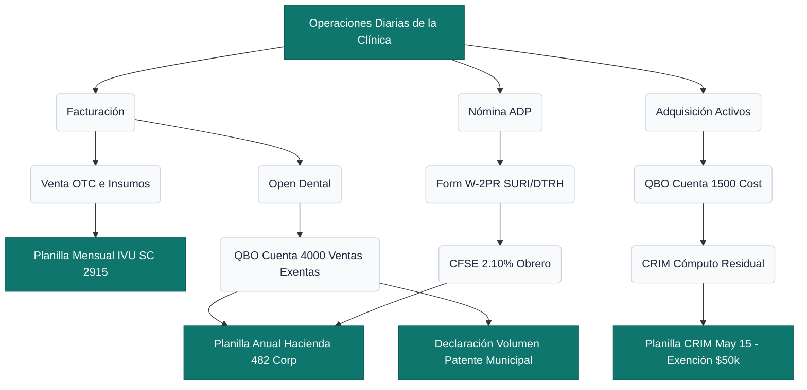
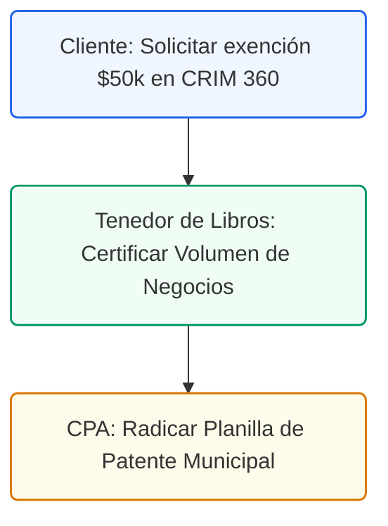

# Guía de Auditoría de Arbitrios Municipales y Cumplimiento
## Riesgos Locales, Exenciones del CRIM y Controles Internos

### Control de Documentos / Document Control
*   **Versión / Version:** 2.6
*   **Fecha / Date:** July 10, 2026
*   **Referencia / Document Ref:** AUDIT-PR-MUNI-ES-01
*   **Cliente / Client:** Clínica de Odontología General / General Dentistry Practice
*   **Autor / Author:** Roberto Alejandro Morales Pérez
*   **Estado / Status:** Activo / Entregable Final

---

## 1. Diagrama de Flujo Contributivo y Relación Inter-Agencial

El siguiente flujo ilustra de forma clara cómo interactúan las transacciones de la clínica dental con las diferentes agencias fiscales estatales (SURI/Hacienda) y municipales (CRIM/Alcaldías):

<!-- pagebreak -->

## 2. Los 6 Riesgos Críticos de Cumplimiento Local y Controles Internos

### A. La Trampa Contributiva Municipal (Leyes de Incentivos vs. Municipios)
*   **Riesgo:** Tener un decreto estatal de la Ley 60-2019 de Médico Cualificado (con tasa del 4%) **no exime automáticamente** del pago de Patentes Municipales o del CRIM. Muchos médicos omiten la radicación local o no solicitan la exención, perdiendo el beneficio municipal y acumulando multas del 10% al 25% más intereses.
*   **Control Interno:** 
    1.  **Exención de Patente Municipal (Volume of Business):** La mayoría de los municipios en Puerto Rico otorgan una **exención del 50% al 75%** sobre la tasa de Patente Municipal a los médicos con decretos vigentes bajo la Ley 60 (y anterior Ley 14). Para reclamarla, se debe radicar la Declaración de Volumen de Negocios anual adjuntando copia del decreto y la Certificación de Cumplimiento anual del DDEC.
    2.  **Trámite Local:** Radicar y registrar la ordenanza municipal de exención específica ante el municipio correspondiente bajo el amparo de la **Ley 107-2020, Código Municipal**.

### B. CRIM: Optimización y Reclamación de la Exención de los Primeros $50,000
*   **Riesgo:** El CRIM otorga una exención estatutaria sobre los primeros **$50,000 de valor neto** en bienes muebles. Omitir esta reclamación en la planilla anual de propiedad mueble (Formulario AS-29-I) resulta en el cobro del 100% de la tasa (ej. 9.0% en San Juan).
*   **Control Interno:** La base imponible declarada al CRIM debe calcularse utilizando las subcuentas de costo (`1500-1`, `1510-1`, `1520-1`) y restando la depreciación acumulada (`1500-2`, `1510-2`, `1520-2`) hasta el tope residual del CRIM (10%/20%). Posteriormente, se resta el crédito estatutario de $50,000 antes del cálculo de la tasa final.

### C. Retenciones Obligatorias del 10% en Servicios de Laboratorio Dental
*   **Riesgo:** Los laboratorios dentales prestan servicios que están sujetos a la **retención en el origen del 10%** bajo la Sección 1062.03 del PR IRC (Formulario 480.6SP). No retener este porcentaje de las facturas del laboratorio hace que la clínica sea solidariamente responsable por el impuesto no depositado.
*   **Control Interno:** Todas las facturas de laboratorios dentales deben ser ingresadas a través del módulo de Cuentas por Pagar (A/P) aplicando la deducción del 10% hacia la cuenta de pasivo `2100 - SURI 10% Withholding Payable`. La retención acumulada debe ser depositada en SURI no más tarde del día 15 del mes siguiente al pago.

### D. Exclusiones Patronales de SINOT y Seguro de Choferes
*   **Riesgo:** Muchos contadores calculan y pagan los seguros obligatorios de SINOT e incapacidad sobre la compensación W-2 de los dentistas socios. Los oficiales corporativos y accionistas activos de una corporación profesional **pueden estar exentos** de la retención de Seguro de Choferes y SINOT si no realizan tareas de choferes o si cuentan con cubiertas equivalentes aprobadas.
*   **Control Interno:** Configurar el sistema de ADP Payroll para aplicar la exclusión a los directores médicos/accionistas, eliminando cargos innecesarios de la cuenta `2520` y `2530`.

### E. Reconciliación Bruta en Procesadores de Tarjetas (Merchant Terminals)
*   **Riesgo:** Los procesadores de tarjetas de crédito (ej. Evertec, ATH Móvil Business) depositan los cobros diarios netos de su comisión (ej. depositan $97 de una factura de $100, cobrando $3). Registrar únicamente el depósito neto en la cuenta de ingresos subestima las ventas reales de la clínica y distorsiona el volumen bruto reportado para Patentes Municipales y Hacienda.
*   **Control Interno:** Los cobros clínicos diarios de Open Dental se registran al 100% bruto en la cuenta de ingresos. Las comisiones del procesador se concilian y debitan mensualmente de forma consolidada hacia la cuenta de gasto `6700 - Merchant & Processing Fees`.

### F. Planificación de Seguros y CFSE
*   **Riesgo:** El Seguro de la Corporación del Fondo del Seguro del Estado (CFSE) es obligatorio para todos los empleados de la clínica. No declarar el total de salarios brutos o no pagar las primas a tiempo invalida la inmunidad patronal, exponiendo al dentista a demandas civiles millonarias en caso de accidentes laborales del personal clínico.
*   **Control Interno:** Registrar una provisión mensual del 2.10% sobre los salarios de la cuenta `6000` acumulándola en el pasivo `2540 - CFSE Payable`. Esto permite conocer el gasto real mensual y contar con la liquidez necesaria cuando se emitan las facturas de las dos cuotas anuales de la póliza de la CFSE.
---
---

### Requisitos de Cumplimiento de la CFSE (Póliza Patronal)
El consultorio dental mantendrá la vigencia de su póliza patronal bajo el **Código de Clasificación 8720**. Para mitigar riesgos de multas u auditorías:
1.  **Declarar en Fecha Límite**: Someter la planilla de salarios en el Portal de Patronos de la CFSE antes del **15 de agosto**.
2.  **Certificaciones de Vigencia**: Generar la certificación anual del portal para adjuntarla al expediente de auditoría de Patentes Municipales y CRIM.

### Control Interno y Defensa Fiscal: Validación de Relevos
En auditorías de Patente Municipal y Hacienda, la clínica debe sustentar por qué no se efectuó la retención del 10% a ciertos proveedores de servicios profesionales. El Tenedor de Libros mantendrá copias digitalizadas de los **Certificados de Relevo (Modelo SC 2756)** validados en el portal público de SURI (suri.hacienda.pr.gov -> Validar un certificado o licencia).

### Tabla de Tasas de Propiedad Mueble del CRIM por Municipio (Tasa Base 2025-2026)
A continuación se detallan las tasas vigentes aplicables al consultorio según la ubicación física de la clínica dental:

| Municipio | Tasa Mueble (%) | Exención Base | Límite de Declaración |
| :--- | :---: | :---: | :---: |
| **San Juan** | 10.33% | $50,000 | 15 de mayo |
| **Guaynabo** | 10.33% | $50,000 | 15 de mayo |
| **Bayamón** | 10.33% | $50,000 | 15 de mayo |
| **Carolina** | 10.33% | $50,000 | 15 de mayo |
| **Caguas** | 10.33% | $50,000 | 15 de mayo |
| **Ponce** | 9.83% | $50,000 | 15 de mayo |
| **Mayagüez** | 9.83% | $50,000 | 15 de mayo |

*Nota: La exención aplica a los primeros $50,000 del valor tasado total de la propiedad mueble (maquinaria, equipo dental, computadoras y mobiliario).*

### Cumplimiento del Formulario 480.9A en Auditorías
El consultorio dental debe tener archivado el acuse de recibo de todas las planillas del **Formulario 480.9A** radicadas el día 10 de cada mes en SURI. Los auditores municipales de patentes cruzan esta información con los gastos reclamados en la cuenta de laboratorios dentales y subcontratistas para verificar retenciones no reportadas.

### Calendario de Vencimiento de la Declaración de Volumen de Negocios (Patente Municipal)
La Declaración de Volumen de Negocios es la planilla municipal clave del consultorio dental. Su radicación y pago se rigen por las siguientes reglas contributivas:
*   **Fecha de Radicación**: No más tarde del **15 de abril** de cada año contributivo.
*   **Descuento por Pago Temprano**: Si la patente municipal anual se paga en su totalidad en o antes del 15 de abril, el consultorio dental tiene derecho a un **descuento del 5%** sobre el impuesto tasado.
*   **Solicitud de Prórroga (Formulario Modelo O-82)**: Si la clínica dental no puede radicar la declaración final a tiempo, el Tenedor de Libros debe someter una solicitud de prórroga automática de **6 meses** utilizando el Formulario O-82 antes del vencimiento del 15 de abril. El pago estimado del impuesto de patente debe acompañar la solicitud de prórroga para que sea válida.

## 4. Ruta de Ejecución y Plan de Acción
Para mitigar riesgos por patentes municipales y el CRIM, ejecute los siguientes pasos:

### Lista de Tareas Operacionales:
*   `[ ]` **[CLIENTE]** Solicitar la exención de los primeros $50,000 de propiedad mueble en el portal **CRIM 360** (Menú: Propiedad Mueble -> Crear Planilla Mueble) antes del 15 de mayo.
*   `[ ]` **[TENEDOR DE LIBROS]** Certificar el Volumen de Negocios Bruto de la clínica para determinar el cómputo de la Patente Municipal.
*   `[ ]` **[CPA]** Auditar, firmar y radicar la Planilla de Patente Municipal en la oficina del municipio correspondiente antes del 20 de abril.
