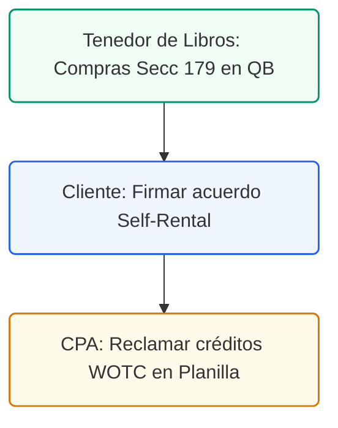

# Guía de Incentivos y Estrategias Fiscales Dentales
## Fondos Estatales y Federales bajo el Código de PR

### Control de Documentos / Document Control
*   **Versión / Version:** 2.8
*   **Fecha / Date:** July 10, 2026
*   **Autor / Author:** Roberto Alejandro Morales Pérez
*   **Estado / Status:** Activo / Entregable Final
*   **Proyecto:** Reconfiguración y Cumplimiento Fiscal de Práctica Dental (Puerto Rico)

---

## 1. Resumen Ejecutivo
Esta guía identifica estrategias contributivas avanzadas, subsidios gubernamentales y créditos estatales y federales aplicables a una práctica dental en Puerto Rico. Bajo el Código de Rentas Internas de Puerto Rico (PR IRC) y las leyes municipales, estos mecanismos permiten a la gerencia de la clínica dental deducir inversiones de forma acelerada, diferir el pago de impuestos y captar incentivos salariales de forma legal para apoyar el crecimiento de la clínica.

---

## 2. Subsidios Estatales, Federales y de Nómina (Fondos Directos)

### A. Incentivos para Pequeños Negocios del DDEC (Fomento Industrial / PYMES)
El *Departamento de Desarrollo Económico y Comercio* (DDEC) ofrece incentivos financieros bajo la clasificación de clínicas dentales (NAICS 621210):
*   **Subsidios en Efectivo para Modernización:** Fondos de pareo para la compra de equipo clínico de alta tecnología (ej. tomógrafos 3D, fresadoras CAD/CAM, sillas dentales).
*   **Subsidios Salariales:** Incentivos para el pareo de hasta el 50% de los salarios de nuevos empleados (higienistas o asistentes) durante sus primeros 6 a 12 meses, canalizados a través del Departamento del Trabajo y Recursos Humanos (DTRH).

### B. Crédito Federal por Oportunidad de Trabajo (WOTC) en Puerto Rico
El crédito fiscal federal WOTC aplica directamente a corporaciones en Puerto Rico:
*   **La Estrategia:** Reclamar un crédito fiscal federal contra la contribución sobre ingresos de la corporación por la contratación de individuos pertenecientes a ciertos sectores elegibles (ej. desempleados de larga duración o beneficiarios del PAN).
*   **El Beneficio:** Un crédito fiscal de hasta **$9,600** por cada empleado elegible contratado.

### C. Ley 120-2014: Incentivos de Nómina para Jóvenes Profesionales
*   **Disposición Legal:** La *Ley de Empleo y Adiestramiento para Jóvenes* (Ley 120-2014) promueve la contratación de jóvenes de entre 16 y 35 años.
*   **El Beneficio:** Subsidio de hasta el 50% del salario mínimo estatal por los primeros 12 meses de empleo. Además, exime a la clínica de la aportación de SUTA y SINOT sobre estos salarios durante ese periodo de 12 meses.

<!-- pagebreak -->

## 3. Arbitraje Contributivo Avanzado y Estrategias Corporativas

### A. Deducción Acelerada de Activos bajo la Sección 179
La adquisición de equipo odontológico pesado requiere un alto capital de inversión:
*   **La Estrategia:** En lugar de depreciar maquinaria (ej. rayos X, sillas dentales) durante un término de 5 a 7 años, la corporación puede acogerse a la **Sección 179 del Código de Rentas Internas Federal (adoptado bajo el PR IRC)**.
*   **El Beneficio:** Permite deducir el **100% del costo** del equipo elegible en el año de adquisición, deduciendo de inmediato el ingreso tributable del negocio para ese periodo contributivo.

### B. Arrendamiento Comercial Propio (Self-Rental Loop)
Si el dentista es propietario del local comercial a través de una LLC de bienes raíces independiente:
*   **La Estrategia:** La corporación de la clínica dental (P.S.C.) paga una renta mensual de mercado a la LLC de bienes raíces del propio dentista.
*   **Arbitraje Contributivo:**
    1.  La clínica dental deduce el gasto de alquiler de su planilla (evitando tasas corporativas de hasta el 37.5%).
    2.  El ingreso neto recibido por la LLC del dentista se compensa con la depreciación del edificio, seguros e intereses, permitiendo el retiro de flujo de caja libre de impuestos.
    3.  *Requisito:* La renta debe estar fijada al valor justo de mercado (FMV) bajo la Sección 1033.17 del PR IRC para evitar reclasificaciones de dividendos informales por parte de Hacienda.

### C. Estructura de Turismo Dental y Exportación (Ley 60)
*   **La Estrategia:** Si la clínica atrae pacientes no residentes de Puerto Rico (Turismo Dental), la operación puede segregarse en dos entidades:
    1.  *Corporación de Operación Local:* Servicios dentales generales a residentes (impuestos normales).
    2.  *Compañía de Servicios de Exportación (Ley 60):* Maneja la promoción, coordinación médica y facturación de pacientes extranjeros bajo la **Sección 2031.01 de la Ley 60-2019**.
*   **El Beneficio:** Los ingresos de exportación tributan a una tasa fija del **4%** y sus dividendos están **100% exentos** de contribuciones sobre ingresos al distribuirse al dentista.

### D. Fideicomisos de Retiro Cualificados (Sección 1081.01)
*   **La Estrategia:** Establecer un plan de retiro cualificado local (Plan Keogh) bajo la Sección 1081.01 del PR IRC.
*   **El Beneficio:** La corporación dental deduce de forma inmediata hasta el **25% de la compensación total** aportada al plan de retiro del dentista (hasta $20,000+ anuales). Los fondos acumulan intereses libres de impuestos dentro del fideicomiso hasta su retiro.

### F. Cumplimiento y Mantenimiento del Decreto Médico (Ley 60 / Ley 14)
*   **La Obligación de Cumplimiento:** Para retener el beneficio de la tasa contributiva fija del **4%** sobre los ingresos de servicios médicos/dentales exentos, el doctor propietario debe cumplir estrictamente con los siguientes requisitos anuales ante la Oficina de Incentivos del DDEC:
    1.  **Radicación del Informe Anual:** Presentar el Informe Anual de Cumplimiento en el portal electrónico del DDEC a más tardar **30 días después** de la fecha de vencimiento para radicar la Planilla de Contribución sobre Ingresos (incluyendo prórrogas).
    2.  **Registro de Horas de Servicio Clínico y Comunitario:** Registrar y certificar las horas anuales de servicio clínico gratuito o comunitario requeridas por los términos de su decreto (típicamente 180 horas anuales en zonas elegibles, debidamente certificadas por el Departamento de Salud o entidad comunitaria sin fines de lucro).
    3.  **Pago de Derechos Anuales:** Efectuar el pago anual por concepto de mantenimiento del decreto (típicamente $300 a $500).
*   **Exención del 11.5% de IVU en Compras de Maquinaria y Equipo:** Los decretos de la Ley 60 otorgan una **exención del 100% sobre el IVU de 11.5%** en la adquisición de maquinaria, sillones dentales y equipo clínico. Para activarla, el doctor debe solicitar el **Certificado de Exención de IVU en Compras** mediante el portal SURI (bajo su cuenta de decreto) y entregarlo al proveedor antes de efectuar compras de bienes de capital. Esto evita capitalizar un impuesto que no genera crédito tributario.
*   **Riesgo de Incumplimiento:** El incumplimiento de cualquiera de estas condiciones resulta en la **revocación retroactiva del decreto**, obligando al consultorio a recalcular y pagar impuestos a la tasa estándar corporativa/individual de hasta el **33%** más multas, intereses y recargos.

---

## 4. Lista de Cotejo Operativa para la Gerencia de la Clínica

*   [ ] **Certificación WOTC:** Utilizar el Formulario IRS 8850 en la fase de reclutamiento de personal regular.
*   [ ] **Planificación de Compras:** Coordinar la compra e instalación del equipo médico en el año natural corriente para justificar la deducibilidad de la Sección 179.
*   [ ] **Estudio de Alquiler Comercial:** Mantener en el expediente contable un estudio de brokers locales que valide que la renta de la corporación clínica a la LLC de bienes raíces se realiza a precios razonables de mercado.
*   [ ] **Seguridad HIPAA:** Separar la información WOTC confidencial de los aplicantes del sistema de expedientes médicos de la clínica.
*   [ ] **Mantenimiento Anual Ley 60:** Archivar el Informe Anual de Cumplimiento de la Ley 60 y el registro de horas de servicio clínico / comunitario certificado antes de la fecha de vencimiento del DDEC.
*   [ ] **Certificado de Exención de IVU en SURI:** Tramitar en SURI el Certificado de Exención de IVU en compras de equipo clínico pesado bajo el amparo de su decreto de Ley 60 para evitar el pago de 11.5% de IVU.
---
---

## 5. Ruta de Ejecución y Plan de Acción
Para maximizar subsidios y deducciones avanzadas, ejecute los siguientes pasos:

### Lista de Tareas Operacionales:
*   `[ ]` **[TENEDOR DE LIBROS]** Identificar y registrar compras de equipo clínico pesado elegibles para depreciación acelerada bajo la Sección 179 del Código.
*   `[ ]` **[CLIENTE]** Redactar y firmar el acuerdo de arrendamiento de local propio (*Self-Rental Loop*) ajustando la tasa de renta a valor de mercado razonable.
*   `[ ]` **[CPA]** Reclamar créditos federales por oportunidad de trabajo (WOTC) en la Planilla de Contribución sobre Ingresos.
