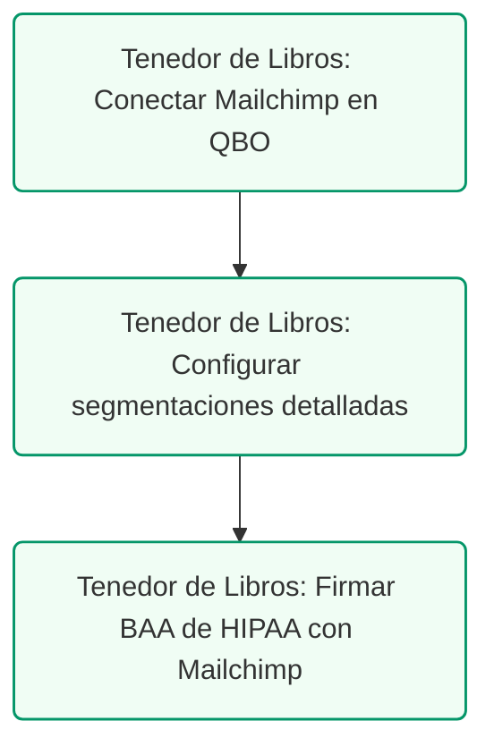

# Guía de Integración: QuickBooks Online & Intuit Mailchimp
## Mercadeo, Segmentación de Pacientes y Cumplimiento HIPAA

### Control de Documentos / Document Control
*   **Versión / Version:** 2.9
*   **Fecha / Date:** July 10, 2026
*   **Autor / Author:** Roberto Alejandro Morales Pérez
*   **Estado / Status:** Activo / Entregable Final
*   **Proyecto:** Reconfiguración y Cumplimiento Fiscal de Práctica Dental (Puerto Rico)

---

## 1. Resumen Ejecutivo
La integración nativa entre **QuickBooks Online** e **Intuit Mailchimp** permite a las empresas sincronizar datos de clientes y transacciones de ventas para automatizar campañas de mercadeo y retención. Para una clínica dental, esta herramienta es de alto impacto para re-enganchar pacientes inactivos y promover servicios estéticos. Sin embargo, debido a la naturaleza de la práctica de salud, esta integración exige configurar estrictas medidas de seguridad para cumplir con las leyes de privacidad federales (**HIPAA**).

---

## 2. Flujo de Datos y Conexión Técnica

### A. Cómo Conectar QuickBooks y Mailchimp
La conexión se realiza a través de la tienda de aplicaciones de QuickBooks Online (App Store) o desde el portal de integraciones de Mailchimp:
1.  Inicie sesión en su portal de **Mailchimp** y vaya a **Integrations -> QuickBooks Online**.
2.  Haga clic en **Connect** e ingrese sus credenciales de QuickBooks Online para autorizar el acceso.
3.  Seleccione la compañía dental correspondiente y configure los parámetros de sincronización inicial.

### B. Mapeo de Datos Sincronizados
Una vez conectados, los datos fluyen de forma automática en dos vías:
*   **Clientes (QBO Customers):** Se sincronizan como **Contactos (Contacts)** en la audiencia principal de Mailchimp, arrastrando nombres, correos electrónicos y teléfonos.
*   **Facturas y Recibos (Invoices & Sales Receipts):** Se sincronizan como **Órdenes de Compra (Orders)** en Mailchimp, registrando el monto gastado, la fecha de la última transacción y los productos adquiridos.

<!-- pagebreak -->

## 3. Estrategias de Segmentación y Retención (Campañas Automatizadas)

Al tener los datos de transacciones de ventas minoristas sincronizados en Mailchimp, el consultorio puede ejecutar campañas de alta conversión utilizando las siguientes segmentaciones:

### A. Campaña de Pacientes Inactivos (Re-engagement)
*   **Criterio de Segmentación:** Clientes que no registran facturas o recibos de ventas en QuickBooks en los últimos **6 a 12 meses**.
*   **Automatización:** Envío automático de un correo electrónico recordando la importancia de su limpieza dental semestral preventiva.

### B. Promoción de Servicios Estéticos y Detal
*   **Criterio de Segmentación:** Clientes que compraron pastas especializadas o cepillos eléctricos (registrados en la cuenta `4100 - Retail Taxable Revenue`), pero que no han realizado tratamientos de blanqueamiento dental.
*   **Automatización:** Envío de una campaña educativa sobre blanqueamiento dental con un descuento especial en su próximo tratamiento de estética.

---

## 4. Alerta de Cumplimiento HIPAA (Crucial para Dentistas)

### Reglas de Seguridad Obligatorias para la Oficina:
1.  **Prohibición de Datos Clínicos:** Jamás sincronice servicios clínicos específicos (ej. endodoncias, extracciones, diagnósticos de caries, códigos ADA) hacia Mailchimp. Estos datos son catalogados como PHI y violan la ley federal de privacidad.
2.  **Sincronización Limpia:** Configure la integración en QuickBooks para que **únicamente se sincronicen datos de clientes generales y transacciones de retail (venta al detal de cepillos o blanqueadores)**.
3.  **Autorización de Mercadeo:** Asegúrese de que cada paciente firme un **Formulario de Autorización de Mercadeo y Divulgación HIPAA** antes de añadir su correo electrónico a campañas masivas de Mailchimp.
4.  **Business Associate Agreement (BAA):** Si planea segmentar correos utilizando cualquier dato derivado de su práctica de salud, debe verificar si el plan corporativo contratado con Mailchimp permite la firma de un BAA para cumplir con los estándares federales de seguridad de datos.

---

## 5. Lista de Cotejo para la Configuración Segura
*   [ ] **Firma de Autorización:** Validar que el personal de recepción obtenga la firma del consentimiento de mercadeo de cada paciente nuevo.
*   [ ] **Filtro de Clientes en QBO:** Configurar QuickBooks para que los clientes clínicos con PHI sensible no se sincronicen directamente a audiencias públicas de Mailchimp.
*   [ ] **Plantilla de Correo:** Diseñar correos genéricos enfocados en educación preventiva (limpieza oral, uso de hilo dental) y evitar correos que asuman o divulguen un diagnóstico clínico específico del destinatario.
---
---

## 5. Ruta de Ejecución y Plan de Acción
La integración de QuickBooks y Mailchimp bajo estándares HIPAA requiere la siguiente secuencia:

### Lista de Tareas Operacionales:
*   `[ ]` **[TENEDOR DE LIBROS]** Conectar la cuenta de QuickBooks Online con Mailchimp (Apps -> Buscar "Mailchimp" -> Conectar).
*   `[ ]` **[TENEDOR DE LIBROS]** Configurar la segmentación automática basada en compras clínicas exentas de IVU vs. productos de higiene bucal tributables.
*   `[ ]` **[TENEDOR DE LIBROS]** Asegurar el cumplimiento de HIPAA firmando el **Acuerdo de Socio Comercial (BAA)** provisto por Mailchimp en su panel de seguridad.
*   `[ ]` **[CLIENTE]** Firmar el Acuerdo de Socio Comercial (BAA) de HIPAA y autorizar la conexión técnica con Mailchimp.
*   `[ ]` **[CPA]** Validar que el flujo de datos anonimizado no exponga información médica protegida en reportes de auditoría.
