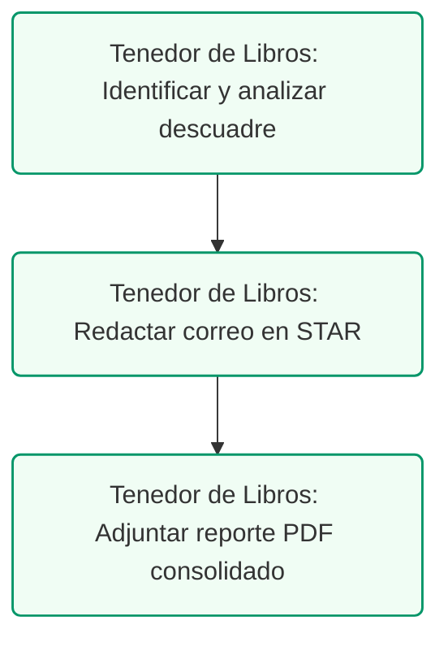

# Guía de Comunicación: Técnica STAR para Asesores
## Marco de Comunicación de Temas Contables con el Cliente

### Control de Documentos / Document Control
*   **Versión / Version:** 2.9
*   **Fecha / Date:** July 10, 2026
*   **Autor / Author:** Roberto Alejandro Morales Pérez
*   **Estado / Status:** Activo / Operational Guide
*   **Proyecto:** Reestructuración y Configuración Contable de Práctica Dental (Puerto Rico)

---

## 1. Introducción
La comunicación clara es la base de un servicio de asesoría contable y fiscal de clase mundial. Cuando explicamos temas complejos (como auditorías del CRIM, discrepancias en SURI, retenciones de nómina o reestructuraciones a S-Corp), los clientes pueden sentirse abrumados. 

La **Técnica STAR** es un marco de comunicación estructurado y simple diseñado para mantener el enfoque, proveer el contexto necesario y guiar al cliente hacia un resultado claro y accionable. Este método aplica a correos electrónicos, mensajes de chat (Slack/Teams) o llamadas telefónicas.

---

## 2. Los Componentes del Marco STAR

El acrónimo **STAR** se divide en cuatro pasos secuenciales:

| Letra | Elemento | Concepto |
| :---: | :---: | :--- |
| **S** | **Situation** (Situación) | Explicar brevemente el trasfondo. |
| **T** | **Task** (Tarea) | Identificar el problema o el objetivo. |
| **A** | **Action** (Acción) | Detallar los pasos requeridos. |
| **R** | **Result** (Resultado) | Compartir el resultado y próximos pasos. |

 

| Letra | Objetivo Práctico |
| :---: | :--- |
| **S** | Establecer el contexto general y qué está ocurriendo de forma directa. |
| **T** | Delimitar cuál es la discrepancia, el reto o la meta a resolver. |
| **A** | Explicar las acciones específicas que tomaremos nosotros o el cliente. |
| **R** | Indicar el beneficio de resolverlo, qué pasará después y las consecuencias. |

<!-- pagebreak -->

## 3. Ejemplos Prácticos de Aplicación (Casos Dentales y Fiscales Reales)

A continuación se presentan escenarios comunes en una práctica dental y cómo transformarlos utilizando la Técnica STAR:

### Caso A: El límite de depreciación de auto de lujo (Explicación al Doctor)
*   **❌ Redacción Tradicional (Deficiente):**
*   ** Redacción bajo la Técnica STAR:**
    *   **[S] Situation:** *"Hola Doctor. Revisamos la compra de su nuevo vehículo de $70,000 para uso de la clínica."*
    *   **[T] Task:** *"Bajo la Sección 1033.07 del Código de Rentas Internas de PR, la capitalización máxima permitida para autos de lujo es de $30,000. El exceso de $40,000 no es deducible, lo que limita la depreciación a un máximo de $6,000 anuales (en 5 años) y requiere prorratear los gastos operativos."*
    *   **[A] Action:** *"Para su contabilidad y defensa fiscal, necesitamos que mantenga una bitácora diaria (log de millaje) que documente que al menos el 50% de las millas recorridas son estrictamente para gestiones comerciales de la clínica."*
    *   **[R] Result:** *"Con esta bitácora protegemos la deducibilidad legal de los $6,000 anuales de depreciación y el porcentaje correspondiente de gastos (gasolina, seguro, mantenimiento), evitando multas en una auditoría de Hacienda."*

### Caso B: Explicación a la Recepcionista sobre el depósito neto vs. bruto
*   **❌ Redacción Tradicional (Deficiente):**
    *"Mira, no registres lo que entra al banco de ATH Móvil neto. Hay que poner el bruto porque si no la Patente Municipal va a salir mal y nos van a multar. Tienes que ver las comisiones aparte"*
*   ** Redacción bajo la Técnica STAR:**
    *   **[S] Situation:** *"Hola María. Notamos que los depósitos diarios de ATH Móvil y Evertec se están registrando en QuickBooks utilizando el monto neto recibido en la cuenta de banco."*
    *   **[T] Task:** *"El procesador nos deposita el dinero restando su comisión (ej. deposita $97 de una factura de $100). Registrar el neto causa que subreportemos los ingresos brutos, lo que creará discrepancias con las planillas de IVU y nos expondrá a multas en la auditoría de Patentes Municipales."*
    *   **[A] Action:** *"A partir de hoy, registra siempre los ingresos al 100% bruto basándote en los reportes de Open Dental, y debita la diferencia de la comisión mensual a la cuenta de gasto '6700 - Merchant & Processing Fees'."*
    *   **[R] Result:** *"Esto garantizará que QuickBooks coincida al centavo con las planillas radicadas en SURI y la declaración de Patente Municipal, eliminando cualquier riesgo de multas por ingresos no declarados."*

<!-- pagebreak -->

### Caso C: La Trampa Municipal de Ley 60 (Explicación al Doctor)
*   **❌ Redacción Tradicional (Deficiente):**
    *"Doctor, le llegó un cobro de patente del municipio. Usted pensaba que con la Ley 60 no pagaba nada, pero no es así, hay que radicar la patente municipal aparte. Mande el decreto para ver si nos dan la exención"*
*   ** Redacción bajo la Técnica STAR:**
    *   **[S] Situation:** *"Hola Doctor. Recibimos una notificación de cobro de Patente Municipal de la alcaldía correspondiente al volumen de ventas del año anterior."*
    *   **[T] Task:** *"Aunque usted posee un Decreto de Médico Cualificado de Ley 60 que reduce su contribución sobre ingresos a nivel estatal, esto no lo exime automáticamente del pago de impuestos municipales a nivel local."*
    *   **[A] Action:** *"Necesitamos que nos envíe copia de su Decreto de Ley 60 firmado para radicar una solicitud formal de ordenanza de exención municipal ante la legislatura del municipio bajo la Ley 107-2020."*
    *   **[R] Result:** *"Una vez aprobada la exención municipal, lograremos una reducción de hasta el 90% en el pago de su Patente Municipal, regularizando el estatus de la clínica sin tener que pagar penalidades por mora."*

### Caso D: Retención del 10% a Proveedores / Laboratorios (Explicación al Suplidor)
*   **❌ Redacción Tradicional (Deficiente):**
    *"Hola, le pagamos $900 en vez de $1,000 porque le aplicamos la retención del 10% de Hacienda. Si no quiere que le retengamos, mande el relevo SC 2756"*
*   ** Redacción bajo la Técnica STAR:**
    *   **[S] Situation:** *"Estimado proveedor. Hemos procesado el pago correspondiente a su última factura de servicios de laboratorio por $1,000."*
    *   **[T] Task:** *"Bajo la Sección 1062.03 del Código de Rentas de Puerto Rico, estamos obligados a retener el 10% sobre servicios profesionales que superen los $500 anuales, por lo que el pago neto emitido es de $900."*
    *   **[A] Action:** *"Para evitar esta retención en facturas futuras, solicitamos que nos envíe su Certificado de Relevo de Retención (Formulario SC 2756) vigente emitido por el Departamento de Hacienda."*
    *   **[R] Result:** *"Al recibir su relevo, configuraremos su perfil de proveedor en QuickBooks para emitir sus pagos al 100% bruto sin retención, manteniendo el cumplimiento con las directrices fiscales estatales."*

<!-- pagebreak -->

## 4. Beneficios del Método para la Firma
1.  **Reducción del Tiempo de Explicación:** El cliente entiende la idea al primer párrafo.
2.  **Mitigación de Ansiedad:** Al plantear la **Acción** y el **Resultado** de inmediato, el cliente siente que el asesor tiene el control de la situación.
3.  **Registro de Auditoría Limpio:** Los correos electrónicos escritos bajo el marco STAR sirven como minutas perfectas de cumplimiento de tareas.

---

## 5. Lista de Cotejo para Redacción de Mensajes
*   [ ] **¿Es breve la Situación?** Limitar el trasfondo a un máximo de 2 oraciones.
*   [ ] **¿Se identifica el problema (Task) claramente?** Evitar tecnicismos excesivos; definir el problema en términos de impacto financiero o legal.
*   [ ] **¿La Acción tiene un responsable y fecha límite?** Especificar claramente *quién* hace *qué* y *para cuándo*.
*   [ ] **¿El Resultado define el estado final?** Indicar claramente el beneficio de actuar o el costo de la inacción.
---
---

## 4. Ruta de Ejecución y Plan de Acción
Para resolver incidencias y comunicar informes ejecutivos con la técnica STAR, siga estos pasos:

### Lista de Tareas Operacionales:
*   `[ ]` **[TENEDOR DE LIBROS]** Identificar y analizar un descuadre contable (ej. discrepancia de depósitos bancarios de aseguradoras).
*   `[ ]` **[TENEDOR DE LIBROS]** Redactar la explicación al cliente estructurando el correo bajo las fases STAR (Situation, Task, Action, Result).
*   `[ ]` **[TENEDOR DE LIBROS]** Adjuntar el reporte de conciliación bancaria exportado en formato ReportLab PDF para defensa contable.
*   `[ ]` **[CLIENTE]** Revisar los informes periódicos redactados bajo la técnica STAR para facilitar la toma de decisiones contables.
*   `[ ]` **[CPA]** Utilizar el marco STAR para justificar el salario razonable del doctor y responder a requerimientos de Hacienda.
