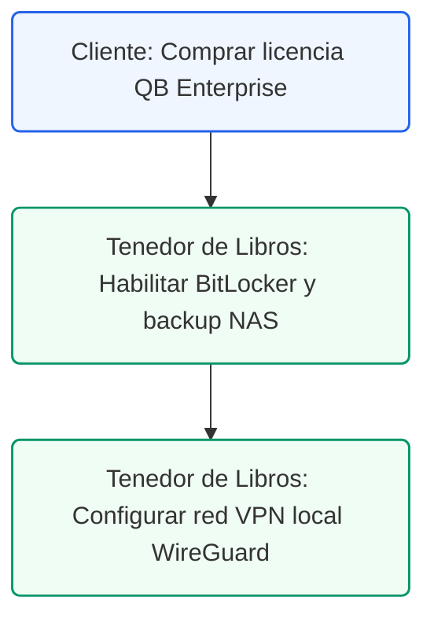

# Guía de Selección e Implementación de QuickBooks Desktop
## Recomendación de QuickBooks Desktop Enterprise Platinum para Prácticas Dentales

### Control de Documentos / Document Control
*   **Versión / Version:** 1.9
*   **Fecha / Date:** July 10, 2026
*   **Cliente / Client:** Clínica de Odontología General / General Dentistry Practice
*   **Autor / Author:** Roberto Alejandro Morales Pérez
*   **Estado / Status:** Activo / Entregable Final

---

## 1. Resumen Ejecutivo
Esta guía provee un análisis formal para la selección e implementación de la edición óptima de QuickBooks Desktop para una práctica dental clínica en Puerto Rico. Evaluamos las necesidades del negocio de operar en un entorno local, privado y seguro, manteniendo funciones contables de nómina y banca sin almacenar datos financieros en nubes públicas de terceros.

Basado en nuestro análisis, **QuickBooks Desktop Enterprise Platinum** es la versión elegida. Representa el plan más completo y seguro que cubre todos los requisitos indispensables: control avanzado de inventario bajo el método FIFO para productos de venta al detal (OTC), segmentación de ingresos por clases, integración de nómina local (Enhanced Payroll), conciliación de transacciones bancarias (Banking) y la posibilidad de acceso seguro multiusuario dentro de una red privada virtual (VPN) autohospedada.

---

## 2. Tablas de Comparación y Mapeo de Requisitos

### Tabla 2.1: Comparativa de Funciones de QuickBooks Desktop Enterprise
La siguiente tabla muestra la disponibilidad de funciones clave por cada plan de QuickBooks Desktop Enterprise:

| Función / Límite | Enterprise Gold | Enterprise Platinum (Elegida) | Enterprise Diamond |
| :--- | :---: | :---: | :---: |
| **Hosting Local (LAN)** | Sí | **Sí** | Sí |
| **Nómina Enhanced Incluida** | Sí | **Sí** | Sí |
| **Conciliación Bancaria** | Sí | **Sí** | Sí |
| **Advanced Inventory (FIFO)** | No | **Sí** | Sí |
| **Advanced Pricing** | No | **Sí** | Sí |
| **Seguimiento por Clases** | Sí | **Sí** | Sí |
| **Multi-usuario (LAN)** | Sí (1-30) | **Sí (1-30)** | Sí (1-40) |

<br/>

<!-- pagebreak -->

### Tabla 2.2: Requisitos de la Práctica Dental y Justificación Técnica
La siguiente tabla detalla la relevancia y justificación operativa de cada función elegida dentro de la clínica:

| Función / Límite | Requisito de la Práctica Dental e Impacto Operativo |
| :--- | :--- |
| **Hosting Local (LAN)** | **Crítico**: Almacenamiento local del archivo de la empresa (`.qbw`) detrás de un firewall de red privada, garantizando control exclusivo sobre la base de datos financiera. |
| **Nómina Enhanced** | **Esencial**: Cálculo local de retenciones contributivas de Puerto Rico e impresión de cheques de pago directos para el personal de la clínica. |
| **Conciliación Bancaria** | **Alto Impacto**: Descarga e importación segura de estados de cuenta mensuales en formato `.QBO` / `.QFX` de bancos de Puerto Rico de forma local. |
| **Advanced Inventory** | **Indispensable**: Control de inventario avanzado bajo el método **FIFO** para el stock de productos dentales de venta al detal y control de lotes/vencimientos. |
| **Seguimiento por Clases** | **Crítico**: Separación contable de ingresos exentos (servicios clínicos) y comerciales imponibles (ventas retail al 11.5% e ingresos por alquiler de sillas al 4%). |
| **VPN Autohospedada** | **Filtro de Seguridad**: Acceso remoto cifrado para el CPA y asesores externos mediante túnel privado (WireGuard/OpenVPN) sin exponer puertos a la web pública. |

<!-- pagebreak -->

## 3. Análisis de Ajuste Operacional y Seguridad Local

La selección de **QuickBooks Desktop Enterprise Platinum** responde a tres pilares de infraestructura y seguridad:

### 3.1 Seguridad Física y Encriptación Local (BitLocker)
Dado que la base de datos contable residirá localmente en la PC o servidor de la oficina, es mandatorio habilitar **BitLocker** (encriptación completa de volumen) en el disco duro. Esto evita que, en caso de robo de la computadora física, terceros puedan extraer el archivo `.qbw` o `.qbb` y acceder a los datos financieros de la práctica.

### 3.2 Control de Inventario Avanzado (Advanced Inventory)
El stock de productos de blanqueamiento y cuidado oral al detal requiere una valoración FIFO estricta bajo los estándares contables aplicables. La edición Platinum habilita este sub-libro de inventario avanzado directamente en el software local, permitiendo además el uso de códigos de barra para agilizar el despacho y auditoría física de mercancías.

### 3.3 Colaboración Cifrada mediante VPN Privada
Para que el tenedor de libros o asesor externo (Roberto Alejandro) realice conciliaciones y reportes mensuales sin comprometer la naturaleza privada del sistema:
1. Se configura una **VPN de red privada** (como WireGuard) a nivel del router de la clínica.
2. El asesor se conecta a la VPN de la clínica desde su oficina, lo que cifra todo el tráfico de datos de extremo a extremo.
3. El asesor accede de forma segura al QuickBooks Desktop local como si estuviera físicamente en el consultorio, manteniendo la base de datos inaccesible para cualquier servidor de nube pública.

<!-- pagebreak -->

## 4. Plan de Trabajo para la Implementación y Migración Local

El proceso de implementación de la versión de escritorio Enterprise Platinum se divide en las siguientes fases:

*   **Fase 1: Preparación del Servidor y Red (Semana 1):** Configuración de la PC servidor con Windows Pro, activación de BitLocker y configuración del router/firewall con la VPN WireGuard para accesos externos cifrados.
*   **Fase 2: Instalación de Licencias (Semana 1):** Descarga e instalación de QuickBooks Desktop Enterprise Platinum en el servidor y las estaciones de trabajo de la recepción en modo multiusuario.
*   **Fase 3: Importación del Catálogo (Semana 2):** Conversión del catálogo de 66 cuentas a formato `.IIF` e importación local en la empresa. Configuración de las cuentas de Enhanced Payroll y mapeo bancario local.
*   **Fase 4: Configuración de Inventario y Seguridad (Semana 3):** Habilitación de la función *Advanced Inventory* en preferencias, carga del inventario físico inicial y asignación de contraseñas complejas para los perfiles de Windows y QuickBooks.

---

## 5. Estrategia de Copias de Seguridad (Backups)

Para mitigar el riesgo de fallos de hardware o ataques de virus locales (ransomware):
*   **Backup Diario en NAS**: Configuración del programador de QuickBooks para guardar copias de seguridad automáticas diarias (`.qbb`) en un dispositivo **NAS (Network Attached Storage)** de la clínica protegido con contraseña.
*   **Backup Frío Semanal**: Copia de seguridad semanal en un disco externo USB cifrado, el cual se almacenará en una caja fuerte ignífuga dentro de la clínica para contingencias mayores.

<!-- pagebreak -->

## 6. HIPAA Standard Operating Procedure (SOP) para QuickBooks Desktop

Para garantizar el cumplimiento de la ley federal HIPAA en una instalación de escritorio local:

1. **Restricción de Acceso Físico**: La PC/servidor que aloja la base de datos contable debe estar ubicada en una oficina administrativa con llave, restringida al personal no autorizado.
2. **Seguridad de Usuarios Windows/QuickBooks**: Cada usuario (dentista, recepcionista, tenedor de libros) debe tener una cuenta individual con contraseña robusta. Queda prohibido compartir credenciales o dejar sesiones contables abiertas sin supervisión.
3. **Bloqueo de Puertos USB**: Desactivar o restringir el uso de puertos USB de almacenamiento externo en las PC que tengan acceso a QuickBooks para evitar la copia no autorizada del archivo contable.
4. **Anonimato del Paciente**: Los cobros diarios consolidados del software de facturación clínica (Open Dental) se deben registrar mediante asientos diarios resumidos bajo el cliente genérico "Clinical Patients Consolidated", prohibiendo el registro de nombres, seguros médicos o diagnósticos en QuickBooks.

<!-- pagebreak -->

## 7. Audit Defense y Reversibilidad del Sistema

### 7.1 Audit Defense Checklist (Expediente de Defensa)
En caso de auditorías por Hacienda o IRS, la clínica debe mantener en su caja fuerte digital y física:
- [ ] **Decreto de Exención Contributiva bajo la Ley 60-2019** activo.
- [ ] **Certificados de Cumplimiento Anual (OEC)**.
- [ ] **Estudio de Compensación Razonable** para justificar el salario W-2 del doctor.
- [ ] **Contrato de Arrendamiento Comercial** y estudio de rentas comparables.
- [ ] **Informes de Depósito Diario Anónimos** reconciliados contra la cuenta bancaria.

### 7.2 Reversibility & Portabilidad Local
Si la clínica decide cambiar de plataforma contable o cesar operaciones, el doctor mantiene la propiedad absoluta de sus datos históricos. El archivo `.qbw` puede exportarse directamente a formatos Excel/CSV de manera local. La ley de Puerto Rico exige conservar estos registros históricos por un periodo mínimo de **5 años**.

<!-- pagebreak -->

## 8. Presupuesto de Transición Operativa (Operational Transition Budget) y Costos de Operación de Escritorio

La transición al ecosistema local cifrado de QuickBooks Desktop Enterprise Platinum requiere el siguiente presupuesto de inversión no recurrente y cargos anuales:

- **Licencia QuickBooks Desktop Enterprise Platinum (Suscripción Anual, 1-5 Usuarios)**: $2,800 (Incluye Advanced Inventory, Enhanced Payroll y soporte local).
- **Configuración de Servidor Local y Red (BitLocker, NAS, Red local)**: $750 (Inversión única en configuración de hardware).
- **Instalación y Configuración del Túnel VPN WireGuard**: $450 (Configuración en router y asesoría técnica de red).
- **Migración del Catálogo de Cuentas vía IIF (Tenedor de Libros / Asesor)**: $900 (Inversión única para limpieza e importación).
- **Adiestramiento de Recepción e HIPAA SOP (Escritorio)**: $400 (Capacitación operativa en copias de seguridad locales y nómina).
- **CPA Estudio de Compensación Razonable y Renta**: $1,200 (Inversión única para defensa fiscal ante auditorías).
- **Fondo de Reserva de Contingencia**: $500.
- **Total Inversión de Transición e Implementación**: **$7,000**

*Nota: Aunque la inversión inicial en la versión de escritorio es mayor que la alternativa en la nube debido a los costos de licenciamiento de Intuit Enterprise y red segura local, esta estructura garantiza control y privacidad física del 100% de la base de datos contable de la clínica.*
---
---

### Automatización de Respaldos (PowerShell Script) y Verificación de BitLocker
Para cumplir con las normas de seguridad de HIPAA, el servidor local que aloja la base de datos de QuickBooks Desktop Enterprise debe tener cifrado completo de disco (BitLocker). 

#### Comando para verificar cifrado en Windows Server:
```powershell
# Ejecutar en PowerShell como Administrador
manage-bde -status C:
```

#### Script de PowerShell para copia de seguridad diaria al NAS local:
```powershell
# backup_qbd.ps1
$SourceFile = "C:\Users\Public\Documents\Intuit\QuickBooks\Company Files\clinica_dental.qbw"
$DestinationDir = "\\NAS-LOCAL\Backups\QuickBooks\"
$Timestamp = Get-Date -Format "yyyyMMdd-HHmmss"
$BackupFile = $DestinationDir + "clinica_dental_backup_" + $Timestamp + ".qbw"

# Validar conectividad con el NAS y copiar archivo
if (Test-Connection -ComputerName "NAS-LOCAL" -Quiet) {
    Copy-Item -Path $SourceFile -Destination $BackupFile -Force
    Write-Output "Respaldo completado exitosamente en: $BackupFile"
} else {
    Write-Error "No se pudo establecer conexión con el NAS local."
}
```

### Gestión de Compra como ProAdvisor (Descuento y Canales Oficiales)
Para gestionar la compra de QuickBooks Desktop Enterprise Platinum con el descuento especial de ProAdvisor para la clínica, se debe acceder a los siguientes canales oficiales:

1. **El Portal de Acceso (Para comprar y gestionar licencias):**
   * **Portal de Contable (QBO Accountant):** [qbo.intuit.com](https://c1.qbo.intuit.com/) (Inicie sesión con las credenciales de ProAdvisor para gestionar beneficios y certificaciones).
   * **Portal de Licencias Desktop (CAMPs):** [camps.intuit.com](https://camps.intuit.com/) (El Customer Account Management Portal para descargar el instalador de Enterprise y consultar números de serie comprados).
2. **Línea Directa de Ventas para ProAdvisors (Recomendado para Enterprise):**
   Dado que QuickBooks Desktop Enterprise es un producto de escritorio corporativo, Intuit no permite autoprocesar el descuento de ProAdvisor directamente en la web de autoservicio pública.
   * **Teléfono de Ventas para ProAdvisors:** **1 (800) 459-0424**

#### Procedimiento durante la llamada:
* Identifíquese con su Customer ID o correo registrado de ProAdvisor.
* Indique que va a realizar la venta de QuickBooks Desktop Enterprise Platinum (1-5 usuarios) bajo la modalidad de **Client-Billed** (facturado mensualmente a la tarjeta del cliente) o **wholesale** (facturado al contable).
* El agente de Intuit aplicará el descuento preferencial correspondiente (típicamente 20% de descuento durante el primer año en mensualidades) y asociará la licencia al portal del contable para su administración y descarga.

## 4. Ruta de Ejecución y Plan de Acción
El proceso de implementación de QuickBooks Desktop local sigue estos pasos de instalación segura:



### Lista de Tareas Operacionales:
*   `[ ]` **[CLIENTE]** Adquirir la licencia anual de **QuickBooks Desktop Enterprise Platinum** con nómina local Enhanced incluida.
*   `[ ]` **[TENEDOR DE LIBROS]** Instalar el software en un servidor local cifrado con BitLocker y configurar respaldos diarios automáticos en un NAS local.
*   `[ ]` **[TENEDOR DE LIBROS]** Configurar e instalar una red privada virtual (**VPN WireGuard** o OpenVPN) para permitir el acceso multiusuario remoto de forma segura sin exponer puertos a la web.
*   `[ ]` **[CPA]** Validar la configuración del catálogo e integraciones de nómina local en QuickBooks Desktop Enterprise.
