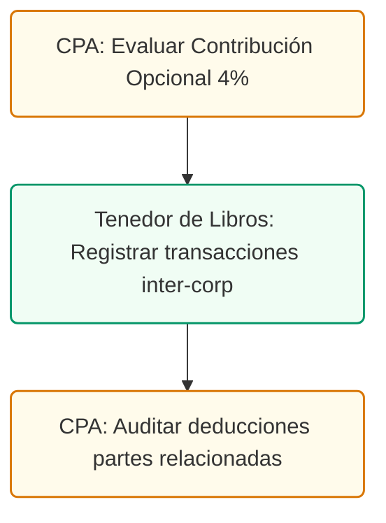

# Alternativas a Ley 60 y Estructuras Corporativas
## Contribución Opcional, Exenciones del 60% y Reglas de Subsidiarias en PR

### Control de Documentos / Document Control
*   **Versión / Version:** 2.9
*   **Fecha / Date:** July 10, 2026
*   **Referencia / Document Ref:** TAX-ALT-CORP-ES-01
*   **Cliente / Client:** Clínica de Odontología General / General Dentistry Practice
*   **Autor / Author:** Roberto Alejandro Morales Pérez
*   **Estado / Status:** Activo / Entregable Adicional

---

## 1. Resumen Ejecutivo
Este memorando responde a dos consultas estratégicas de la gerencia de la clínica dental:
1.  **Alternativas Tributarias:** Qué opciones existen para mitigar la carga contributiva de la práctica dental en caso de que no se solicite o no se cualifique para el Decreto de Médico Cualificado de la Ley 60-2019.
2.  **Aclaración de Estructura Corporativa:** Análisis del rumor sobre una estructura corporativa con subsidiarias que recibe una "deducción del 60%", aclarando las reglas de exención municipal del 60% de la Ley 60, la deducción de dividendos inter-corporativos y las limitaciones de gastos entre entidades relacionadas.

---

## 2. Alternativas Tributarias si NO se Obtiene el Decreto de la Ley 60

Si la clínica opera sin un decreto de exención de la Ley 60, tributa bajo el régimen general del Código de Rentas Internas de Puerto Rico (PR IRC). Las principales estrategias de optimización para este escenario son:

### A. Régimen General Corporativo (Tasa Máxima del 37.5%)
Las corporaciones regulares (P.S.C. o LLC que tributan como corporación) pagan impuestos sobre su ingreso neto:
*   **Contribución Normal:** 18.5% sobre el ingreso neto sujeto a contribución.
*   **Contribución Adicional (Surtax):** Escala progresiva que va del 5% al 19% sobre el ingreso neto que exceda los $25,000.
*   **Tasa Máxima Efectiva:** 37.5%.
*   **Estrategia de Mitigación:** Maximizar las deducciones ordinarias y necesarias de la operación clínica, salarios razonables por W-2 para los socios dentistas, y aportaciones deducibles a planes de retiro cualificados.

### B. La Contribución Opcional para Servicios (Tasa del 6% al 20% sobre Ingreso Bruto)
Bajo la **Sección 1022.07** del PR IRC, las corporaciones que derivan sus ingresos exclusivamente de la prestación de servicios (como los servicios dentales) pueden optar por tributar sobre su **ingreso bruto** (sin deducciones) a tasas fijas reducidas.

| Ingreso Bruto Anual | Tasa de Contribución Opcional |
| :--- | :--- |
| Hasta $100,000 | **6%** |
| Más de $100,000 hasta $200,000 | **10%** |
| Más de $200,000 hasta $300,000 | **13%** |
| Más de $300,000 hasta $450,000 | **15%** |
| Más de $450,000 hasta $600,000 | **17%** |
| Más de $600,000 | **20%** |

*   **Ventajas de la Contribución Opcional:**
    1.  **Sin Requisitos de Ley 60:** No requiere completar horas de servicio comunitario ni radicar informes anuales en el DDEC.
    2.  **Simplicidad Operativa:** Al no depender de deducciones, la clínica no está expuesta a auditorías de gastos de viaje, comidas o representación por parte de Hacienda.
    3.  **Sin Estados Financieros Auditados:** Evita el costo de contratar un CPA para emitir estados financieros auditados o compilados para reclamar deducciones.
*   **Requisito de Elegibilidad:** El 100% del ingreso bruto debe ser reportado en informativas (480.6SP / 480.6B) o estar sujeto a retención en el origen.

<!-- pagebreak -->

## 3. Aclaración del Rumor: La Estructura de Subsidiarias y la "Deducción del 60%"

El concepto de una corporación con subsidiarias que obtiene un "60% de beneficio o deducción" suele responder a una confusión o mezcla de tres disposiciones fiscales distintas en Puerto Rico:

### A. La Exención del 60% en Impuestos Municipales (Ley 60)
Bajo el Código de Incentivos (Ley 60-2019), las empresas exentas (con decretos elegibles) disfrutan de exenciones sobre impuestos municipales:
*   **CRIM (Propiedad Mueble e Inmueble):** Exención estándar del **75%** (en algunos decretos industriales o de zonas especiales es del **60%**).
*   **Patente Municipal:** Exención estándar del **50%** (o del **60%** según la zona o tipo de actividad y ordenanza municipal).
*   *Aclaración:* El "60%" no es una deducción de gastos sobre el impuesto sobre ingresos, sino una **exención sobre los impuestos de propiedad del CRIM y volumen de negocios municipal**.

### B. Deducción por Dividendos Recibidos en Estructuras Parent-Subsidiary (100% de Exclusión)
Si la clínica dental opera bajo una estructura donde una Corporación Holding (Matriz) es dueña de las acciones de una Corporación Operativa (Subsidiaria):
*   **Sección 1033.19 del PR IRC:** Una corporación matriz puede reclamar una **deducción del 100% por los dividendos recibidos** de su subsidiaria nacional.
*   *El Beneficio:* Los ingresos acumulados y tributados en la corporación operativa pueden ser transferidos a la matriz sin pagar una segunda capa de impuesto corporativo, permitiendo la centralización del capital en la holding para realizar nuevas inversiones.

### C. Límite de Deducción del 60% en Gastos a Entidades Relacionadas (Regla Antielusión)
Bajo el Código de Rentas Internas, si una corporación en Puerto Rico le paga cargos por servicios de administración o "management fees" a una entidad relacionada (como una subsidiaria o matriz constituida fuera de Puerto Rico):
*   **La Limitación General:** Hacienda limita la deducibilidad de estos gastos para evitar que las empresas transfieran ganancias al exterior y eludan el impuesto local.
*   **La Regla de Dispensa del 60%:** Si la corporación solicita y obtiene una **dispensa formal** del Secretario de Hacienda para deducir los pagos a partes relacionadas:
    *   Se autoriza la deducción de hasta el **60% de los gastos solicitados**.
    *   El 40% restante se declara no deducible.
    *   *Aclaración:* Este es un límite restrictivo de deducción de gastos (desventajoso), no un beneficio contributivo.

---

## 4. Conclusiones y Recomendaciones de Estructuración

1.  **Si no se opta por Ley 60:** Se recomienda evaluar la **Contribución Opcional** si el margen de ganancia neta de la clínica dental es alto en relación con sus gastos operativos. Si los gastos operativos son altos (ej. salarios de higienistas, materiales dentales costosos), el régimen general con salarios W-2 y planes de retiro cualificados resulta más ventajoso.
2.  **Estructura de Holding y Subsidiarias:** Esta estructura añade valor para separar la propiedad del local comercial (LLC de Bienes Raíces) y el equipo médico (Holding de Activos) de la operación clínica propensa a demandas (Corporación Operativa P.S.C.). No genera una deducción automática del 60% de gastos, pero permite mover dividendos con **100% de exención inter-corporativa** y optimizar la exposición de activos fijos al CRIM.
---
---

## 4. Ruta de Ejecución y Plan de Acción
El análisis fiscal corporativo bajo el régimen general se ejecuta mediante el siguiente plan:

### Lista de Tareas Operacionales:
*   `[ ]` **[CPA]** Evaluar la conveniencia de acogerse a la Contribución Opcional del 4% en el portal SURI al radicar la planilla corporativa.
*   `[ ]` **[TENEDOR DE LIBROS]** Mantener al día los contratos y registros de transacciones inter-corporativas para cumplir las reglas de precios de transferencia de Hacienda.
*   `[ ]` **[CPA]** Validar y ajustar las deducciones de gastos de servicios prestados por entidades relacionadas bajo los límites legales en Puerto Rico.
*   `[ ]` **[CLIENTE]** Autorizar la estructura de Holding corporativa y firmar contratos de arrendamiento comercial entre entidades relacionadas.
