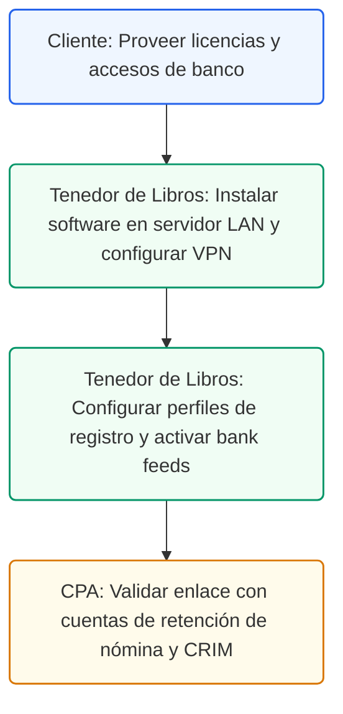

# Guía de Inicialización Contable y Onboarding en QuickBooks
## Protocolo de Instalación, Registro de Licencias y Conexión de Cuentas Bancarias

### Control de Documentos / Document Control
*   **Versión / Version:** 1.4
*   **Fecha / Date:** July 10, 2026
*   **Autor / Author:** Roberto Alejandro Morales Pérez
*   **Estado / Status:** Activo / Listo para Implementar
*   **Proyecto:** Reconfiguración y Cumplimiento Fiscal de Práctica Dental (Puerto Rico)

---

## 1. Introducción
Esta guía técnica establece el protocolo oficial para la descarga, instalación, registro de licencias y onboarding de la plataforma QuickBooks Desktop Enterprise Platinum para la práctica de odontología general del Dentista Propietario. Este procedimiento está diseñado para garantizar la integridad de los datos financieros locales en una red segura (LAN/VPN) y facilitar la sincronización inicial de los feeds bancarios sin fricciones operacionales ni de cumplimiento.

---

## 2. Requisitos Previos del Sistema y Entorno LAN/VPN
Antes de iniciar la instalación de QuickBooks Desktop Enterprise, el Tenedor de Libros y el administrador de sistemas de la clínica deben certificar que el entorno tecnológico cumple con las especificaciones de seguridad y redundancia locales.

La base de datos de QuickBooks Desktop Enterprise Platinum se alojará en un servidor local dentro de la red de la clínica. El almacenamiento debe estar encriptado con BitLocker de Windows para cumplir con los estándares de seguridad física y la Ley HIPAA de protección de datos de pacientes. Los respaldos se programarán de forma automática en un dispositivo NAS local seguro. Para accesos remotos del Tenedor de Libros y el CPA, se utilizará una VPN cifrada (WireGuard o OpenVPN) que impida la exposición de los puertos de base de datos a redes públicas.

| Requisito del Sistema | Especificación Técnica Recomendada | Estado de Verificación |
| --- | --- | --- |
| Sistema Operativo | Windows Server 2022 / Windows 11 Pro 64-bit | Verificado y Activo |
| Memoria RAM | Mínimo 16 GB (Servidor) / 8 GB (Terminales) | Verificado y Activo |
| Encriptación de Disco | BitLocker con llave de recuperación en bóveda física | Configurado y Activo |
| Red Local | Gigabit Ethernet LAN con cableado estructurado Cat6 | Configurado y Activo |
| Acceso Remoto | VPN WireGuard dedicada con autenticación de doble factor | Configurado y Activo |
| Copias de Respaldo | NAS local Synology de 2 bahías (RAID 1) + copia fría externa | Programado y Activo |

---

## 3. Checklist Técnico de Instalación Paso a Paso
El proceso de preparación y despliegue del software debe ejecutarse en el orden estricto detallado a continuación. El Tenedor de Libros será responsable de documentar cada paso en la bitácora de sistemas.

*   **Paso 1: Descarga del Instalador Oficial:** Descargue el instalador ejecutable de QuickBooks Desktop Enterprise Platinum 2026 desde el portal de administración de cuentas de Intuit utilizando las credenciales del Propietario.
*   **Paso 2: Configuración del Servidor de Base de Datos (Database Server Manager):** Ejecute el instalador en el servidor de archivos local. Seleccione la opción "Host QuickBooks Database Only" para instalar únicamente el motor de base de datos Sybase SQL Anywhere y los servicios de red asociados.
*   **Paso 3: Instalación en las Estaciones de Trabajo (Terminales):** Ejecute el instalador en las computadoras de la clínica dental. Seleccione la opción "I will be using QuickBooks on this computer, and storing the company file on our network server".
*   **Paso 4: Mapeo de Unidades de Red:** Configure una unidad de red mapeada (por ejemplo, unidad Q:) en cada estación de trabajo, apuntando a la carpeta compartida encriptada en el servidor donde se almacenará el archivo `.QBW`.

*   **Paso 5: Configuración del Firewall de Windows:** Abra los puertos de red requeridos por QuickBooks Database Manager (puertos TCP 8019 y puertos dinámicos para QuickBooks 2026) en el servidor y las estaciones de trabajo para permitir la comunicación multiusuario.
    *   **Puertos Específicos**: El QuickBooks Database Manager utiliza el puerto estático TCP 8019 para la comunicación del archivo de base de datos.
    *   **Puertos Dinámicos**: Configurar las reglas de entrada y salida del firewall para permitir el tráfico dinámico del servicio de QuickBooks Monitor Utility (`qbmonitor.exe`) y el Database Manager (`qbw32.exe`) en el rango de puertos 55383 a 55387.
    *   **Protocolo de Red**: Habilitar el protocolo de red SMB v2/v3 en las directivas de grupo del servidor LAN, deshabilitando el SMB v1 obsoleto para mitigar ataques de malware y ransomware.

---

## 4. Perfil de Registro de Licencias de Intuit
Para activar las funciones avanzadas de Enterprise Platinum (que incluyen el control avanzado de inventario FIFO y el módulo de nómina local de Puerto Rico), es obligatorio registrar la licencia utilizando los datos reales y legales de la práctica odontológica general.

> **Importante:** La información ingresada en el perfil de registro debe coincidir exactamente con el Certificado de Registro de Comerciante emitido por el Departamento de Hacienda en SURI y la confirmación del EIN federal. Cualquier discrepancia en el nombre legal o en la dirección puede causar la suspensión temporal de los servicios en la nube de Intuit (como la actualización de las tablas de retención de nómina).

A continuación se presenta el perfil de registro de licencias del sistema:

| Campo del Perfil de Registro | Información de Registro del Cliente | QuickBooks Mapping Layer |
| --- | --- | --- |
| Nombre Legal de la Empresa | Morales Dental Clinic, P.S.C. | Company Legal Name (1099/Tax Info) |
| Nombre Comercial (DBA) | Morales Dental Clinic | Company DBA Name |
| Número de Identificación Patronal (EIN) | 66-0982713 | Employer Identification Number Field |
| Dirección Física de la Clínica | Ave. Principal #123, San Juan, PR 00907 | Physical Address Block |
| Dirección Postal de la Clínica | P.O. Box 902123, San Juan, PR 00902 | Postal Address Block |
| Teléfono Comercial Oficial | (787) 555-0100 | Primary Company Phone |
| Administrador Principal de la Cuenta | Dr. Roberto A. Morales Pérez | Master Administrator Login User |
| Licencia de Software (License #) | 4592-1209-8823-1120 | Activation License Key |
| Número de Producto (Product #) | 782-902 | Product Key ID |

---

## 5. Perfil de Conexión de Feeds Bancarios (Bank Feeds)
QuickBooks Enterprise Platinum utiliza la tecnología Bank Feeds para importar de forma segura los estados de cuenta diarios. La clínica dental mantendrá sus cuentas operacionales e ingresos en una institución financiera local regulada (como Banco Popular de Puerto Rico).

| Campo del Feed Bancario | Perfil de Conexión y Autorización | QuickBooks Account Link |
| --- | --- | --- |
| Institución Financiera | Banco Popular de Puerto Rico | BPPR Commercial Online Banking Portal |
| Nombre de la Cuenta Comercial | BPPR Operating Account / Morales Dental Clinic | [1100] BPPR Cta. Operacional (Bank) |
| Número de Cuenta Bancaria | 012345678 | Account Number Mapping Parameter |
| Número de Ruta (Transit Routing) | 021502011 | Transit Routing Number Field |
| Modo de Conexión | Web Connect / Direct Connect (QBO Format) | Direct Bank Feed Integration Module |
| Oficial Autorizado | Dr. Roberto A. Morales Pérez | Authorized Account Officer |
| Frecuencia de Sincronización | Diaria (Lunes a Viernes a las 8:00 AM) | Automated Sync Schedule |

---

## 6. Formularios de Muestra y Acuerdos de Autorización

### Formulario de Registro de Software Oficial (Intuit Profile Setup)
Este formulario representa los datos requeridos para la creación de la cuenta corporativa de Intuit y la activación de los servicios integrados de nómina y facturación electrónica.

| Parámetro de Registro | Valor Registrado en la Base de Datos | Validación en Auditoría |
| --- | --- | --- |
| Correo Electrónico del Master Admin | admin@moralesdentalpr.com | Confirmado por Verificación MFA |
| Pregunta de Seguridad 1 | Nombre de la primera clínica dental | Encriptada en el llavero de seguridad |
| Respuesta de Seguridad 1 | Morales Dental Clinic Santurce | Encriptada en el llavero de seguridad |
| Nivel de Suscripción Adquirido | Enterprise Gold/Platinum Multi-user (3 Users) | Suscripción Activa Renovación Anual |
| Fecha de Renovación Anual | July 15, 2026 | Pago Directo Programado |

### Formulario de Autorización Bancaria de Feeds (Bank Feed Authorization)
Este formulario se completa y firma digitalmente para autorizar el intercambio automático de datos transaccionales entre el banco comercial del cliente y el sistema contable local de QuickBooks.

| Cláusula de Autorización | Detalle y Términos de Servicio | Firma y Aprobación |
| --- | --- | --- |
| Objeto del Acuerdo | Transferencia diaria de saldos e historial de transacciones | Aceptado por el Cliente |
| Limitación de Permisos | Acceso de lectura únicamente (Read-Only). No permite transferir | Aceptado por el Cliente |
| Protocolo de Encriptación | Conexión SSL de 256 bits mediante API bancaria comercial | Certificado por Banco Popular |
| Responsable Contable | Tenedor de Libros (Roberto Alejandro Morales Pérez) | Autorizado para conciliación |

---

## 7. Ruta de Ejecución y Plan de Acción
A continuación se detalla la secuencia operacional para la inicialización y onboarding del sistema contable en la práctica dental:

### Lista de Tareas Operacionales:
*   `[ ]` **[CLIENTE]** Entregar las llaves de licencia de QuickBooks Desktop Enterprise Platinum y las credenciales del portal corporativo de Intuit al Tenedor de Libros.
*   `[ ]` **[CLIENTE]** Firmar la autorización bancaria del Banco Popular de Puerto Rico para habilitar la integración del feed de datos en QuickBooks.
*   `[ ]` **[TENEDOR DE LIBROS]** Ejecutar la instalación de QuickBooks Desktop Database Server Manager en el servidor local de la clínica con encriptación BitLocker activa.
*   `[ ]` **[TENEDOR DE LIBROS]** Configurar los accesos de red multiusuario y mapear la unidad de red segura (Q:) en las computadoras de la recepción y la oficina de facturación.
*   `[ ]` **[TENEDOR DE LIBROS]** Realizar la primera conexión del feed bancario, verificar la importación limpia del extracto bancario y programar la descarga diaria automatizada.
*   `[ ]` **[CPA]** Validar que la configuración de la empresa en QuickBooks esté alineada con las cuentas del Departamento de Hacienda en SURI y la estructura fiscal de Morales Dental Clinic, P.S.C.

---

## 8. Anexo A: Ficha de Onboarding Contable y de Licencias (Intake Form)
Este formulario se envía al Dentista Propietario para recopilar la información requerida para el registro del sistema y los accesos bancarios:

| Campo de Registro Contable | Espacio para Completar | Parámetro en QuickBooks |
| --- | --- | --- |
| Nombre Legal de la Empresa | ___________________________________________ | Company Legal Name |
| Nombre Comercial (DBA) | ___________________________________________ | Company DBA Name |
| Número de Seguro Social / EIN | ________________-_______ | Employer ID (EIN) |
| Dirección Física Oficial | ___________________________________________ | Street Address |
| Dirección Postal Autorizada | ___________________________________________ | Billing Address |
| Número de Licencia QuickBooks | _____________-_____________-_____________-_____________ | License Activation Key |
| Número de Producto QuickBooks | _________-_________ | Product Activation Key |
| Correo Electrónico Master Admin | ___________________________________________ | Intuit ID Account User |
| Banco Comercial de Enlace | Banco Popular de Puerto Rico | Bank Name |
| Número de Cuenta Bancaria | ___________________________________________ | Bank Account Link |
| Número de Ruta Bancaria | 021502011 | Routing Transit Number |
| IP Servidor Local (LAN) | 192.168.1.200 | Host Database Server IP |
| Llave Pública WireGuard VPN | ___________________________________________ | VPN Client Encryption Key |

### Anexo B: Bitácora de Respaldos de Servidor LAN y Llaves de Recuperación BitLocker
Utilice este registro mensual para certificar la encriptación de datos de salud y copias de seguridad de QuickBooks:

| Fecha del Respaldo | Hora de Ejecución | Estado del Proceso (Éxito / Fallo) | Copia NAS Local | Rotación Disco Frío | Iniciales Tenedor Libros |
| --- | --- | --- | --- | --- | --- |
| ____/____/________ | ____:____ _M. | [ ] Exito / [ ] Fallo | [ ] Conforme | [ ] Disco A / [ ] Disco B | __________________ |
| ____/____/________ | ____:____ _M. | [ ] Exito / [ ] Fallo | [ ] Conforme | [ ] Disco A / [ ] Disco B | __________________ |
| ____/____/________ | ____:____ _M. | [ ] Exito / [ ] Fallo | [ ] Conforme | [ ] Disco A / [ ] Disco B | __________________ |
| ____/____/________ | ____:____ _M. | [ ] Exito / [ ] Fallo | [ ] Conforme | [ ] Disco A / [ ] Disco B | __________________ |

---

## 9. Navegación en Portales y Ruta de Clics (SURI & Intuit)
Para configurar las conexiones bancarias y gubernamentales, siga estas rutas exactas de clics:
*   **Enlace de Cuenta de Intuit a SURI**: `SURI -> Iniciar Sesión -> Cuentas -> Registro de Comerciante -> Enlaces Relacionados -> Autorizar Acceso Externo (Intuit QuickBooks)`.
*   **Activación de Nómina en SURI (Deducciones)**: `SURI -> Cuentas -> Retención de Nómina -> Registrar Cuenta de Retención Local`.
*   **Descarga de QuickBooks Enterprise Server**: `camps.intuit.com -> Iniciar Sesión -> Downloads & Updates -> Select Product: QuickBooks Enterprise -> Download`.
*   **Disaster Recovery & Restore click-path**: `QuickBooks -> File -> Open or Restore Company -> Restore a backup copy (.QBB) -> Local Backup -> Select file from Synology NAS share`.

*   **QuickBooks HIPAA Audit Trail Verification**: `QuickBooks -> Reports -> System -> Audit Trail (Para auditar quién vio, editó o eliminó registros financieros asociados a los IDs de pacientes)`.

*   **ADP G/L Journal Import (IIF)**: `QuickBooks -> File -> Utilities -> Import -> IIF Files -> Select ADP exported payroll journal file`.

## 10. Audit Defense Strategy Checklist (Expediente de Instalación)
Para defender la instalación local y la configuración LAN en una auditoría de sistemas, archive los siguientes documentos:
- [ ] Certificado de encriptación BitLocker del servidor de base de datos (con llave guardada en caja fuerte).
- [ ] Captura de pantalla de la regla del Firewall de Windows (TCP Port 8019 activa y SMB v2/v3).
- [ ] Confirmación firmada de la Carta de Autorización Bancaria de Banco Popular de Puerto Rico.
- [ ] Acuse de recibo de Intuit que confirme el registro correcto del EIN federal (`66-0982713`).
