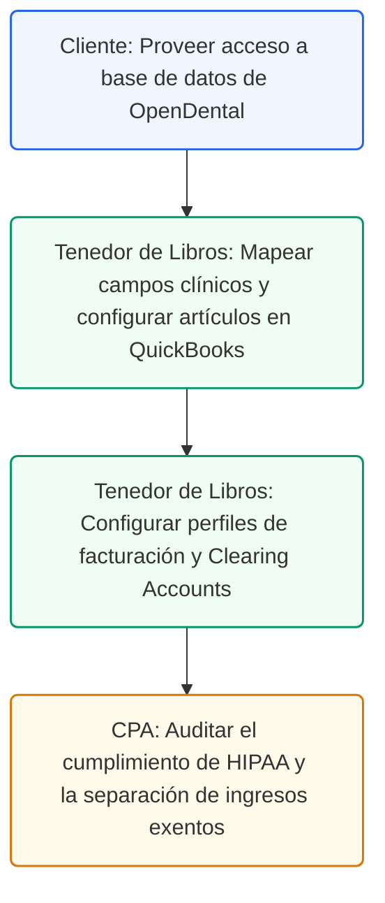

# Guía de Arquitectura de Invoicing e Integración de Ingresos
## Protocolo de Facturación y Mapeo OpenDental a QuickBooks

### Control de Documentos / Document Control
*   **Versión / Version:** 1.8
*   **Fecha / Date:** July 10, 2026
*   **Autor / Author:** Roberto Alejandro Morales Pérez
*   **Estado / Status:** Activo / Listo para Implementar
*   **Proyecto:** Reconfiguración y Cumplimiento Fiscal de Práctica Dental (Puerto Rico)

---

## 1. Introducción
Esta guía técnica detalla la arquitectura de facturación y el mapeo de ingresos de la clínica dental. Establece el protocolo para sincronizar la información del sistema de gestión clínica (OpenDental) con el sistema de contabilidad (QuickBooks Desktop Enterprise Platinum), asegurando que todas las transacciones de servicios clínicos (exentos de IVU) y ventas de productos al detal (sujetos al 11.5% de IVU) se registren con precisión y bajo cumplimiento estricto con las regulaciones de la Ley HIPAA y del Departamento de Hacienda de Puerto Rico.

---

## 2. Checklist de Configuración de Invoicing en QuickBooks
Para garantizar la exactitud en el registro de los ingresos y la conciliación de los pagos de planes médicos y copagos de pacientes, el Tenedor de Libros debe configurar los módulos de cuentas por cobrar en QuickBooks siguiendo este checklist operacional.

*   **Paso 1: Configurar Preferencias de Ventas:** Vaya a *Edit -> Preferences -> Sales & Customers*. Active las opciones de facturación detallada, facturas por servicio e importación de transacciones desde aplicaciones externas.
*   **Paso 2: Crear la Jerarquía de Clientes (Customer:Job):** Establezca la estructura de cuentas donde cada paciente es un sub-cliente (Job) bajo el pagador correspondiente (Seguro Médico o Auto-pago).
*   **Paso 3: Configurar Artículos de Servicio y ADA Codes:** Ingrese el catálogo de servicios utilizando los códigos oficiales de la Asociación Dental Americana (ADA Codes) vinculados a la cuenta de ingresos exentos.
*   **Paso 4: Configurar Artículos de Inventario (Retail Products):** Registre los productos de venta al detal (como medicamentos neuropathic pills) vinculados a la cuenta de ingresos tributables y configure el cobro del 11.5% de IVU (10.5% estatal y 1% municipal).
*   **Paso 5: Definir Cuentas de Compensación (Clearing Accounts):** Establezca cuentas de puente bancario para depósitos en tránsito de tarjetas de crédito y transferencias electrónicas de aseguradoras (ACH clearing).

---

### 3. Mapeo de Base de Datos: OpenDental API a QuickBooks
El flujo de datos entre el sistema clínico OpenDental (base de datos relacional MySQL) y QuickBooks Desktop Enterprise se realiza mediante una integración por API o exportación programada de reportes diarios. Para evitar violaciones a la Ley HIPAA, todos los datos personales de salud de los pacientes deben ser sanitizados, utilizando únicamente el número de paciente (`PatNum`) y las iniciales del nombre como identificador único en QuickBooks, en lugar del nombre completo o número de seguro social.

#### Detalle de Tablas de Base de Datos y APIs:
- **`patient` Table**: Almacena los perfiles de los pacientes. El API extrae únicamente el campo autoincrementable `PatNum` para mapear el ID del sub-cliente en QuickBooks.
- **`insplan` & `patplan` Tables**: Definen el plan de seguro dental asociado al paciente. Se utiliza para generar la cuenta por cobrar de plan médico correspondiente (`InsPlanNum` -> QuickBooks A/R).
- **`procedurelog` Table**: Registra los tratamientos clínicos ejecutados. Los campos clave de la tabla son `ProcFee` (tarifa base) y `ADACode` (código del servicio dental de la Asociación Dental Americana, e.g., D0120, D1110).
- **`claimproc` Table**: Registra el estado de la reclamación y los pagos. El campo `WriteOff` contiene el descuento contractual acordado con la aseguradora, el cual se mapea a la cuenta de contra-ingresos de QuickBooks.

> **Importante:** La cuenta de ingresos por servicios clínicos dentales es considerada exenta bajo el Código de Rentas Internas de Puerto Rico, mientras que las ventas de productos dentales de cuidado en el hogar (retail) están sujetas al IVU. Este mapeo de base de datos asegura que cada tipo de ingreso se dirija a la cuenta contable correcta desde el momento de la facturación en OpenDental.

A continuación se presenta la tabla de mapeo técnico de campos de base de datos:

| Tabla de Origen (OpenDental) | Campo de Origen (OpenDental Schema) | Cuenta de Destino en QuickBooks | Descripción del Mapeo Contable |
| --- | --- | --- | --- |
| `patient` | `PatNum` + `LName`[0] + `FName`[0] | Customer:Job Layer (ID Único) | Identificador de cliente sanitizado bajo HIPAA |
| `procedurelog` | `ProcFee` (donde `ADACode` es de servicio) | [4100] Ingresos por Servicios Clínicos | Ingreso exento de IVU por tratamientos dentales |
| `procedurelog` | `ProcFee` (donde `ADACode` es de producto) | [4200] Ventas Retail (Tributables) | Ingreso sujeto a IVU de productos al detal |
| `claim` | `InsPayEst` (Monto estimado de seguro) | [1200] Cuentas por Cobrar Planes Médicos | Cuenta por cobrar de la aseguradora (A/R) |
| `claimproc` | `InsPayAmt` (Pago real recibido) | [1150] Depósitos en Tránsito (Clearing) | Conciliación de pagos ACH recibidos de seguros |
| `claimproc` | `WriteOff` (Ajuste por contrato de seguro) | [4150] Descuentos y Ajustes Contractuales | Gasto contra-ingreso por tarifas contratadas |
| `payment` | `PayAmt` (Pago de copago del paciente) | [1250] Undeposited Funds / Efectivo | Efectivo o tarjeta recaudado en la recepción |

---

## 4. Plantillas de Formularios de Facturación e Ingresos

### Plantilla de Factura de Paciente (Patient Invoice)
Esta plantilla representa el documento emitido al paciente al finalizar su cita clínica, detallando los servicios recibidos, los montos cubiertos por el seguro médico y el balance de copago que debe liquidar en la recepción.

| Campo de Facturación | Detalle de la Transacción | Cuenta Contable QuickBooks |
| --- | --- | --- |
| Número de Factura | FAC-2026-0892 | Correlativo Único de Factura |
| Cuenta de Paciente | PatNum: 4592 - M.P. (HIPAA Masked) | Customer:Job: `4592-MP` |
| Servicio Clínico (ADA D0120) | Examen Oral Periódico — Fee: $65.00 | [4100] Ingresos por Servicios Clínicos |
| Servicio Clínico (ADA D0220) | Radiografía Intraoral Primera — Fee: $35.00 | [4100] Ingresos por Servicios Clínicos |
| Medicamento Retail (NDC) | Neuropathic Pills (Excluido IVU receta) — Fee: $45.00 | [4200] Ventas Retail (Tributables) |
| Cobertura Estimada del Seguro | Coaseguro del plan médico (80%) — Monto: $80.00 | [1200] Cta. Cobrar Planes Médicos |
| Copago a Pagar por Paciente | Monto a pagar por el paciente en recepción — Monto: $65.00 | [1250] Undeposited Funds |

### Registro de Reclamación de Seguro Dental (Dental Plan Insurance Claim)
Este registro detalla la reclamación enviada electrónicamente a la aseguradora (por ejemplo, Triple-S Vida o MCS) para el cobro del tratamiento dental del paciente.

| Campo de Reclamación | Información del Formulario ADA | QuickBooks Ledger Impact |
| --- | --- | --- |
| ID de Reclamación | CLM-902123 | Número de Transacción de A/R |
| Compañía de Seguro | Triple-S Salud Dental | Vendor/Customer Name: Triple-S |
| Número de Suscriptor | TS-9827392 | Campo de Referencia en Invoice |
| Procedimiento Clínico | ADA D1110 (Limpieza de Adulto) — Fee: $85.00 | [4100] Ingresos por Servicios Clínicos |
| Monto Reclamado al Plan | Tarifa contratada al 100% — Monto: $85.00 | Débito a Cuentas por Cobrar [1200] |
| Pago Estimado de Aseguradora | 90% de la tarifa del plan — Monto: $76.50 | Crédito a Ingresos por Servicios [4100] |
| Copago Estimado del Paciente | 10% de coaseguro — Monto: $8.50 | Débito a Cuentas por Cobrar Paciente [1201] |

### Formulario de Liquidación de Copagos Multi-Tier (Copay Settlement Form)
Este formulario se completa en la recepción cuando el paciente liquida su porción del tratamiento utilizando efectivo, cheque o tarjeta de crédito.

| Parámetro de Liquidación | Detalle de Cobro en Recepción | Mapeo Bancario QuickBooks |
| --- | --- | --- |
| ID de Liquidación | SET-2026-4592 | Número de Documento de Recibo |
| Fecha de Cobro | July 9, 2026 | Fecha de Entrada Contable |
| Monto Total Cobrado | Tarifa total cobrada en caja — Monto: $65.00 | Débito a Undeposited Funds [1250] |
| Método de Pago | Tarjeta de Crédito (Visa Commercial) | Mapeado a Cuenta Puente POS [1160] |
| Referencia de POS Terminal | Auth #089271 | Número de Referencia de Transacción |
| Conciliador Contable | Recepcionista de Turno | Usuario del Sistema Registro Clínico |

---

## 5. Ruta de Ejecución y Plan de Acción
A continuación se presenta el flujo de trabajo operacional para la configuración de facturación e integración de ingresos:

### Lista de Tareas Operacionales:
*   `[ ]` **[CLIENTE]** Conceder acceso de solo lectura a la base de datos MySQL de OpenDental para que el Tenedor de Libros pueda verificar los nombres de los campos de base de datos.
*   `[ ]` **[CLIENTE]** Validar que la recepción de la clínica utilice la plantilla de facturación autorizada que cumple con el enmascaramiento de datos HIPAA.
*   `[ ]` **[TENEDOR DE LIBROS]** Crear los artículos de venta (Items) en QuickBooks correspondientes a los códigos ADA y productos de retail, configurando los códigos de impuestos correctos.
*   `[ ]` **[TENEDOR DE LIBROS]** Configurar la cuenta puente de depósitos de tarjetas de crédito (Clearing Account) en QuickBooks para la conciliación mensual de los depósitos del terminal POS.
*   `[ ]` **[TENEDOR DE LIBROS]** Realizar una prueba de importación de facturas diarias desde OpenDental a QuickBooks, validando que los datos de los pacientes ingresen de forma anónima (ID de paciente).
*   `[ ]` **[CPA]** Realizar una auditoría fiscal de prueba en QuickBooks para certificar la separación exacta de ingresos exentos (servicios dentales) e ingresos tributables (ventas retail de medicamentos).

---

## 6. Anexo A: Reportes Diarios de Cuadre Clínico (Formato CSV/Excel)
Este formato debe ser utilizado por la recepción para preparar el reporte diario de facturación sanitizado bajo HIPAA:

| ID Paciente (PatNum) | Iniciales de Control | Aseguradora / Plan Dental | Código ADA de Servicio | Monto Total de Gasto | Copago Recaudado Caja | Método de Recaudación (Caja) |
| --- | --- | --- | --- | --- | --- | --- |
| 4592 | M.P. | Triple-S Salud | D0120 | $65.00 | $13.00 | Visa POS Terminal |
| 4593 | J.R. | MCS Classicare | D1110 | $85.00 | $8.50 | Efectivo en Recepción |
| 4594 | A.V. | Auto-Pago | D4341 | $120.00 | $120.00 | ATH Móvil Business |
| ________ | ________ | _____________________ | ________ | $________ | $________ | __________________________ |

### Anexo B: Formulario de Conciliación de Facturas en Envejecimiento (Claims Aging)
Este control diario se utiliza para auditar reclamaciones vencidas de planes médicos en QuickBooks A/R:

| Rango de Vencimiento | Código de Denegación Aseguradora | Acción de Cobro Tomada (Bitácora de Llamadas) | Próxima Fecha de Contacto |
| --- | --- | --- | --- |
| [ ] 31 a 60 Días Vencidos | ______________________ | __________________________________________________________________ | ____/____/________ |
| [ ] 61 a 90 Días Vencidos | ______________________ | __________________________________________________________________ | ____/____/________ |
| [ ] Más de 90 Días Vence | ______________________ | __________________________________________________________________ | ____/____/________ |

---

## 7. Navegación en Portales y Ruta de Clics (SURI IVU)
Para conciliar los ingresos y radicar la planilla de IVU mensual exenta y tributable, siga estas rutas exactas:
*   **Radicar Planilla de IVU (Estatal)**: `SURI -> Iniciar Sesión -> Cuentas -> Impuesto sobre Ventas y Uso (IVU) -> Períodos -> Radicar Planilla Mensual -> Sección de Ingresos Exentos (Servicios Clínicos) y Tributables (Medicamentos Retail)`.
*   **Radicar Planilla de IVU (Municipal)**: `Cofim.pr.gov -> Iniciar Sesión -> Declaraciones Municipales -> Radicar Planilla Municipal de San Juan -> Declarar Ingreso Bruto Municipal`.

*   **Radicar Reclamación Dental en Triple-S (Provinet)**: `Provinet Comercial -> Iniciar Sesión -> Facturación Electrónica -> Radicar Reclamaciones Dentales -> Subir Archivo ADA XML de OpenDental`.
*   **Radicar Reclamación Dental en MCS (Portal de Proveedores)**: `Portal Proveedores MCS -> Transacciones -> Reclamaciones Dentales -> Radicación Individual o Lote de Facturas`.

*   **Credit Memos & Refunds click-path**: `QuickBooks -> Customers -> Create Credit Memos/Refunds -> Select sanitizado Patient ID (e.g., 4592-MP) -> Enter credit detail (Exempt/Taxable) -> Apply to invoice or issue check`.

*   **Radicar Planilla de Propiedad Mueble del CRIM**: `Portal del CRIM -> Iniciar Sesión -> Radicación Electrónica -> Planilla de Propiedad Mueble (Para declarar equipos dentales, mobiliario de oficina y computadoras)`.

*   **Modificar Registro de Comerciante SURI**: `SURI -> Iniciar Sesión -> Registro de Comerciante -> Enlaces Relacionados -> Modificar Registro de Comerciante (Para añadir códigos NAICS o sucursales)`.

## 8. Audit Defense Strategy Checklist (Expediente de Ingresos)
Para defender la exención de IVU en los servicios dentales y comprobar el cobro del 11.5% en retail ante Hacienda, archive mensualmente:
- [ ] Reporte diario detallado de OpenDental con IDs enmascarados y códigos ADA de tratamientos.
- [ ] Hoja de conciliación del clearing account de depósitos de POS frente al estado de cuenta bancario de BPPR.
- [ ] Acuse de recibo de la planilla mensual de IVU radicada en SURI y la confirmación de COFIM.
- [ ] Reporte de envejecimiento de reclamaciones médicas (A/R Aging) conciliado con depósitos ACH de Triple-S.

## 9. Controles Internos de Caja Chica (Petty Cash Receipts)
Debido a que la recepción recauda copagos en efectivo de pacientes de forma diaria, se establece el siguiente control:
*   **Límite de Caja Chica**: La caja chica se mantendrá con un fondo fijo de $200 para gastos operativos menores.
*   **Registro Contable**: Cada desembolso debe estar respaldado por un recibo firmado. El Tenedor de Libros conciliará semanalmente la caja chica contra la cuenta contable `[1120] Petty Cash`.
*   **Depósito de Efectivo**: El efectivo recaudado por copagos se depositará en BPPR al final de cada semana Laboral.

---

## 10. Anexo C: Registro de Ventas Especiales y Planes de Descuento Interno
Utilice esta plantilla de control para registrar tratamientos bajo planes de descuento de la clínica o promociones especiales corporativas:

| Parámetro de Venta Especial | Detalle Transaccional Clínico | Mapeo Contable QuickBooks |
| --- | --- | --- |
| **Tipo de Plan Especial** | [ ] Plan Dental Interno / [ ] Promoción Corporativa | Segmentación de Ingresos |
| **Paciente HIPAA ID** | ________________________ (PatNum + Iniciales) | Sub-Cliente: `Customer:Job` |
| **Código ADA de Procedimiento**| ________________________ (e.g., D1110, D2391) | Item de QuickBooks |
| **Tarifa Estándar del Servicio**| $_______________________ | Cargo Bruto (Exento) |
| **Descuento Aplicado (%)** | [ ] 15% / [ ] 20% / [ ] Otro (___%) | Item Tipo Descuento (Discount) |
| **Monto Neto Recaudado** | $_______________________ | Depósitos en Tránsito [1250] |
| **Método de Recaudación** | [ ] Visa/MC / [ ] AMEX / [ ] ATH Móvil / [ ] Cash | Cuenta Puente POS / Banco |
