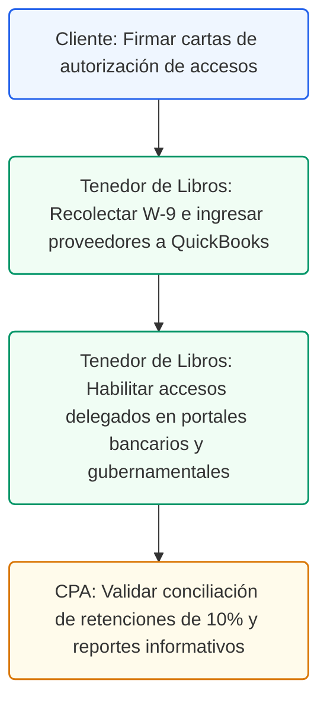

# Registro de Proveedores y Accesos del Tenedor de Libros
## Cumplimiento, Control Credenciales y Base de Proveedores

### Control de Documentos / Document Control
*   **Versión / Version:** 2.2
*   **Fecha / Date:** July 10, 2026
*   **Autor / Author:** Roberto Alejandro Morales Pérez
*   **Estado / Status:** Activo / Listo para Implementar
*   **Proyecto:** Reconfiguración y Cumplimiento Fiscal de Práctica Dental (Puerto Rico)

---

## 1. Introducción
Esta guía de cumplimiento y control administrativo establece el protocolo oficial para la gestión de proveedores (Vendors) y el otorgamiento seguro de accesos delegados al Tenedor de Libros. El propósito es asegurar que todos los proveedores que prestan servicios o suministran materiales a la clínica dental estén debidamente registrados bajo las normas de Hacienda en Puerto Rico (incluyendo el cobro del IVU y las retenciones en el origen del 10% por servicios profesionales) y que el Tenedor de Libros cuente con los accesos necesarios para ejecutar sus deberes contables sin comprometer la seguridad de las cuentas de la práctica.

---

## 2. Base de Datos de Proveedores de la Práctica Dental
La clínica dental interactúa con diversos proveedores clave para el mantenimiento de su operación. Cada proveedor debe estar catalogado en QuickBooks Desktop Enterprise con su clasificación fiscal correcta (Corporación, Individuo, o Servicio Profesional con retención del 10%) para automatizar los reportes anuales en SURI (Formularios 480.6SP y 480.6B).

> **Información:** Para todos los contratistas independientes e individuos que presten servicios profesionales en Puerto Rico, es mandatorio retener el 10% del total facturado como retención en el origen, a menos que presenten un certificado de relevo total o parcial emitido por Hacienda. Esta retención debe acumularse en el pasivo de QuickBooks y pagarse mensualmente a través de SURI.

A continuación se presenta la base de datos maestra de proveedores recurrentes:

| Nombre del Proveedor | Categoría de Gasto | Términos de Pago | Cuenta Contable Predeterminada | Retención SURI |
| --- | --- | --- | --- | --- |
| Henry Schein Dental | Materiales y Equipos Clínicos | Net 30 | [5050] Suministros Clínicos | No aplica (Corporación) |
| Benco Dental Supply | Materiales y Equipos Clínicos | Net 15 | [5050] Suministros Clínicos | No aplica (Corporación) |
| San Juan Real Estate | Alquiler de Oficina Comercial | Net 0 (1ro de Mes) | [5300] Alquiler de Local Comercial | No aplica (Corporación) |
| ADP Puerto Rico | Procesamiento de Nómina | Pago al Contado | [5100] Cargos Procesamiento Nómina | No aplica (Corporación) |
| Dr. Carlos Rivera (Cirujano) | Consultor Clínico Independiente | Net 15 | [5020] Servicios Dentales Subcontratados | Sí aplica (10% Retención) |
| Autoridad de Energía Eléctrica | Servicios Públicos (Luz) | Net 20 | [5350] Servicios de Utilidades (AEE) | No aplica (Servicio Público) |
| Triple-S Salud (Planes Médicos) | Beneficios de Empleados | Net 30 | [5150] Plan Médico Patronal (Fringe) | No aplica (Corporación) |

---

## 3. Checklist de Accesos y Credenciales Contables para el Tenedor de Libros
Para que el Tenedor de Libros pueda cumplir con la conciliación diaria, la facturación, el procesamiento de nómina y las radicaciones fiscales, se le deben otorgar accesos específicos en los portales gubernamentales y financieros de la clínica comercial.

| Nombre del Portal | Nivel de Acceso Otorgado | Propósito Contable y Fiscal | Método de MFA y Seguridad |
| --- | --- | --- | --- |
| SURI - Dept. de Hacienda | Representante Autorizado (Limitado) | Radicar IVU mensual, retenciones del 10% y W-2 | Enlace a cuenta personal del tenedor |
| Banco Popular de Puerto Rico | Cuenta de Visualización (Read-Only) | Descargar estados de cuenta e importar ACH feeds | Token de seguridad por App móvil |
| ADP Run (Nómina Local) | Especialista en Nómina (Payroll Admin) | Ingresar horas, verificar deducciones y exportar diario | Código MFA enviado a celular de tenedor |
| DTRH Portal Gubernamental | Representante Patronal | Radicar declaraciones trimestrales de SUTA y SINOT | Llavero de seguridad en la oficina |
| CFSE Portal (Fondo del Seguro) | Representante Delegado | Radicar Declaración de Nóminas Anual (Form 8720) | Contraseña y token de correo oficial |
| QuickBooks Enterprise Server | Administrador Local de Base de Datos | Configuración de catálogo de cuentas y conciliación | Autenticación de dominio local LAN |

---

## 4. Formularios de Cumplimiento y Cartas de Autorización


## 4. Comprensión del Formulario W-9: Propósito, Estructura y Cumplimiento
El **Formulario W-9** (Request for Taxpayer Identification Number and Certification) es el documento base requerido para el registro de cualquier suplidor en el sistema contable. A continuación se detalla su funcionamiento, su aspecto estructural y su obligatoriedad legal en Puerto Rico:

### ¿Qué es y para qué sirve?
Es una declaración jurada donde el suplidor certifica su nombre legal, tipo de organización y número de identificación fiscal (SSN o EIN). El Tenedor de Libros utiliza esta información para configurar la ficha del proveedor en QuickBooks y para reportar los pagos anuales a Hacienda.

### Estructura Visual del Formulario W-9
El formulario consta de las siguientes secciones clave:
1.  **Identificación (Líneas 1 a 6)**:
    *   **Línea 1**: Nombre legal completo del individuo o corporación (debe coincidir con la tarjeta de Seguro Social o la carta del IRS).
    *   **Línea 2**: Nombre comercial o DBA (Doing Business As), en caso de ser distinto al nombre legal.
    *   **Línea 3**: Clasificación fiscal federal (Corporación Regular, Corp S, Sociedad, Fideicomiso, o Individuo/Propiedad Única).
    *   **Línea 5 y 6**: Dirección física y postal oficial donde se enviarán los cheques o comprobantes de retención.
2.  **Parte I - Número de Identificación (TIN)**:
    *   Casilla para el seguro social (SSN) de contratistas independientes o el número patronal (EIN) de corporaciones y sociedades.
3.  **Parte II - Certificación (Firma)**:
    *   Firma bajo pena de perjurio del dueño o representante autorizado del suplidor, certificando que el número provisto es correcto y que no está sujeto a retención por backup.

### ¿Por qué es obligatorio tenerlo en Morales Dental Clinic, P.S.C.?

### ¿Qué espera el suplidor de la clínica dental?
El suplidor que presta servicios profesionales en Puerto Rico espera que la clínica actúe con total diligencia fiscal en los siguientes aspectos:
1.  **Emisión del Certificado de Retención (SC 2908)**: Cuando retenemos el 10% de su pago, el suplidor necesita este comprobante para acreditar ese dinero retenido contra sus planillas de contribución sobre ingresos en SURI. La clínica debe emitir este certificado dentro de los plazos legales.
2.  **Entrega Anual de la Informativa (480.6SP)**: El suplidor espera que la clínica radique a tiempo y le provea su copia de la Informativa anual antes de la fecha límite (28 de febrero del año siguiente) para que puedan radicar sus planillas personales sin penalidades.
3.  **Segregación de Reembolsos de Gastos**: Si el suplidor incluye gastos reembolsables en su factura (e.g., peajes, materiales específicos), la clínica debe programar el pago para aplicar el 10% de retención **únicamente al renglón de servicios profesionales**, eximiendo del cómputo los reembolsos documentados.
4.  **Pagos a Tiempo y Seguridad de Datos**: Cumplimiento estricto con los términos acordados (Net 15 o Net 30) y custodia segura de sus datos de cuenta bancaria (números de ruta y cuenta para depósitos ACH) para evitar fraude o filtraciones.

*   **Deducibilidad de Gastos**: Para que la clínica pueda deducir en su planilla de contribución sobre ingresos corporativa los pagos efectuados a suplidores, es mandatorio radicar las **Declaraciones Informativas (480.6SP o 480.6B)** en SURI. Sin el W-9, el Tenedor de Libros no puede realizar esta radicación, lo que anula la deducción del gasto.
*   **Enlace con Retención del 10%**: El W-9 provee la clasificación fiscal que determina si el suplidor califica para retención del 10% en el origen por servicios profesionales. Si el suplidor es una corporación, la retención no aplica. Si es un individuo, se le debe retener el 10% a menos que provea una exención oficial de Hacienda (SC 2756).
*   **Evitar Multas por Omisión**: La posesión del formulario W-9 firmado sirve como defensa legal ante Hacienda, eximiendo a la clínica de la responsabilidad solidaria de pagar la contribución del suplidor en caso de una auditoría.

### Formulario W-9 de Puerto Rico (Registro de Cumplimiento del Proveedor)
Este formulario se solicita a cada proveedor nuevo antes de emitir su primer pago, para confirmar su nombre legal, dirección física, EIN federal o Seguro Social, y su estado de retención fiscal en Puerto Rico.

| Sección del Formulario W-9 | Información Requerida del Proveedor | Verificación Contable |
| --- | --- | --- |
| 1. Nombre Comercial Legal | Nombre legal registrado en el Departamento de Estado | Confirmado con Certificado de Registro |
| 2. Clasificación Fiscal | Corp. Regular / Corp. Especial / P.S.C. / Individuo | Determina si aplica retención del 10% |
| 3. Número EIN o Seguro Social | 66-0982713 | Verificado con la carta del IRS |
| 4. Dirección del Proveedor | Ave. Ponce de León #456, San Juan, PR 00918 | Dirección física oficial de facturación |
| 5. Certificación de Impuestos | Declaración de que la información provista es correcta | Firma manuscrita o digital del dueño |
| 6. Relevo de Retención | Adjuntar Certificado de Relevo vigente en SURI | Válido si está firmado por Hacienda |

### Carta de Autorización y Delegación Contable (Access Authorization Letter)
Esta carta es emitida por el Dentista Propietario en representación de la corporación para autorizar formalmente al Tenedor de Libros ante bancos, contadores externos o agencias públicas.

```
FECHA: July 9, 2026

A QUIEN PUEDA INTERESAR:

Por la presente, yo, Dr. Roberto A. Morales Pérez, en mi carácter de Presidente y Administrador Único de Morales Dental Clinic, P.S.C., autorizo formalmente a Roberto Alejandro Morales Pérez, portador de la identificación gubernamental ID-XXXXX, a actuar como nuestro Tenedor de Libros y Asesor Contable.

El Sr. Morales Pérez está plenamente autorizado para realizar las siguientes gestiones en nombre de la corporación:
1. Acceso de solo lectura (Read-Only) a las cuentas de depósito de Banco Popular de Puerto Rico para propósitos exclusivos de conciliación de cuentas y descarga de estados de cuenta mensuales.
2. Acceso como Representante Limitado en el portal SURI para radicar planillas de IVU y declaraciones informativas (480).
3. Comunicación directa con el CPA externo de la clínica para el intercambio de estados financieros y reportes auxiliares de QuickBooks.

Esta autorización no otorga facultad para firmar cheques, transferir fondos ni obligar financieramente a la clínica. Permanecerá vigente hasta que sea revocada por escrito.

Atentamente,

Dr. Roberto A. Morales Pérez
Presidente
Morales Dental Clinic, P.S.C.
```

---

## 5. Ruta de Ejecución y Plan de Acción
A continuación se presenta el flujo de trabajo operacional para la gestión de proveedores y control de accesos delegados:



### Lista de Tareas Operacionales:
*   `[ ]` **[CLIENTE]** Firmar las cartas de autorización comercial y delegar los accesos de visualización bancaria (Banco Popular) al Tenedor de Libros.
*   `[ ]` **[CLIENTE]** Firmar y aprobar en SURI la delegación del Tenedor de Libros como representante para la radicación de planillas.
*   `[ ]` **[TENEDOR DE LIBROS]** Solicitar el formulario W-9 y certificado de relevo SURI a todos los proveedores antes de ingresar su primera factura en el sistema.
*   `[ ]` **[TENEDOR DE LIBROS]** Configurar las fichas de proveedores (Vendor Center) en QuickBooks Desktop, marcando la opción de retención del 10% para aquellos proveedores de servicios aplicables.
*   `[ ]` **[TENEDOR DE LIBROS]** Conciliar mensualmente la cuenta de pasivo de retenciones por pagar con los pagos reales emitidos a través de las colecturías virtuales de SURI.
*   `[ ]` **[CPA]** Auditar la preparación anual de los Formularios 480.6SP y 480.6B generados por el Tenedor de Libros en SURI frente a los saldos acumulados en QuickBooks.


---

## 6. Anexo A: Solicitud de Documentación Fiscal a Nuevos Suplidores
Formato de requerimiento formal para la creación del expediente de cumplimiento del suplidor en QuickBooks:

> **Información:** Carta de Requerimiento de Cumplimiento (W-9 / SURI / Relevos) para suplidores recurrentes:
> 
> Estimado Proveedor Recurrente,
> 
> Para poder procesar y programar de forma conforme los pagos correspondientes a sus servicios y suministros médicos prestados a **Morales Dental Clinic, P.S.C.**, le solicitamos de forma mandatoria proveer copia actualizada de los siguientes documentos:
> 
> 1. **Formulario W-9 de Puerto Rico** debidamente firmado en todas sus partes.
> 2. **Certificado de Registro de Comerciante de SURI** vigente.
> 3. **Certificado de Relevo de Retención (Formulario SC 2756)** si cuenta con exención total o parcial en Hacienda.
> 
> Agradecemos enviar estos documentos en formato PDF a la dirección de correo oficial: `admin@moralesdentalpr.com`.


### Anexo B: Comprobante de Retención del 10% en el Origen (Hacienda SURI)
Registro auxiliar del Tenedor de Libros para certificar la retención del 10% por servicios profesionales antes de radicar en SURI:

| Campo de Auditoría de Retención | Valor Transaccional Registrado ($) | Verificación Fiscal SURI | Número de Confirmación SURI (Pago) |
| --- | --- | --- | --- |
| Monto Bruto Facturado (100.00%) | $_______________________ | Base Imponible del Servicio | No aplica |
| Retención Contributiva (10.00%) | $_______________________ | Pasivo Acumulado a Remesar | __________________________________ |
| Monto Neto Emitido (90.00%) | $_______________________ | Cheque o ACH Neto de Caja | No aplica |


---


---

## 7. Anexo C: Formulario Modelo SC 2908 (Certificado de Retención de Servicios Profesionales)
Este formulario representa la plantilla oficial del comprobante de retención que la clínica emite al suplidor por cada pago efectuado:

| Sección del Formulario SC 2908 | Detalle Registrado en QuickBooks | Parámetro Contable |
| --- | --- | --- |
| **Agente Retenedor (Payer)** | Morales Dental Clinic, P.S.C. | Nombre Legal del Cliente |
| **Número Patronal (EIN)** | 66-0982713 | EIN del Agente Retenedor |
| **Nombre del Proveedor (Payee)** | ___________________________________________ | Vendor Name en QuickBooks |
| **Número de Seguro Social / EIN** | ________________-_______ | ID Fiscal del Suplidor |
| **Fecha de Pago de Factura** | ____/____/________ | Transaction Date en Ledger |
| **Monto Total Bruto Pagado** | $_______________________ | Gasto Bruto Computable |
| **Tasa de Retención Aplicada** | 10.00% | Porcentaje Legal de Retención |
| **Contribución Retenida en Origen**| $_______________________ | Monto Retenido (Pasivo SURI) |

---

## 8. Anexo D: Declaración Informativa Formulario 480.6SP (Resumen SURI)
Esta plantilla representa el formato en el que se consolidan los pagos anuales del proveedor para su radicación final en SURI:

| Casilla del Formulario 480.6SP | Concepto Fiscal a Declarar | Acumulado Anual ($) |
| --- | --- | --- |
| **Casilla 1 (Gross Income)** | Total de Servicios Profesionales Pagados en el Año | $_______________________ |
| **Casilla 2 (Tax Withheld)** | Contribución Retenida en el Origen (10% Acumulado) | $_______________________ |
| **Casilla 3 (Exempt Amount)** | Monto Exento de Retención (Bajo Relevo SC 2756) | $_______________________ |
| **Casilla 4 (Expenses)** | Reembolso de Gastos Operacionales Facturados | $_______________________ |
| **Confirmación de Radicación** | Número de Control Electrónico emitido por SURI | _________________________ |

## 9. Navegación en Portales y Ruta de Clics (SURI Retenciones)
Para pagar las retenciones del 10% y radicar los informativos de proveedores en Hacienda, use estas rutas:
*   **Pagar Retención Mensual del 10%**: `SURI -> Iniciar Sesión -> Cuentas -> Retención en el Origen (Servicios Profesionales) -> Períodos -> Efectuar un Pago -> Método de Pago (BPPR Cuenta Operacional)`.
*   **Radicar Declaración Informativa Anual (Formulario 480.6SP)**: `SURI -> Iniciar Sesión -> Cuentas -> Retención en el Origen -> Radicar Declaraciones Informativas -> Cargar Archivo de Proveedores de QuickBooks`.
*   **Vendor Profile Changes & Merges click-path**: `QuickBooks -> Vendor Center -> Right-click Vendor -> Edit Vendor (To update EIN or address) / Right-click -> Make Vendor Inactive (If they stop providing services, to protect 480 registry)`.

## 10. Audit Defense Strategy Checklist (Expediente de Proveedores)
Para defender las deducciones por servicios profesionales y compras de suministros clínicos en auditorías de Hacienda, archive:
- [ ] Copia digital de los formularios W-9 firmados de todos los contratistas independientes e individuos.
- [ ] Certificado de relevo de retención emitido por Hacienda para proveedores exentos del 10%.
- [ ] Copia del comprobante de retención mensual (Voucher Auxiliar) firmado por el Tenedor de Libros.
- [ ] Acuse de recibo de la radicación de las Informativas 480.6SP emitidas a través de SURI.


---

## 11. Anexo E: Formulario de Alta y Autorización de Suplidores (Intake Sheet)
Este formulario físico lo completa el suplidor o el personal de compras para solicitar la creación del perfil de proveedor en QuickBooks:

| Campo del Formulario (Form Field) | Espacio Rellenable (Fillable Area) | Ejemplo de Guía (Sample Data) | Validación Contable (Accounting Rule) |
| --- | --- | --- | --- |
| **Nombre o Razón Social** | ___________________________________________ | *Popular Supply Inc.* | Nombre Comercial del Suplidor |
| **EIN Federal o Seguro Social** | ________________-_______ | *66-0982713* | EIN en QuickBooks Vendor Center |
| **¿Presta Servicios en PR?**| [ ] Sí / [ ] No | *[x] Sí* | Determina retención del 10% SURI |
| **Método de Pago Preferido** | [ ] Cheque / [ ] Transferencia ACH | *[x] ACH* | Método de Pago Predeterminado |
| **Nombre del Banco Comercial** | ___________________________________________ | *Banco Popular de Puerto Rico* | Banco del Suplidor |
| **Número de Ruta ACH (Routing)** | _________________________ (9 dígitos) | *021502011* | Configuración de Transacción |
| **Número de Cuenta Bancaria** | ___________________________________________ | *012345678* | Cuenta del Suplidor |
| **Firma Autorizada del Proveedor**| ___________________________________________ | *Firma del Suplidor Autorizado* | Fecha de Firma: __/__/____ |
