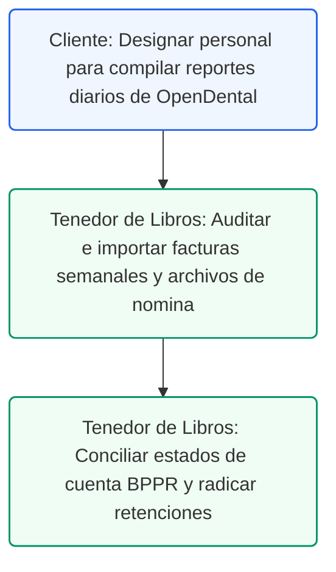

# Guía de Requerimiento de Datos para el Tenedor de Libros
## Protocolo de Datos y Expediente Transaccional para la Contabilidad
### Control de Documentos / Document Control
*   **Versión / Version:** 1.0
*   **Fecha / Date:** July 10, 2026
*   **Autor / Author:** Roberto Alejandro Morales Pérez
*   **Estado / Status:** Activo / Listo para Implementar
*   **Proyecto:** Reconfiguración y Cumplimiento Fiscal de Práctica Dental (Puerto Rico)

---

## 1. Resumen Ejecutivo
Para que el **Tenedor de Libros** pueda procesar la contabilidad de forma transparente, completa y conforme con las regulaciones fiscales del Departamento de Hacienda de Puerto Rico y HIPAA, la administración de la clínica dental debe suministrar un conjunto específico de datos transaccionales. Esta guía establece el inventario de datos requerido, la frecuencia de entrega y el formato de los expedientes necesarios para la conciliación.

---

## 2. Inventario de Datos por Ciclo Operacional

El Tenedor de Libros requiere los siguientes datos específicos organizados por su frecuencia de procesamiento para mantener el Catálogo de Cuentas y las cuentas de conciliación al día:

### A. Datos de Frecuencia Diaria (Control de Caja e Ingresos)
*   **Reporte de Depósitos de OpenDental**: Reporte diario que detalla los cobros ingresados al sistema por paciente enmascarado (e.g., `4592-MP`) y el desglose de los servicios dentales prestados (códigos ADA).
*   **Reporte de Cierre de Terminal de Punto de Venta (POS)**: El comprobante físico de cierre del terminal de tarjetas de crédito (ATH, Visa, MasterCard, AMEX) que detalla el total bruto procesado y las comisiones descontadas por el procesador.
*   **Recibos de Caja Chica (Petty Cash)**: Copia digital de cualquier vale de caja chica firmado por el recepcionista y el suplidor por compras menores de suministros de oficina o mantenimiento de emergencia.

### B. Datos de Frecuencia Semanal (Validación de Depósitos)
*   **Conduces de Depósito Bancario**: Copias de las hojas de depósito físico entregadas en la sucursal de Banco Popular de Puerto Rico (BPPR) para la cuenta operacional `012345678`, conciliando el efectivo reportado en el cuadre diario.
*   **Comprobantes de Transferencias Recibidas**: Reportes de transferencias electrónicas (ACH o ATH Móvil Business) correspondientes a pagos directos de pacientes corporativos o planes de descuento internos.

### C. Datos de Frecuencia Mensual (Cierre de Período y Conciliación)
*   **Estados de Cuenta Bancarios (BPPR)**: Estado de cuenta oficial en formato PDF para la cuenta de cheques operacional `012345678` y cualquier cuenta de ahorro o línea de crédito activa.
*   **Reporte de Reclamaciones Médicas Pendientes (Aging Report)**: Reporte de cuentas por cobrar de OpenDental que muestra el saldo pendiente por aseguradora (Triple-S, MCS, Humana) dividido por antigüedad (30, 60, 90+ días).
*   **Facturas de Suplidores con W-9 y Relevos**: Expediente de facturas de suplidores recurrentes recibidas en el mes, acompañadas de sus formularios W-9 firmados y certificados de relevo de retención de Hacienda (SC 2756) para el cálculo del 10%.
*   **Reporte de Nómina ADP Puerto Rico**: Reportes de nómina consolidados que detallan los salarios brutos de los empleados, deducciones locales (Retención de Nómina, SINOT, Seguro Social, Medicare) y el archivo de importación `.IIF` para QuickBooks.

---

## 3. Matriz de Datos Requeridos para el Registro de Suplidores
Para crear o modificar un suplidor en QuickBooks y preparar las Informativas anuales, el Tenedor de Libros requiere los siguientes datos estructurados:

| Dato Requerido | Formato / Documento de Respaldo | Propósito Contable / Fiscal |
| --- | --- | --- |
| **Nombre Comercial / Legal** | Certificado de Incorporación o W-9 PR | Creación del perfil del suplidor (`Vendor Name`). |
| **Identificación Fiscal (TIN)** | Formulario W-9 firmado (SSN o EIN) | Mapeo para radicación de Informativa 480.6SP/480.6B. |
| **Certificado de Comerciante**| Certificado de SURI (SC 2918) | Validar el código NAICS de actividad económica del suplidor. |
| **Waiver de Hacienda** | Certificado de Relevo SC 2756 vigente | Determinar el porcentaje de retención del 10% (0%, 2%, 6%). |
| **Dirección de Remesa** | Línea 5 y 6 del Formulario W-9 | Registro para la emisión física de cheques de pago. |
| **Información de Ruta ACH** | Formulario de Alta de Suplidor (Anexo E) | Configuración de transferencias directas desde BPPR. |

---

## 4. Matriz de Datos Requeridos para la Facturación de Ingresos
Para conciliar los ingresos y asegurar que las facturas de QuickBooks reflejen exactamente los tratamientos clínicos y las reclamaciones de seguros:

| Dato Clínico Requerido | Formato / Documento de Respaldo | Mapeo Contable QuickBooks |
| --- | --- | --- |
| **Paciente Enmascarado** | ID de OpenDental (PatNum + Iniciales) | Campo `Customer:Job` (Cumplimiento HIPAA). |
| **Código ADA de Procedimiento**| Catálogo de Procedimientos Clínicos (e.g. D1110) | Item de Servicio (Exento de IVU). |
| **Ventas de Retail (Higiene)** | Código de Medicamentos / Cepillos Dentales | Item de Inventario (Tributable al 11.5% IVU). |
| **Copago del Paciente** | Recibo del POS o ATH Móvil | Cuenta Puente de Depósitos Recaudados [1250]. |
| **ACH de Aseguradora (Remesa)**| Detalle de Liquidación de Reclamación (EOB) | Conciliación de Cuentas por Cobrar contra BPPR. |

---

## 5. Audit Defense Strategy Checklist (Expediente Contable Mensual)
Para garantizar la defensa fiscal de los datos provistos en caso de auditoría por Hacienda o el CRIM, archive mensualmente:
- [ ] Hoja de conciliación del estado de cuenta de BPPR operacional firmada por el Tenedor de Libros.
- [ ] Expediente digital por suplidor conteniendo: Factura + Copia de W-9 + Comprobante de Retención (SC 2908).
- [ ] Reporte consolidado de depósitos mensuales cuadradado contra el reporte de ingresos mensuales de OpenDental.
- [ ] Confirmación de radicación y pago de las retenciones mensuales del 10% en el portal SURI de Hacienda.

---

## 6. Ruta de Ejecución y Plan de Acción
A continuación se detalla el flujo secuencial para implementar este protocolo de datos entre la administración de la clínica y el Tenedor de Libros:

### Lista de Tareas Operacionales:
*   `[ ]` **[CLIENTE]** Asignar al recepcionista de la clínica dental la recopilación diaria del reporte de depósitos de OpenDental y los cierres de POS.
*   `[ ]` **[TENEDOR DE LIBROS]** Configurar la carpeta compartida encriptada LAN/VPN para la carga mensual de facturas de suplidores y estados de cuenta.
*   `[ ]` **[TENEDOR DE LIBROS]** Ejecutar la reconciliación mensual de la cuenta operacional `[1100] BPPR Cta. Operacional` contra el reporte de ingresos médicos.
*   `[ ]` **[TENEDOR DE LIBROS]** Emitir y enviar los comprobantes de retención SC 2908 a todos los suplidores sujetos al 10% dentro de los 30 días posteriores al pago.
