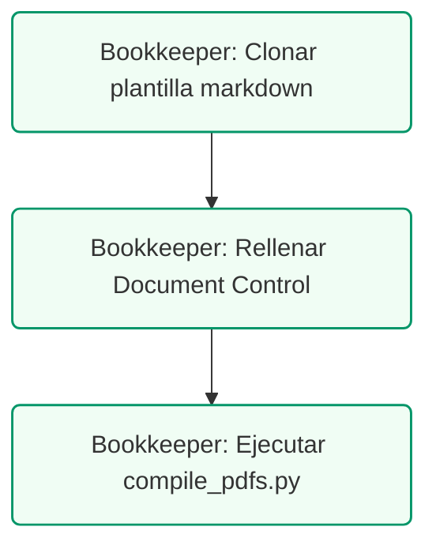

# TÍTULO DEL DOCUMENTO EJEMPLO
## Subtítulo del Documento que Explica su Propósito de Forma General

### Control de Documentos / Document Control
*   **Versión / Version:** 1.6
*   **Fecha / Date:** July 10, 2026
*   **Autor / Author:** Roberto Alejandro Morales Pérez
*   **Estado / Status:** Activo / Plantilla Estandarizada
*   **Proyecto:** Reconfiguración Contable y Fiscal

---

## 1. Introducción
Esta es una sección de ejemplo que muestra cómo se visualiza el cuerpo del documento en las páginas siguientes a la portada corporativa. En esta sección de contenido, se utiliza tipografía estándar Helvetica y un esquema de color institucional basado en verde azulado (Teal #0F766E).

---

## 2. Elementos Gráficos Estandarizados

### A. Listas de Cotejo y Viñetas
Las listas y viñetas se presentan con indentación y espaciados consistentes para facilitar la lectura del cliente:
*   **Elemento Clave 1:** Descripción del primer concepto operativo importante.
*   **Elemento Clave 2:** Descripción del segundo concepto operativo importante.

### B. Tablas Comparativas de Dos Columnas
Para evitar tablas sobrecargadas con columnas estrechas, se dividen los datos extensos en una estructura de dos columnas de alta legibilidad:

| Concepto Técnico | Justificación y Aplicación Operativa |
| :--- | :--- |
| **Cuenta de Ingresos (4000)** | Registro consolidado de transacciones de servicios clínicos exentos de IVU. |
| **Cuenta de Retención (2100)** | Acumulación de retención del 10% aplicada a suplidores y laboratorios locales. |

### C. Bloques de Advertencia o Notas
Las notas importantes y advertencias de cumplimiento (como HIPAA) se encierran en bloques destacados con una línea de color teal en el borde izquierdo:

---

## 3. Conclusión
Cada página de contenido (a partir de la página 2) cuenta con una línea superior de encabezado que identifica a la clínica, y una línea inferior con la declaración de confidencialidad y la numeración automática de páginas.
---
---

## 4. Ruta de Ejecución y Plan de Acción
La creación y compilación de un nuevo entregable estándar sigue los siguientes pasos:

### Lista de Tareas Operacionales:
*   `[ ]` **[CLIENTE]** Revisar y aprobar la versión final en PDF.
*   `[ ]` **[TENEDOR DE LIBROS]** Clonar la plantilla estándar `TEMPLATE_ENTREGABLE.md` a un nuevo archivo de reporte en `documents/mds/`.
*   `[ ]` **[TENEDOR DE LIBROS]** Rellenar los campos requeridos en el bloque de control de documentos (título, subtítulo, fecha, autor).
*   `[ ]` **[TENEDOR DE LIBROS]** Ejecutar el script compilador `compile_pdfs.py` para generar la versión final en PDF con marca de agua y paginación.
*   `[ ]` **[CPA]** Certificar el cumplimiento de los estándares de ReportLab en la plantilla.
